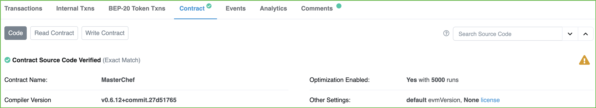
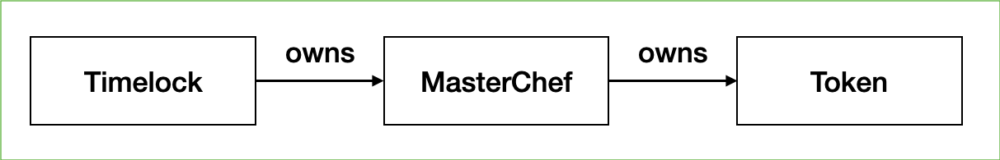
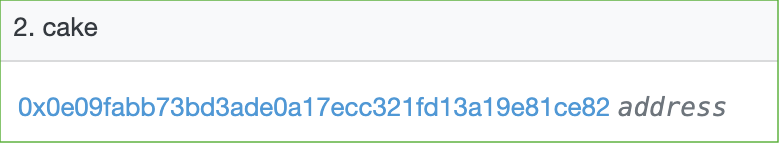
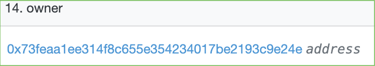

Rugged. Rugged. Rugged.

If you are a DeFi investor, you have definitely heard of these words. As newly DeFi projects mushroom to BSC chain each day, not all of them are good —— be careful, they might steal your investment! According to the 200 most recently launched DeFi project analysis in RugDoc, 28% of them are tagged as “High Risk”, which means that they are highly likely to lead to catastrophic losses as they are right now, and 29% of them are marked as “Some Risk” that have ability to perform soft rug, and only 43% of them are “Low Risk” or “No Risk”.

In other words, there is more than 28% probability that you lost all your the investment on DeFi project (if you randomly picked one!). Such lost maybe due to ignorance, credulous, or lack of learning. So, how do you control the risk of investment in DeFi and how to identify whether the project has a high likelihood of screwing you over? This article helps you to spot a potential rug DeFi project by following some simple steps, which only takes around 10 minutes. Remember, scammers are becoming smarter and smarter and they are able to disguise their project to make it look safe. So, even if you find a project with no obvious problem —— proceed with caution!

### Step 1: Verify the contract you are interacting with

When we enter a project’s website, they may have a reference to which MasterChef contract you are interacting with. However, it might be a lie! The contract you are actually interacting with may be different to the one they posted on the website. To verify this, the most trustable way is to do a “test” transaction: 

Take MetaMask as an example, the contract you are actually interacting with is shown on the right corner. Copy it with a left click and check whether the contract address is the same as they show to you. Also make sure the contract source code is “verified” by BscScan (check whether there is a green mark above “Contract Name”). 

(Verified contract has a green mark above “Contract Name”)

### Step 2: Check the “owner” of contracts

In a DeFi project, the MasterChef contract is the one who manages most operations, and you can verify the MasterChef contract by following step 1. However, MasterChef is super-powerful, and should not be owned by a regular address. Honest developers will create a Timelock contract to own the MasterChef, and each write operation by the owner to MasterChef will be delayed for a period of time, giving you time to take your investment out if developers made any mistake. On the other hand, evil scammers try to own the MasterChef themselves —— so that they can take away your money in a second. Usually, the ownership graph between each contract is shown as follows: 

Such verification can be done by reading the contract variable and verifying the addresses on BscScan. Let’s walk through this process with an example of PancakeSwap:

1. Find the PancakeSwap MasterChef (0x73feaa1ee314f8c655e354234017be2193c9e24e) on BscScan.com, and click on “Read Contract”. 

2. Find the “owner” variable of the MasterChef.

3. Click on the address link, and we found that it is a Timelock contract.

4. Next, find the Token contract in MasterChef, the PancakeSwap token is named “cake”. This might vary from projects. 

5. Click on it, and find whether the owner of “cake” is the MasterChef contract we came from. 

6. Compare the addresses, they are the same! Meaning that the PancakeSwap project is safe (for now), Hoo-Yeah!

Note: When checking the Timelock and Token contracts, make sure that they are “verified” by BscScan!

### Step 3: Check upgradable proxy & Timelock duration

If a project’s MasterChef uses “upgradable proxy” (if you don’t know what is an upgradable proxy, Click Here), then its code is totally modifiable by its owners. For such powerful contract like MasterChef, you generally do not want it be easily changed —— cause the developers may replace the original MasterChef with an evil one. Thus making sure the project’s MasterChef do not use proxy is very important. When you clicking on the “Contract”, you do NOT want to see these extra buttons: 

The “Read as Proxy” and “Write as Proxy” means that they are using upgradable proxy to deploy their contracts. It does not always mean the end of the world, but you would better ask the developers why did they do so —— and they’d better give a reasonable answer.

In the previous step, we told you to check the Timelock contract, but we also need to make sure that the Timelock is actually locking some “time”! To verify this, we go to the “Read Contract” of Timelock: 

As you can see here, the minimum delay of this Timelock is 21600 seconds, which is 6 hours, and the current delay is set to 21700 seconds. This mean that the developers’ action will be delayed for at least 6 hours before they take actual effects. Generally, you want the minimum delay time to be set above 6 hours —— to not worry about your investments while you are asleep.

### Step 4: Check commonly evil features

There can be lots of evil code hiding inside the contracts, and finding all of them is super time-consuming. Luckily, there are some commonly-used evil features by the scammers, and if you find the project you are about to invest contains one, or multiple of the following code, be careful, you might get rugged!

* (High Risk) If they have the “migrate” function in MasterChef. (Except PancakeSwap)
* (High Risk) Search “fee => 10000” and see if they have any fee up to 100%.
* (High Risk) If they have “setVaultAddress” function in MasterChef.
* (High Risk) Go to their website, check whether “Total Value Locked” matches the sum up from their Liquidity Pools.
* (Medium Risk) Check whether the number of “poolLength” in MasterChef matches the actual pool numbers on their website.
* (Medium Risk) If they have “updateStartBlock” function in MasterChef, it might causes severe bug to the project if not used correctly.
* (Medium Risk) If their code highly matched the Panther project (0x058451c62b96c594ad984370eda8b6fd7197bbd4), then proceed with caution because Panther itself have some “risks” due to operator privileges, and the newly started DeFi project are more tend to abuse them.

Woo-hoo! You luckily find your target DeFi project “passed” all the steps listed above and is going to dip into it…. Wait a minute! Passing this 10-minute test does not mean that it is totally safe, if you want to invest your lifetime money into it, think twice! As I mentioned above, this guide only helps you to make sure that the project does not do an “obvious rug”, but what if the scammers are smart? Here are some extra assessments you can do to lower your risk:

* Check the top token holders of the project, they usually are the burn address or the staking contract.
* Look deeper into the code and find if the dev is able to drain funds or unlimitedly emit new tokens to itself.
* Track the transactions and ask dev team for any odd moves you found. Good dev will always give you space to ask questions.
* Search on the twitter & any public rug scanning community about the project, if they have not done the review on it yet, submit a request.
* Find whether the contract code has any audit. They’d better have one or two paid audits to prove their code security.
* Do not put all your eggs in one bucket, and never invest what you can’t lose.
