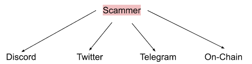
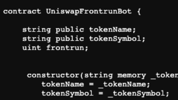
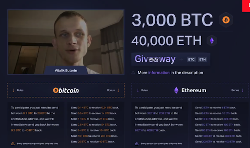
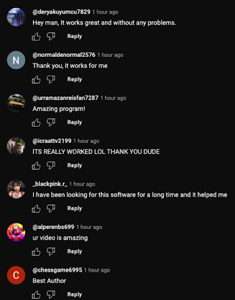
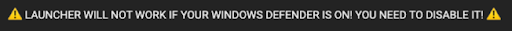

Back in 2021, crypto scams were a growing attack vector tricking victims into investing in the crypto space. According to [CNBC](https://www.cnbc.com/2022/06/03/crypto-scams-cost-people-more-than-1-billion-since-2021-ftc.html), more than $1 billion were lost to crypto scams in 2021, where the most common types include fake investments and romance scams.  

Since then, 2022 has shown that scammers are getting more and more creative.

As a leader in securing the BNB Chain ecosystem, it is our duty to keep users in the BNB Chain ecosystem safe by making sure they are always one step ahead of these scammers. Here are the most popular scams this year:

### 1: Phishing Link Scams 

Phishing is already a popular technique used by scammers in Web 2. This is because scammers can just create a malicious website and subsequently mass send the links to their victims. Here, we will focus mostly on ways that the scammers will try to steal your private keys. 

In Web 3, scammers usually send their phishing links through different mediums where the Web3 community is, like Discord, Twitter, Telegram, and even On-Chain.

Phishing websites usually look like the real website, but with different url names. They can be about a new giveaway or NFT pre-mint events, basically any situation that will make the user feel excited (FOMO - Fear Of Missing Out) and not think straight. The scammer takes advantage of the user’s emotional instability.

They can blatantly be asking for the user to provide his seed phrase or private key. For example, contacting  users on  social media,reaching out as wallet software support and jumping in with direct messages spoofing as an Exchange Support to steal one’s private key directly.

Another way is that scammers will develop chrome extensions that look similar to legitimate ones like Metamask. By impersonating the real applications, users often are led to letting their guard down and provide their private key to use the new application.

One interesting tactic we noticed is that scammers will also try to trick users into thinking there is a new bug/vulnerability with existing applications and there is a new software upgrade. We detected a scammer trying to trick users into thinking the current Metamask version had a bug and users should upgrade to the new version. The scammer proclaimed in the message that the new upgrade is not out yet so the upgrade has to be done manually this time. He afterwards gave a set of instructions which aims to trick the user into providing his metamask password which will expose his private key to the scammer.

In this scenario, users should always wait for the official announcement from Metamask and upgrade their Metamask version from official sources.

To upgrade an extension, just head to chrome://extensions/ 

Click on the update button

This will update all your extensions accordingly.

##### A friendly reminder: 
Normal application upgrades WILL NOT require a user to provide sensitive information such as login credentials. 

### 2: Ice-Phishing 

This is a tactic where the user is tricked into signing a transaction that gives an attacker control over the user’s tokens, without the leakage of his private keys. This is an extension of the Phishing technique.

For some background, when a user is using DeFi applications (e.g PancakeSwap) and interacting with the main token standards (e.g. ERC-20, ERC-721, and ERC-1155) the approval method is shown on their metamask window. This is a request for the user to delegate authority to a 3rd party to act on behalf of that user on those tokens. Afterwards, the user can perform other operations like performing a swap.

Attackers will direct users to the phishing website and induce them to sign some transactions that they didn't request. For example, the interacted contract might not even be a contract, but the attacker’s address. Once the approval transaction is done, the attacker has the authority to transfer funds out of the victim’s wallet.

Usually, the scam website has an algorithm to scan the victim’s wallet to detect the valuable assets such as an expensive BAYC NFT or cryptocurrencies like WBTC or WETH. Often, the website will continually show the metamask window to prompt users to sign another transaction even though they may have already signed once.

Another way to prevent being a victim of Ice-Phishing is to stay away from signing eth_sign transactions. They usually look something like this: 

The method eth_sign is an open-ended signing method that allows signing an arbitrary hash, which means it can be used to sign unclear transactions, or any other data, making it a dangerous phishing risk.

An arbitrary hash here means that the usual suspects of approve or approve for all methods are not the only possible methods, the scammer can make you sign transactions like native token transfer or a contract call. Essentially, having almost full control of your account without even holding your private key!

Although MetaMask will display a risk warning when signing eth_sign requests, when combined with other phishing techniques, it can still be possible for users with no security experience to fall for these traps.

### 3: Event Spoofing & NFT Sleep Minting

#### Event Spoofing

Event spoofing is a tactic where scammers transfer random BEP20 tokens to users, and prompt users to interact with it. The catch is that even though the scammer is the one transferring the tokens, from the blockchain explorer like BscScan, it will show that the source of funds were from a separate wallet such as Binance Hot Wallet. Then, they will be enticed to interact with these new ‘free’ tokens which can lead to users to phishing websites by displaying a link in the token name or the code itself. This is an extension of the Phishing technique.

This method takes advantage of how blockchain explorers show events. 

For example, this screenshot from BscScan shows CHI being sent from Null Address to the address 0x7aa3

From the code perspective, this means that at the line emit Transfer(...)
* msg.sender -> Null address (_from)
* _to -> 0x7aa3
* _value -> 294

However, blockchain explorers will blindly use the parameters of the emit events. If the _from address is changed to another address for e.g 0xhashdit, then BscScan will display the CHI being sent from 0xhashdit to the receiving address. Note: this isn’t particularly a bug with blockchain explorers, but more of the flexibility to change parameters since BscScan cannot know for sure whether the parameters are accurate. As such, scammers can use this to their advantage and spoof the source of funds.

Look at our twitter [post](https://twitter.com/HashDit/status/1557536292979855360) for such an example! 

#### NFT Sleep Minting

Building on plain BEP20 event spoofing, scammers can be creative with how they execute their scam. NFT Sleep Minting is when a scammer mints an NFT directly to a famous creator’s wallet. However, the NFT code has a backdoor method where the scammer can reclaim the NFT back. This creates the appearance that (1) the famous creator authentically minted an NFT to themselves; and then (2) sent that NFT to a scammer. Based on the “on-chain” provenance, the scammer can claim they own an NFT minted by a famous creator and sell it for a higher value, faking the value in the process.

The deception of Sleep Minting comes from the fact that you can emit any piece of data in an Event log. One would expect that if the user sends a transaction to transfer an NFT, then your address should be in the Event log as the “from” field. However, that is not the case when a scammer reclaims a sleep-minted NFT from a famous creator. A scammer could artificially place the famous creator’s address in a Transfer Events “from” field, completing the illusion.

For exmaple, we can take a look at Beeple's [account](https://etherscan.io/address/0xc6b0562605d35ee710138402b878ffe6f2e23807#tokentxnsErc721) and observe several NFTS minted to him, and not exactly minted by him.

### 4: Ponzi Scams

In these scams, there is usually no real strategy to earn rewards or make profits. Essentially, the whole scheme uses the money of new investors to pay the old investors. Once there is no more new money coming in to support the scheme, the whole system will fail.

There are several telltale signs in a Crypto Ponzi Scam:

##### First, the project side collects tax fees and these fees keep users longer in the ecosystem. 
Since every deposit/compounding action incurs some sort of fees, this means that the user has to compound for a longer period of time in order to break even. These fees are also used to pay back the dividends of the users who want to claim. 

##### Second, there is no way to withdraw the user's initial invested funds. 
Once one user deposits their initial tokens, there is no way for him to withdraw back his initial invested funds. The only way for the user to get back any funds is to claim back dividends. 

##### The third way is using a referral system. 
The project encourages participants to actively promote and refer others through the referrer benefits. The upline will receive additional rewards whenever a downline performs certain actions. Also, in order for a user to start participating in the protocol, he has to have an upline address to start. This creates a system where each address is linked to another, similar to a pyramid scheme. There are increased bonuses for having more than 5 downline addresses too.

A common theme that one will see is a steep rise in funds locked in the contract at the start, usually driven by the initial hype through marketing by the team or funds pumped by the team themselves to generate activity. Once the contract’s balance has reached an inflection point, this means there are no new funds coming in. This will slowly result in the scheme falling apart and the new investors panicking to withdraw as much dividends as possible.

At the end of the day, the project party which solely earns the tax fees will be the biggest beneficiary for such Ponzi scam projects.

### 5: CHI Gas token farming

CHI Gas token is an initiative by 1inch project, where the Chi Gastoken is a BEP20 token that is meant to be used on 1inch exchange to pay transaction costs. Chi is pegged to the network’s gas price. When the gas price is low, the Chi price is also low, and the opposite. 

How scammers make use of this is very interesting. First, they would airdrop a bunch of random BEP20 tokens. When the user approves PancakeSwap to sell these tokens, in the approve() method of these tokens it will hard coded to consume a large amount (e.g above 90%) of the user's gas limit to mint Chi Gastoken which can be used to subsidize the gas fee, the minted Chi Gastoken are the profit of the scammers. 

It is recommended to pay attention to the consumed condition of gas fee in approval transactions before calling the approve() function in some airdrop tokens.
 
##### In general, don’t touch random tokens airdropped to you

Look at our twitter [post](https://twitter.com/HashDit/status/1573330966969720835) for such an example!

### 6: MEV Scams / Scam Events

#### Crypto Jargon

Scammers will make use of crypto jargon like “MEV (Maximal Extractable Value)”, “Arbitrage trading bot”, “Sniper bot”, “Front-run bot” promising passive income of a few thousand dollars a day to entice users to participate. These are usually promoted on platforms like Twitter, Tiktok and Blockchain Explorers.

Usually, scammers will attach a video link to the post where victims are brought to video hosting platforms like Youtube and Vimeo.

Example:

Essentially, the scam video will guide the user to deploy their malicious code using the [Remix IDE](https://remix.ethereum.org/), they will provide the malicious code usually in a pastebin url in the video description. 

With the code now deployed on-chain, the user will be instructed to next prepare some native funds to perform the ‘front run or arbitrage’. The scam video will prompt the user to prepare more native funds so that when you perform the ‘front run or arbitrage’ operation, you will be able to make more profits, tricking the user. Once the user injects the funds into the contract and ‘starts the front run’, instead of earning him profits like what the scammer claims to do, the funds will be directly transferred to the scammer

Another relatively new way is for scammers to provide a link for CEX (Centralized Exchange) trading bots such as the screenshot here.

Users will be prompted to download a malicious file and follow the instructions. Usually, users that want to trade on Binance Exchange automatically will have an API key. This scam video tricks users into using their trading bot and asking users to give up their API key and the password for it. Once the user is scammed into doing so, the scammer will be able to receive the user’s credentials on their end and trade with the user’s funds now.

#### Crypto Event

In such situations, scammers also use social media to spread fake information of a giveaway being done by notable players in the space such as crypto exchanges or projects.

Users will be prompted to enter this link and are instructed to “verify” their address first. In order to so, they have to send some BTC or BNB to the specified address and in return they will get back 10x of the amount. At the same time, the scam website shows a transaction history of the giveaway records to trick users into thinking that the giveaway is real and works. However in reality, once the crypto is sent by the user, the funds will be lost to the scammer and there will be no rewards to receive in the end. 

Oftentimes, scammers might use old videos or even resort to deep faking a popular figure, to trick users into thinking that the person is endorsing and promoting a new giveaway. When in reality, this cannot be further away from the truth.

A common similarity among these cases is that there will be fake engagement in the video’s comment section. This is to psychologically trick users into thinking that this trading bot really works well.

Also, if this is in the description, **RUN**. It is a HUGE red flag.

### Conclusion

Scams will continue to grow in a decentralized environment such as crypto so it is critical for us to each be responsible for our own security. To beef up the security and safety of users in the BNB Chain, Hashdit has been partnering with ecosystem players such as PancakeSwap and AvengerDAO to detect scams as soon as possible. Moving forward, we will strive to build a safe ecosystem for both protocol users and smart contract developers on the BNB Chain. 

If you found this article useful, please share it around on Twitter and tag us! If there are any scams you would like us to cover as well, please drop us a message! 

Remember the golden rule: **If it is too good to be true, it probably is**. Till then, stay safe!