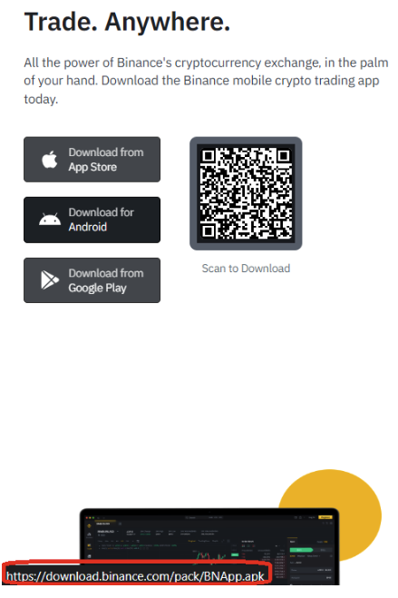

During the past years, Android strengthened its leadership among all mobile operating systems, with an average of approximately 70.96% of the market share. Most of its success is no mere temporary surge because of the developer-friendly application development process. Google offers a plethora of platforms that support the design and development, testing, and sharing of their applications. Consequently, the number of applications in the Google Play Store reached 2.6 million in 2022. 

However, to put that another way, from a security standpoint, the remarkable growth of Android coupled with the fact that a large number of innocent mobile users may become potential victims of cyber attacks. One of the prevalent types of attack is something called repackaging. Repackaging refers to the practice of customizing an existing mobile app and redistributing it in the wild. Specifically, attackers modify a popular app downloaded from app markets, reverse-engineer the app, inject some malicious code, and redistribute the modified app. Because it is difficult for regular users to notice the difference between the repackaged app and the original app, victims may suffer financial loss, mainly when security-critical private and business apps they use, such as Crypto Exchange apps, are repackaged.

## Repackaged Android Apps

Some may get astounded by the fact that Android app is prone to repackaging. We can say that Android is negligent in such an attack. That's because of the intrinsical relation to the structural characteristics of the app distribution process. The app requires "ANY" valid signature to be successfully installed — they do not verify the actual identity of the signer. The app developer (even including the bad actor!) does not need a legitimate public key certificate issued by a trusted authority, indicating the possibility that an actor can modify an existing app, inject some harmful codes, and re-sign it with the self-generated private key. 

What happens when you have installed the repackaged app on your mobile device? Based on our experience,

- Plifering cryptocurrencies
- Stealing your credentials (Account Information, Passport Copy for KYC, ...)
- Leaking your secret phrases
- Or... almost everything you can imagine is possible!

## 2 helpful guidelines for giving the app a check

Whether you're downloading an app as a customer or as a developer NOT via the official app store such as Google Play, there are some essential guidelines and tips that you need to consider to guarantee the safety of your device. Let's check them out!

### Protip 1. Establish trust via download links.

When reading a blog post, you may find they are hosting a third-party download. Clicking the button may lead to potential problems — you must validate the address beforehand. In the case of Binance, the address should be `https://download.binance.com/pack/BNApp.apk`, as shown in the picture below.

But remember, scammers are becoming more innovative and intelligent, and they can disguise the URL to make it look safe. The malicious URL can be various: `https://download.b1nance.com/` or `https://download.blnance.co/`. Although you find the post with no apparent problem, please proceed cautiously!

### Protip 2. Check the digital signature.

With a tool called apksigner, you can check the app's authenticity. The apksigner tool, available in revision 24.0.3 and higher of the Android SDK Build Tools, lets you sign APKs and confirm that an APK's signature will be verified successfully on all Android platform-supported versions by that APK. Make a comparison between the original and repackaged versions — you may immediately sense the difference.

The syntax for confirming the successful verification of an APK's signature on supported platforms is as follows:

`apksigner verify [options] app-name.apk`

The apksigner verify command has the following options.

**--print-certs**

Show information about the APK's signing certificates.

**--min-sdk-version <integer\>**

The lowest Android framework API level that apksigner uses to confirm that the APK's signature will be verified. Higher values allow the tool to use more robust security parameters when signing the app but limit the APK's availability to devices running more recent versions of Android. By default, apksigner uses the value of the minSdkVersion attribute from the app's manifest file.

**--max-sdk-version <integer\>**

The highest Android framework API level that apksigner uses to confirm that the APK's signature will be verified. By default, the tool uses the highest possible API level.

**-v, --verbose**

Use the verbose output mode.

**-Werr**

Treat warnings as errors.

## Conclusion

You should only trust apps obtained from official app stores. Suppose you ever downloaded the Binance app from third-party markets or have already installed it. In that case, you are probably at risk — immediate action is required: change your password, factory reset your device, fresh-install it from our official host, and please contact us for assistance.

Other apps also can be a potential backdoor. Once you use the repackaged app, the lousy actor can annoy you in countless programmatically unimaginable ways. Telegram is a good example: Hashdit once ever stumbled across an unofficial Telegram app replacing crypto wallet addresses with the bad actors' ones on-the-fly.
