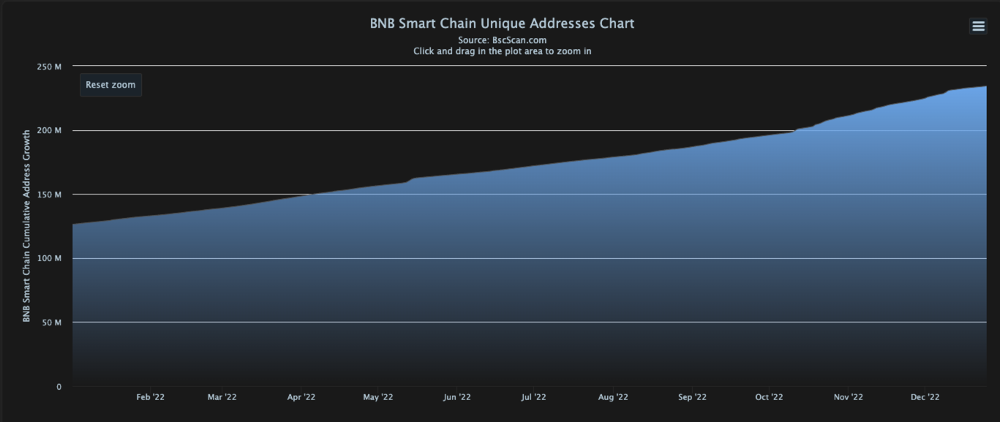
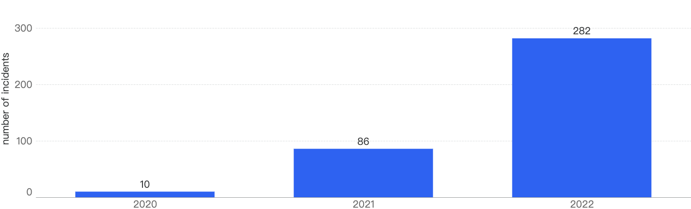
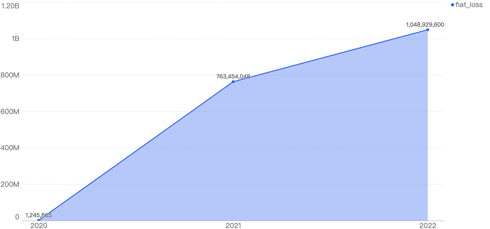
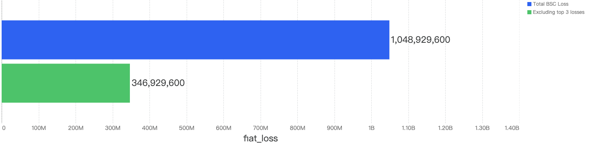
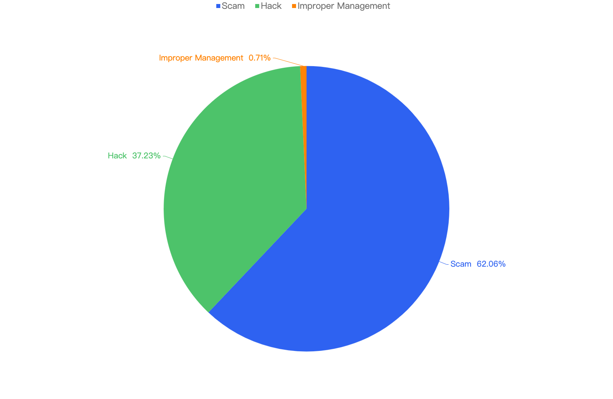
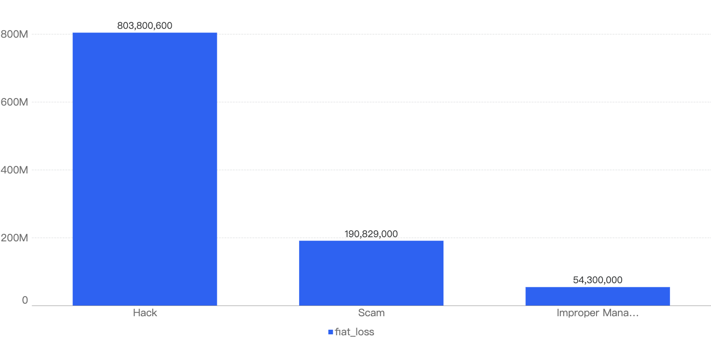
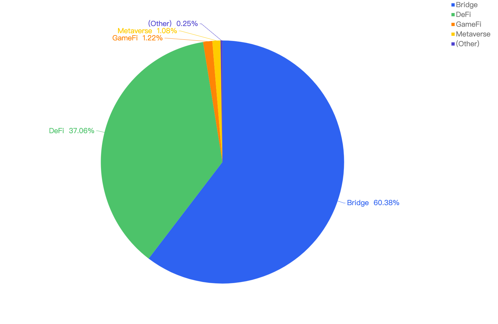

### Overview

This report focuses on security events that happened on BSC in 2022, analyzing the type of projects targeted and sharing the common attack techniques used in 2022, with respect to the financial loss of the incidents.

This report also examines the trends on BSC from 2020 to 2022 to help give readers a better understanding of how the space has grown. Lastly, this report shares some of the products we at Hashdit have developed, and what risks can be covered by the capabilities that Hashdit have/are building.

#### Disclaimer

The financial data provided here is accurate based on our own monitoring system and based on the $USD amount of the crypto currency involved at the time of the incident. Due to the fluctuating price nature of crypto currencies, the total amount loss might differ with the current token valuations.

#### BSC Growth

This year has been a year of building and growth on BSC. Despite the general cryptocurrency bear market and black swan events like [Luna](https://vulcanpost.com/791820/terra-luna-timeline-how-crash-revival-plan/) and [FTX](https://www.investopedia.com/what-went-wrong-with-ftx-6828447), BSC has continued to reach new milestones and surpass expectations.

Here is a list of some of BSC’s achievements in 2022: [Refer to the [blog](https://www.bnbchain.org/en/blog/bnb-chain-enjoys-significant-growth-in-2022-despite-crypto-winter/) released by BNBChain for more information]

- $1 billion growth [fund](https://www.bsc.news/post/bsc-releases-areas-of-investment-focus-for-its-1-billion-growth-fund)
- [AvengerDAO](https://www.bnbchain.org/en/blog/introducing-avengerdao-the-security-initiative-protecting-users-from-malicious-actors/) Launch 
- Implement [Liquidity Staking](https://www.coindesk.com/business/2022/08/30/bnb-chain-introduces-liquid-staking-to-provide-crypto-users-access-to-additional-income-streams/) on BSC and [Binance Account-Based](https://www.binance.com/en/BABT) (BAB) tokens
- OpenSea incorporates [BSC](https://www.coindesk.com/web3/2022/11/29/opensea-adds-support-for-bnb-chain-nfts/)
- [zkBNB](https://www.cryptotimes.io/bnb-chain-unveils-zero-knowledge-proof-scaling-tech-zkbnb/) launched on Testnet
- Unique addresses crossed **234 million**. Source: [BscScan](https://bscscan.com/chart/address)

- Peak TVL - **USD 16.25b** on Jan 3. TVL trend as per screenshot. Source: [Defillama](https://defillama.com/chain/BSC)

- Transactions
    - Peak Txs: **9.78 million** txs on 13th May
    - Avg Daily txs since 01 Jan: **4.34 million txs**  
    - **More than 3.7 billion txs** on BSC

- Active Wallet Addresses (DAU)
    - Peak Daily Active Wallets (DAU): **2.16 million DAU** on 12th Oct 
    - Avg Daily AUs since 01 Jan: **968k** DAU ( compared to **740k DAU**  in 2021) 
        - [Stabilization](https://bscscan.com/chart/active-address) of daily active users, which may suggest a foundational user base of an average of **~1 million** per day
    - Currently ranked no. 1 compared to other chains in terms of DAU 

- Number of DApps
    - **1200/1300** launched in 2022 alone

### BSC Year-over-Year (YoY)

However, due to BSC’s decentralization nature and its fast growth, more bad actors have been attracted to the space as well. As such, security incidents have generally been on a rising trend.

This section aims to describe the security incidents YoY from 2020 to 2022. 

#### General

According to our statistics, in 2022, there were 282 security incidents on BSC which have increased by 228% YoY from 2021. In 2021, there were 86 security incidents, a 760% increase from 2020.

Financial losses have also increased from 2020 to 2022, with damages totalling $1.81 billion over the past 3 years, as seen from the chart below. The YoY increase from 2020 to 2021 is 61,221%, while the YoY increase from 2021 to 2022 is 37%, a large decline in YoY percentage.  

This pie chart shows a better understanding of the financial losses over the year with 2022 accounting for 57.84% of the total financial loss across, 2021 being 42.10% and 2020 with a mere 0.07%.

#### Type of attack vectors
According to our statistics, this is the breakdown of the general attack vectors from 2020 - 2022.

It can be seen that crypto scams (in green) are a growing concern on the BSC, with 167 in 2022, a 328% increase YoY. Also, there were 2 counts of improper management incidents in 2022, which were never accounted for previously. This seems to suggest that project parties might be getting more sloppy with user’s funds, mishandling them.

#### Type of projects

This chart represents the type of projects that were exploited since 2020.

It is clear that DeFi projects are still the main targets for crypto hackers, with 208 in 2022, a 147% increase from 2021. 

Bridge and GameFi projects were the only other projects which encountered security incidents in 2021, besides DeFi projects. In total, 9 Bridge and 19 GameFi projects were exploited, a 800% and 1800% increase respectively from 2021.

With the expansion of the BSC ecosystem, other categories of projects came into the limelight such as ExerciseFi and SocialFi, which did not exist back in 2021. Some of these projects were victims of hacks as well.

### 2022 in focus

#### General
In total, nearly $1.05 billion were lost to security incidents on BSC. By observing the monthly chart below, the months with the top amount loss were October, January followed by June. 

In those months, the main contributing incidents were (1) BSC token hub exploit, (2) Qubit exploit, and lastly the (3) EvoDefi bridge mismanagement incident.  

Interestingly, when removing these 3 outlier incidents from the chart, the total financial loss drops down to just $346.9m, a staggering 67% drop or one-third of total amount loss of 2022. 

This chart is closely correlated to the number of security incidents monthly in 2022. 

.png)

For example, the highest number of security incidents took place in October which is in line with the highest amount of loss.

However, months that have a higher number of security incidents might have a low amount of loss too. For example, even though August has 29 security incidents which is above the monthly average (23), the financial loss for that month is only $8m which is the 2nd lowest throughout the year.

#### Type of attack vectors

Out of the 282 security incidents, crypto scams are the most common on the BNB Chain as shown below, 62.06% of security incidents are crypto scams, followed by 37.23% are hacks and 0.71% are improper management.

However, it is interesting to note that the total financial loss of scams ($190m) is less than half of the loss to hacks ($803m).

For further analysis of the specific attack vectors, this chart displays this against the financial loss in 2022.

32.93% attributes to the BSC token hub exploit incident where there was a low level vulnerability, specifically an [IAVL](https://pkg.go.dev/github.com/cosmos/iavl) tree related verification bug. The 2nd largest contributor was Business Logic Vulnerabilities within smart contracts deployed on BSC, accounting for 29.45%. 

It is notable here that “low-level” scams like Rugpull and Ponzi, even though they are the most common, do not take up much of the proportion as seen in the pie chart.

#### Type of projects

When focusing on the project type vs financial loss, without surprise, 60.38% of financial loss are attributed to Bridge projects. This is because cross-chain bridges generally lock large amounts of crypto assets on one chain to mint collateralized assets on the destination chain. Hackers took notice of this trend and targeted vulnerabilities within these cross-chain bridge smart contracts.

The 2nd most project type targeted was DeFi projects at 37.06%, followed by GameFi and Metaverse projects at 1.22% and 1.08% respectively. 

#### Top 10 incidents in 2022 

The following were the top 10 security incidents in terms of financial loss in 2022. 

#### Top 10 incidents in 2022 

##### BSC Token Hub exploit - $572 Million Loss

On 6th October 2022, BSC Token hub, a bridge between the BNB Beacon Chain and the BNB Smart Chain, was exploited by an attacker resulting in the unauthorized transfer of 2M BNB.

Root cause analysis confirmed a flaw in the verification implementation developed by Cosmos, and incorporated by BSC into their contract’s proof verification process. Essentially, there was a bug in the proof verification which allowed the attacker to forge arbitrary messages. Fortunately, the attacker here only forged two messages, as the damage could have been far worse.

##### QubitFinance - $80 Million Loss

On 27th Jan 2022, the Qubit protocol was exploited, resulting in almost $80M loss. Qubit Bridge is essentially a platform for users to collateralize their ETH on the Ethereum chain without moving assets to BSC. The incident was due to a flawed minting of qXETH on BSC where the tokens were later used for borrowing assets via Qubit lending. 

Root cause analysis was that a legacy function (deposit) remained in the Qbridge Handler contract after it was replaced by a newer function (depositETH).

The legacy function did not check the amount of tokens, in this case WETH, supposed to be transferred in. As a result, the attacker was able to pass in the 0x0 address to fake a deposit event.

##### EvoDefi - $50 Million Loss

The team behind EVODeFi, a cross-chain platform offering a set of crypto products on BNB Smart Chain (BSC) & Polygon, invested users’ funds on Terra’s Anchor Protocol in order to fund their cross-platform bridge as well as sustain high APR on ValleySwap, the second project owned by the team. In a further effort to boost APR on ValleySwap, the team minted unbacked USDT, causing funds on Oasis Emerald to be unbacked, the network ValleySwap was based on.

However, due to the collapse of Terra’s ecosystem, EVODeFi lost their investment in Anchor Protocol, their unbacked USDT became worthless, and they had no liquidity to continue operations.

Thus, EVODeFi was forced to close their bridge, trapping millions of dollars worth of users’ funds on Oasis, with no way to move funds out of Oasis Network without losing a majority of their fund’s value.

##### StableFund - $23 Million Loss

StableFund was identified to be a Ponzi scheme. The project team can get a risk-free 3% handling fee, while it was marketed that the participants can get 1.5% rewards every day, and they can choose to get their principal back after 4 weeks. 

In reality, the project does not have any profit-making method, to sustain the high 1.5% daily yield. The rewards of the first entrants need to be paid by the principal of the latter entrants, this is the standard Ponzi feature. 

The project started from 2022-06-27, where >13k addresses have participated, and more than $23 million have been invested into the pools so far.

##### Elephant Money - $22 Million Loss

On 13th April 2022, Elephant Money was exploited, resulting in the loss of 27,416.46 BNB. The attacker first used WBNB to buy a large amount of ELEPHANT, and then used BUSD to mint the TRUNK stablecoin. During the minting process, the Elephant contract will convert BUSD to WBNB and then back to ELEPHANT to drive up the ELEPHANT price. 

The root cause was that the vulnerable contract relied on the instantaneous price of ELEPHANT-WBNB liquidity pool. Since, the value of ELEPHANT was artificially inflated, the attacker could mint more TRUNK stablecoin, which he can redeem back for WBNB and BUSD.

##### Transit Finance - $21 Million Loss

On 1st October 2022, Transit Finance / Swap (a cross-chain protocol) was exploited for > $21m. Essentially, this attack targeted the users directly via a vulnerability in the use of the transferFrom() function. Any tokens approved for trading on Transit Swap could be transferred directly from users’ wallets to the unknown exploiter’s address.

Thankfully, > $18.9m was returned to the Transit Finance on the receiver address 0xfab745c5ee6c59c09605a40464232930892ba48c on both chains (ETH and BNB).  

The root cause was that there was a lack of validation for input parameters. The hacker parsed in the Permissions management contract to the vulnerable contract and called the claimTokens function to do a transferFrom from users that have unlimited approval to this contract.

##### ANKR / Helio - $20 Million Loss

On 2nd December 2022, Ankr protocol was exploited for around $5m, but what was surprising was 1 of their products, Helio, was impacted as well for around $15m, bringing the total damage to ~$20m. Essentially, the root cause was that the private key of the Ankr deployer was compromised. According to the team, it was an insider attack that stole the private key. As such, the exploiter introduced a backdoor function and minted a large amount of unbacked aBNBc tokens to drain the liquidity pool for BNB. 

Helio was impacted because one of the ways to provide collateral on their platform was aBNBc. Since the value of aBNBc has plummeted, many users seized the opportunity to purchase it at a valuation below market value. At the same time, Helio uses Chainlink to reflect the actual value of BNB at that point of time. As such, these users had a higher collateral value than expected where they could borrow large amounts of $HAY (platform’s stablecoin) and not pay back the debt.

##### Racoon Network and Freedom Protocol - $20 Million Loss

On 20th July 2022, Racoon Network and Freedom Protocol performed a rugpull. More than 20 million USDT were transferred to the same EOA address, suggesting that they belong to the same party. 10% of the funds were transferred from Raccoon Network, while 90% of the funds were transferred from Freedom Protocol.

For Raccoon Network, the loophole is in the unverified token contract, Raccoon Network Token (RAC). In this token, every time a user transfers a RAC token, there is a 6% tax and the tax fees are transferred to an EOA, where the malicious project party could cash out to USDT anytime.

For the Freedom Protocol, the project party collected USDT by selling their NFTs at a price of 100 USDT. Afterwards, they did not continue their development and the funds have since been transferred out through CEXs.

##### $FLARE - $17 Million Loss

On 14th November 2022, $FLARE token conducted an exit scam of ~$17m. Essentially, the root cause was the victim contract (unverified) allowed the attacker to use a faketoken as input to call getUserInfo() and then set some value to the "balance" related data structure.

The project has a rewards contract which rewards users who have invested USDT, in exchange they get USDT. Internally, there is this “balance” related data structure which calls the investing contract and getUserInfo() to keep track of how much tokens have been invested.

However, the lack of input validation allowed the exploiter to parse the address input of his faketoken, with the necessary getUserInfo() method and fake his amount invested.

##### DEGO Finance / Cocos - $15 Million Loss

On 9th February 2022, DEGO Finance / Cocos were hacked for $15m. The hacker compromised multiple private keys of the team. As a result, the hacker removed liquidity from the projects and stole all funds from their hot wallets. The funds have already been bridged to ETH chain and deposited into Tornado Cash.

### Conclusion

BSC continues to be a strong competitor, outperforming Ethereum in terms of daily active users and transactions. However, it is undeniable that 2022 has proven to be a tough year for both investors and developers due to the bear market and hack incidents, which impeded trust within the cryptocurrency community. Below we have some final tips for investors and developers:

For investors:
- Understand what you're signing, don't blindly sign random signatures/transactions (never sign signatures outside of official websites)
- Always double check that you are on the official website of the dapp
- Be extra wary of new/trending projects or projects that guarantee High APYs / use MEV bots, and always verify the project team’s authenticity
- Use multiple wallets for different activities (hot wallet for frequent transactions; cold wallet to store high value funds)
- Ensure you are interacting with an open-source contract and revoke approval once interaction is done

**Feel free to reach out to our team if you have any doubts about a certain project / transaction!**

For developers:
- Verify & open-source all relevant contracts on-chain (to ensure transparency and trust within the space)
- Ensure the project is audited by at least 2 well-known security companies and fix all issues where applicable
- Incorporate / Implement a bug-bounty program to upkeep the security posture of the project and encourage the community to ensure the code remains secure
- Ensure security is at the core of the business: run sufficient testing / simulations using industry standard tools such as Slither to fix all vulnerabilities 
- Prevent centralization risks by using multi signature wallets and not a single EOA wallet to run operations
- Minimize contract upgradeability and only apply to contracts when necessary

#### Hashdit

HashDit’s core mission is to provide the essential threat intelligence for the everyday crypto investors to make informed decisions. 

Thanks to our ever hardworking team, Hashdit has launched several products in 2022.

We use a variety of automated and manual techniques to evaluate a Dapp project. 

Products at Hashdit currently:
- **Meter**: All-in-one collection of security rating framework, auto-scan tools, and corresponding APIs, which are able to deliver accurate detection for potential rugpull/exploit risks based on a smart contract address. 

    It is able to detect multiple other risks, besides the usual SWC bugs, such as Tornado Cash interaction, risky functions encompassing ERC20 or ERC721 token standards (such as Migrate() or Blacklist() ), HoneyPot detection, etc. This can help users gain a better understanding of the smart contract, if it could be a scam.

- **Audit service**: Comprehensive code audits for smart contracts and discovering code loopholes / security vulnerabilities before they are deployed on-chain, guaranteeing users’ safety on BSC. 

- **Monitoring**: Detecting sensitive events / transactions that happen on-chain to quickly respond and minimize any additional financial losses. At the same time, Hashdit warns users early by sharing any information we found on our [Twitter](https://twitter.com/hashdit?s=21&t=U4gLkKc72FyZ1zfJDsWzqg) 

We have an amazing roadmap planned for 2023 to reduce the security incidents on BSC, especially towards Bridge projects and Scams. We are excited to present even better products in the future and improve BSC overall security.

To a better year ahead! Happy new year to all! 

### Glossary

#### General Incident classification
The type of incidents can be generally broken down into 3 types:

* Hacks
    * Hacks in general, is the practice of intentionally exploiting weaknesses in an organization's computer systems. In the context of blockchain, it is exploiting vulnerabilities in fundamental components of Dapps and in the blockchain infrastructure. The non-exhaustive  list of components can be: blockchain bridges, oracles, crypto wallets, Frontend/backend application and smart contracts which are deployed on-chain. Examples include business logic issues and lack of validation.
    * At times, it could be compromising the private keys of project teams through traditional attack vectors.

* Scams
    * Scams are Web3 projects that do not intend to deliver promised features. Indeed, they usually entice users to invest or participate in the project with the only intent of keeping their invested money and leaving the users hanging. 
    * Scams could be executed by dumping tokens, stealing all the invested funds, through means like sending sketchy emails and websites, or creating fake accounts on social media. In the context of blockchain, scams can involve investing in a “Get-rich-quick scheme” such as a Ponzi scheme or tricking users into signing unintended transactions that will result in stolen funds.
    
    * Do refer to our blog article for more details on the [top 6 crypto scams](https://hashdit.github.io/hashdit/blog/top-6-crypto-scams-2022/) in 2022. 

* Improper Management
    * Improper Management is a unique situation where the project party mishandles user funds. Some examples include misconfiguration issues in the backend when making certain operations or when the project party mints uncollateralized funds to perform high risk trading. This will be at the expense of users’ funds being lost.

#### Project type classification

* Bridge
    * A blockchain bridge is a tool that lets you port assets from one blockchain to another, solving one of the main pain points within blockchains – a lack of interoperability. Since blockchain assets are often not compatible with one another, bridges create synthetic derivatives that represent an asset from another blockchain.

* DeFi (Decentralized Finance)
    * Decentralized finance (DeFi) is a new financial framework consisting of decentralized blockchain protocols and underlying smart contract technology. DeFi, as it is most commonly known, makes it possible for users to access different types of financial products and services without the need for a centralized authority.

* GameFi (Play-to-Earn)
    * 'GameFi' refers to the financialisation of video gaming. It is characterized by its 'play-to-earn' (P2E) business model, and mainly refers to blockchain games that offer tokenized incentives to players while enabling frameworks for player-as-owner rather than the standard player-as-consumer.

* Learn-to-Earn
    * 'Learn-to-Earn’ refers to the financialisation of quizzing. It is characterized by the business model, which offers tokenized incentives to players who participate in the project and answer quizzes.

* Metaverse
    * Crypto metaverses are immersive virtual worlds with immense social and financial potential. Their use of blockchain infrastructure enables them to tap into the wider crypto economy, making virtual items exchangeable for real economic value beyond the confines of the metaverse.

* SocialFi
    * SocialFi is the fusion of social media and Web3. It refers to social media on a blockchain with a layer of finance in it. The concept brings together the principles of decentralized finance (DeFi) and social media to create, manage, and own content generated by the users on the platforms.

* ExerciseFi
    * ExerciseFi or Move-to-Earn as its name implies, users are rewarded for movement, whether walking, running or dancing to a rhythm.

* Oracle
    * Oracles are complex computerized systems that connect data from the outside world (off-chain) with the blockchain world (on-chain). Most blockchains have native cryptocurrencies that are used to transfer value, enable the operations of the protocol, or facilitate governance.

* Wallet
    * A cryptocurrency Wallet is an application that functions as a wallet for your cryptocurrency. It is called a wallet because it is used similarly to a wallet you put cash and cards in. Instead of holding these physical items, it stores the passkeys you use to sign for your cryptocurrency transactions and provides the interface that lets you access your crypto.

* DAO
    * A decentralized autonomous organization (DAO) is an emerging form of legal structure that has no central governing body and whose members share a common goal to act in the best interest of the entity.

