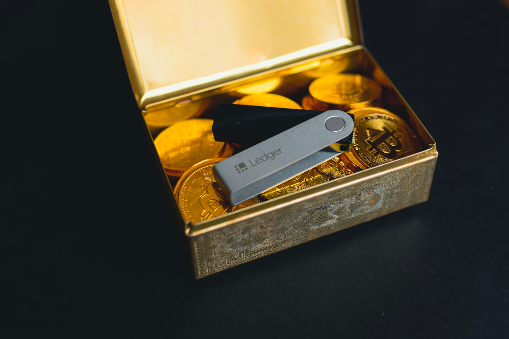

# The Risks and Future of Crypto Wallets

## Introduction

&emsp;Crypto wallets are a piece of software used to manage and transfer crypto assets. But different from traditional wallets, no crypto assets are stored in them. Crypto wallets, however, are composed of a public key that is associated with the wallet's public address used to send someone crypto assets. and, private keys, which are necessary to access and manage the associated assets. Crypto assets stay on chain, their smart contract state changes to reflect the changing of owners.

&emsp;Crypto wallets are the first component a new user has to start learning. And they are fundamental for anyone wanting to interact with crypto assets, decentralized applications (Dapps) - in Decentralized Finance, Non-Fungible Tokens, Decentralized Autonomous Organizations, etc.

&emsp;Even if under the hood, crypto wallets rely on the usage of secure asymmetric cryptographic keys, managing such keys has always been a security challenge in the IT industry. Over the years, asymmetric keys have been used to secure communications between parties, by ensuring message confidentiality and are heavily used to secure internet communications between browsers and servers, with the famous HTTPS standard.

  

<i>Figure 1</i>: <u>Worldwide secure communication with TLS and HTTPS.</u>

   

&emsp;Now, cryptographic keys have the challenge of securing crypto assets. This is a completely new use case that presents more risks than using public key infrastructure (PKI) to secure messages between parties over the internet. The financial impacts cannot be compared. Instead of being stored securely in Hardware Security Module (HSM), managed by a Key Management System secured by cloud providers with years of experience and a team of experts, crypto wallets can now be stored in a browser plugin, in a web app, mobile app or in a desktop app. Lot of relevant characteristics exist for crypto wallets: are they hot wallets, cold wallets, paper wallets, or hardware wallets? Do they implement hierarchical deterministic standards, are they blockchain-specific, multi-chain? Are they self-custody or 3rd party custody? With all these questions, arise security concerns that we are not addressing in the article.

&emsp;Mismanaging crypto private keys has been a common cause of loss of funds for investors and a reason for Dapps to be hacked. In the long run, this becomes a major problem for wide crypto adoption. Especially when compared with today's banking system security and user experience.

&emsp;So far, the Web3 industry has been getting inspiration from the IT industry's best practices, when considering the public key infrastructure. However, is it enough? Should the Web3 industry create new standards dedicated to such use cases?

## Crypto Wallets and Single Point of Failure (SPOF)

&emsp;However, the usage of public keys to managing assets associated with a crypto wallet is unfortunately risky. Indeed, the seed phrase and the private keys become a central security element that can put all the funds associated at risk. In this article, we are further evaluating the risks associated with the loss or the theft/leak of private keys.

### Loss of Seed Phrases and Private Keys

&emsp; If a private key or a seed phrase is lost, users are not able to access their crypto assets. According to Chainalysis, 20% or $140 billion dollars of all bitcoins are lost. Many stories of users that lost their wallet password, or the hard drive containing the wallets, seed phrases, and hardware wallets. Once keys are lost, by design, for asymmetric cryptographic keys to be secure, it is impossible to regenerate the private key. Therefore, funds are lost forever.

### Stolen or Leaked Private Keys and Seed Phrases

&emsp;Similarly, if these sensitive pieces of information are stolen, malicious actors get full control of one's assets. The most common and most effective type of attacks in the crypto industry is the usage of social engineering attacks, phishing and scams are still the most profitable ways to steal crypto assets because they are single and rapid to be put into place, one only need to build a fake website pretending to be real Web3 projects, or fake wallet application that steal the data one inadvertently shares with them. In many cases, such malicious applications request seed phrases or private keys, which should never be shared - only if one migrates their wallet’s private keys to another wallet provider. To summarize, as a user or investor, it just requires a small amount of inattention for one to click a malicious link and interact with the underlying application for them to lose part of all of their crypto assets.

&emsp;For projects, it becomes a real problem to manage a considerable amount of crypto assets. The project is only as secure as their less secure link. Not only are they susceptible to phishing attacks, but also, to hacks and sometimes internal jobs or an employee who went rogue that could be covered as hacks.

&emsp;Note: If one discovers, their private keys or seed phrases have been compromised, they should move any remaining assets to a new safe wallet as soon as possible!

&emsp;This is why we consider crypto wallets a single point of failure. A single point of failure is a part of a system that, if it fails, causes the entire system (Decentralized application or wallet) to fail. It is a critical component or a bottleneck that, if it becomes unavailable, causes the system to be unavailable as well. It is important to identify and mitigate single points of failure in order to increase the reliability and availability of a system.

&emsp;In a Public Key Infrastructure (PKI) system, a single point of failure can exist if the private key associated with a particular public key is lost or compromised.

&emsp;So let’s consider the classic dilemma in the web3 ecosystem: “Not your crypto, not your coins” - the dilemma between self-custody such as hardware wallets, and third-party custody, such as in exchanges. On the one hand, one should take full ownership of managing their crypto wallets, using, storing, and securing them on their own. They would be subjected to the existing risk of losing or mismanaging them. On the other hand, some users would rather delegate the management of their crypto wallet to a third party that is specialized in the matter. This is a valid debate.

<i>Figure 2</i>: <u>Ledger self-custody hardware wallet.</u>

 
&emsp;It is important however for every end-user to understand the risks associated with the management of crypto wallets. But when thinking of mass adoption, there is always a community that would rather pay not to have to waste time or to worry about the risks and responsibility that it is to securely manage their crypto life savings. Such groups would rather rely on a trusted third-party entity to do it for them. Similar to what we have done over the years with banks and insurance.

<i>Figure 3</i>: <u>Illustration of a third-party custody safe.</u>

 
&emsp;However, in this article, we are not evaluating the many practical and philosophical pros and cons of each one of the options and are limiting ourselves to mentioning that each option implies a very different level of responsibilities and requires different levels of expertise in cybersecurity, in general. Self-custody, with today’s technology, is still risky even for individuals with technical knowledge.

&emsp;But, many solutions are in place to address the single point of failure problem and enable a more secure self-custody experience for users and web3 projects. So let’s discover the solutions.

## The Secure Future of Crypto Wallets

&emsp;To mitigate the risks of a single point of failure in PKI, over the years organizations have created securities policies and best practices gathered in security frameworks such as the ISO/IEC 27099. In such a framework, some of the guidelines suggest the implementation of robust key management protocols in combination with HSMs, as well as regular testing and monitoring of these systems for vulnerabilities. This includes implementing measures such as backups and redundant solutions to ensure that the system remains functional in the event of a key management failure, at the software and hardware level.

&emsp;However, the crypto space has changed the way we use public key infrastructure. Now, the new practice is to use it for managing crypto assets. And PKI's traditional policies and procedures did not take into account the usage of such mechanisms for crypto asset management. The web3 industry had to develop solutions for this new use case of asymmetric keys being used as wallets.

&emsp;Thanks to cryptographic techniques such as signature verification, multi-party computing (MPC), and smart contracts technology, two new solutions are being considered the future of crypto wallets because of their ease of use, flexibility, security, control, compatibility with current existing solutions while addressing the problems of a single point of failure. On the one hand, there are the Multi-party Computation Wallets and the Smart Wallets, also known as multi-signature (multisig) wallets.

### Multi-Party Computation Wallets

&emsp;Firstly, multi-party computation (MPC) wallets are crypto asset wallets that can use MPC cryptographic techniques such as secret sharing, homomorphic encryption, zero-knowledge proof, or oblivious transfer. The goal of such solutions is to enable different parties to manage one private key and the assets associated with it, without one single participant knowing the whole private key. This means, not a single entity knows the private key on his own, which prevents them from accessing the funds.

&emsp;Such particularity makes an MPC wallet a tool for creating a shared crypto account, with family members or with your business partners. MPC wallets help in introducing trust when required to manage crypto assets together.

&emsp;MPC wallets are still in their early days, mainly because (secure) multi-party computation is still an evolving field in cryptographic and should still evolve in the next few years with great new techniques.

Here are some of the MPC <b>advantages</b>:

<ul>
    <li>Off-chain recovery.</li>
    <li>Chain agnostic.</li>
    <li>No gas overhead.</li>
    <li>No need for change in Dapp for integration.</li>
</ul>

Some of the <b>drawbacks</b> are:

<ul>
<li>Early stage technology, libraries implementations, which is not great from a security point of view because they can have undetected vulnerabilities.</li>
<li>Immutability and lack of redundancy - once created, one cannot change the signers of the associated wallets. In case one loses their wallet, all the funds stored in the MPC will stay blocked.</li>
<li>All wallets associated with it have to sign. There is no m-over-n signature architecture.</li>
</ul>

### Smart Wallets

&emsp;Secondly, smart (contract) wallets or multisig wallets have been used and battle-tested for longer. Indeed, they are smart contracts deployed on chains and publicly available for anyone to verify. With smart wallets, similarly to MPC wallets, it is possible for a group of individuals to manage together crypto assets associated with the main smart wallet.

&emsp;Multisig wallet owners are able to set up the minimum number of signatures required for the wallet to validate and authorize transactions. This allows them to distribute the keys associated with the main wallet account to other parties, decentralizing the responsibility of managing the funds of a project and creating redundancy.

&emsp;Practically speaking, to authorize a transaction multiple parties have to read and validate the transaction before it can be taken into account. Thanks to this mechanism, if one of the private keys is lost or stolen, a malicious actor will not be able to access the funds without the other wallet owners. And they are notified someone is performing a suspicious transaction that can be confirmed directly with other key managers. Such a mechanism provides an additional layer of security for the wallet and the crypto assets it holds.

&emsp;Multisig wallets are important for individual users who want to keep ownership of their crypto assets. This helps solve the problem of lost hard drives where crypto wallets or seed phrases were stored. If one gets lost, they still can manage the funds and reconfigure the multisig and remove the lost key and add a new one.

<i>Figure 4</i>: <u>2 of 3 Multi-Signature wallet.</u>

 

&emsp;Additionally, multisig wallets can provide an additional layer of security for organizations or groups such as DAO that hold large amounts of crypto assets. By requiring multiple signatures for transactions, multisig wallets can help to prevent unauthorized access or misuse of the funds. One of the main actors that can benefit from multisig wallets is the web3 projects. In recent history, many hacks such as The AscenDex hack as well as the Ankr protocol hack happened because of leaked/stolen private keys. These two projects suffered major financial losses severely impacting not only the project financials but their partners and the trust placed in them by the users, investors, and the community. Multi-sig could become a new standard.

&emsp;Multi sig has also a very interesting added value. From the perspective of web3 projects and protocols: The increasing number of smart contracts in a decentralized application and the increasing complexity of their architecture and interactions, it becomes fundamental to provide transparency and visibility on key performance indicators such as the usage of a secure crypto wallet. They fulfill two main roles: managing crypto assets, but also performing important actions in decentralized applications such as updating the smart contract, pausing a protocol, changing the fees, etc.

&emsp;Such information is relevant not only for web3 projects' internal security and monitoring but also to increase trust between them and business partners, customers and investors. Since the blockchain is a single source of truth, all the stakeholders can easily verify the security measure on the chain,

<i>Figure 5</i>: <u>Observability and Monitoring.</u>

 
&emsp; Smart wallets are one of the most advanced security solutions for managing crypto wallets for projects to allow anyone to certify they are using proper security measures to protect their applications and as a consequence, protect their users, their business partners, and their community.

Smart wallets are quite versatile, enabling more features, and here are a few of them:

<ul>
<li>Timelock - prevent spending before a certain date.</li>
<li>Spending limits.</li>
<li>Mutability, add and remove keys or signers after the wallet is set up.</li>
<li>Gas abstractions and pay for fees with other tokens than network tokens.</li>
<li>Transaction batching.</li>
</ul>

Some of the <b>drawbacks</b> are:

<ul>
    <li>The overhead for the multi-wallet creation is about 30-40.000 gas and an additional 2.000 gas on the subsequent ones.</li>
    <li>Requires Dapp adoption of the EIP 1271 standard.</li>
</ul>

## Conclusion on the Security Perspective.

&emsp;MPC and Smart Wallets are the future technologies for crypto wallets even if MPC and its cryptographic technologies are still being developed and standardized. Multisig, on the other hand, has been around for longer, and battle-tested and even hacked with the Parity Multisig Hack which made projects put more effort into smart wallet security. Both types of wallets create redundancy to prevent the mismanagement of funds by one user.

&emsp;Even if MPC wallets display a simpler and off-chain process for wallet creation and recovery, being a little cheaper to use and more compatible with decentralized applications, they lack flexibility once they are created. Losing any of the keys required to sign a transaction prevents the parties from accessing the wallet's funds. Smart wallets on the other hand are more flexible, users can be added or removed from the multisig wallet, and keys can be rotated, which is important in case of a security breach or a lost key. Finally, because they are smart contracts, they can implement very different functional features such as paying limits, lack of funds, and others.

&emsp;We prefer Multi-signature wallets over other options such as multi-party computation wallets because the latter cannot be easily identified nor audited on-chain. Any project user, business partner, or investor can verify on the chain they are using security best practices to reduce the risks associated with a compromised private key be it an internal job or an external hack, it just makes the whole system more redundant and resilient.

