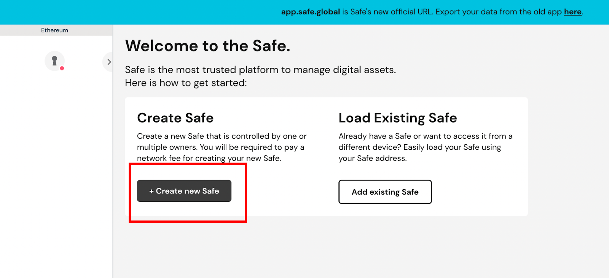
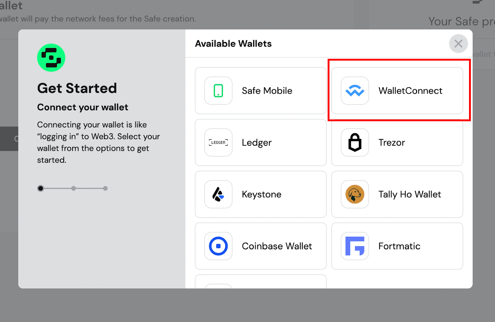
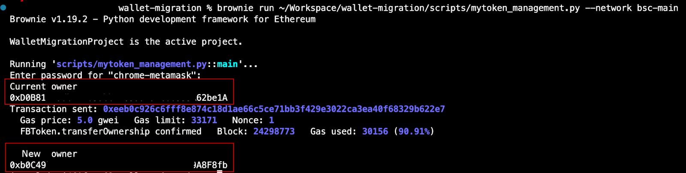

## Smart Contract Wallets, the Future of Crypto Wallets?

&emsp;Multi-signature wallets, also referred to as multisig wallets, are standardized smart contracts that consolidate multiple accounts and private keys into a single wallet for managing crypto assets. The main goal of a multisig wallet is to create redundancy by requiring multiple private key signatures to authorize a transaction, similar to other crypto wallet solutions. Smart wallets utilize a group of exclusive key pairs and wallet owners can set the minimum number of signatures required for authorizing any transaction, allowing them to distribute the keys associated with the primary wallet to other parties and decentralize the responsibility of managing funds. As a result, multiple parties must sign off on a transaction before it is validated, providing an extra layer of security for the wallet and the crypto assets associated with it. This mechanism also prevents malicious actors from accessing funds if one of the accounts private keys is lost or stolen.

&emsp;To learn more about the risks associated with traditional crypto wallets and to get a comprehensive technical analysis of the benefits of using a multisig wallet, please check out our article, [The Risk and Future of Crypto Wallets](https://hashdit.github.io/hashdit/blog/The-risks-and-future-of-crypto-wallets/). In this article, we compare MPC Wallet and Smart Wallets and explain which one is preferable from a security perspective. As crypto wallets are a critical component in a blockchain system, it is crucial to establish robust policies, guidelines, and best practices to safeguard and benefit the entire community.

&emsp;That's why we've created a guide on how to migrate from a conventional wallet to a multisig solution. Since crypto wallets are a single point of failure, we recommend transitioning to smart wallets to reduce the impact if one of the private keys is intentionally or accidentally leaked. Additionally, this significantly diminishes the likelihood of former employees attacking the protocol in case of an inside job.

## How to Migrate to a Smart Wallet

&emsp;This guide outlines the process of migrating your wallets to a secure multisig wallet using Gnosis Safe and Trust Wallet. We provide step-by-step instructions for you and your team to perform a straightforward migration by transferring smart contract ownership to the newly created multi-sig wallet.

<i>Figure 1</i>: <u>Time to migrate.</u>

 

### Out of scope

The following point will not be detailled on our guide.
<ul>
<li>To create an account on Trust Wallet. Please refer to this <a href="https://www.binance.com/en/blog/ecosystem/the-ultimate-beginners-guide-to-trust-wallet-348207409895657170">guide</a> .</li>
<li>For a detailed explanation of the usage of an upgradable contract, please refer to <a href="https://docs.openzeppelin.com/upgrades-plugins/1.x/proxies"> Openzeppelin Documentation</a>.</li>
<li>Technical teams should be able to choose their favorite web3 development and testing framework to properly create the transactions required to perform the contract migration. Also, they should be able to perform the proper setup for testnet and mainnet.</li>
</ul>

### Migration Prerequisites

&emsp;We highly recommend that all projects managing significant amounts of crypto assets, such as project treasuries, migrate their funds to new smart wallets. Additionally, we strongly advise projects with simple crypto wallets that have elevated privileges in their decentralized applications to switch to a multisig solution. If your project has any roles with elevated privileges in its smart contracts, it is essential to migrate all the wallets from classic to multisig setups. This guide provides detailed instructions on how to use Gnosis Safe and Trust Wallet to manage the Safe. However, before considering migrating your smart contracts to a multisig solution, ensure that your project complies with the following requirements:

&emsp;Make sure your smart contracts have a mechanism to change the addresses with elevated roles. For instance, if your smart contract is using the Ownable interface, one might be able to use the contract function [transferOwnership](https://docs.openzeppelin.com/contracts/2.x/api/ownership#Ownable-transferOwnership-address-) to transfer the ownership between addresses - in this case from an External Owned Address (EOA) to the multisig wallet. If your contract does not have this capability to change a role address, we suggest adding such capability to a new version of your smart contract and upgrading it. Note: to upgrade one’s smart contract, one needs to use a proxy smart contract.
Create your Multisig wallet using [Gnosis Safe](https://gnosis-safe.io/).
Create your free [Trust Wallet](https://trustwallet.com/) account, on mobile or desktop.

#### Migration steps

<ol>
<li>Creation of a Gnosis Safe.</li>
<li>Prepare smart contract migration in the test phase (testnet).</li>
<li>Perform and validate smart contract migration on production (mainnet).</li>
</ol>

### Create the Gnosis Safe

<ol>
<li>Start the creation process</li>

To create a new Gnosis safe multi-wallet, connect to their official website and select the option to create a new Safe.

<i>Figure 2:</i> <u>Gnosis Safe safe creation process</u>

 

<li>Use Wallet Connect</li>

To connect their multisig wallet with Trust Wallet, select the WalletConnect plugin.

<i>Figure 3:</i> <u>Connecting Trust Wallet via WalletConnect</u>

 

<li>Connect With Trust Wallet</li>

Open Trust Wallet with the device of your choice. Trust Wallet exists for mobile android, iOS, Web plugins's and desktop platforms.

&emsp;To associate your wallet with the multisig one, use your favorite platform and either scan the QR code that appears on your screen with your smartphone or upload the QR code using the associate feature in the app. Make sure to choose the Trust Wallet with enough funds to pay for the Transaction. In our case, the multisig creation cost only 0.31$.

<i>Figure 4:</i> <u>Wallet Connect QR code connection.</u>

 

<li> Associate the wallets via QR code identification.</li>

&emsp;After scanning the QR code with the Trust Wallet application, the Trust Wallet BNB Smart Chain address becomes available on the right top corner of the following page.

<li>Setup the multisig wallet details</li>

&emsp;Choose a multisig wallet name that is displayed in the Gnosis Safe web app.
Finally, make sure you select the BNB Smart Chain network.

<i>Figure 5:</i> <u>Safe wallet setup for BNB Smart Chain, connected to one’s Trust Wallet account.</u>

 

<li>Setup the wallets and threshold.</li>

Click Next and add the other wallet addresses of the wallets used to validate your transactions.

&emsp;For relevant crypto wallets, we recommend at least 3 signatures. Also, we recommend using a threshold of at least 50% of the total number of associated wallets. The more keys a project manages the larger surface of the attack and the higher the probability of mismanaging them or having them stolen.

&emsp;Such a recommendation comes after the incident with Harmony Horizon Bridge had 2 out of 5 private keys stolen and also raised a concern about how to securely manage private keys on a validator node… But that's a discussion for another time.

<i>Figure 6:</i> <u>Setup of underlying wallets associated with the multisig wallet.</u>

 

<li>Review the final setup.</li>

The next page displays the summary of the Wallet setup.

<i>Figure 7:</i> <u>Multi Sig creation Summary.</u>

 

<li>Validate the multisig creation from your TrustWallet app.</li>

&emsp;When clicking next, your Gnosis requests the confirmation and the signature from your first and main wallet. In the meantime, the screen looks like this:

<i>Figure 8:</i> <u>Wallet creation awaiting confirmation.</u>

 

This is the message you receives in your Trust Wallet application:

    

<i>Figure 9:</i> <u>Trust Wallet mobile app view on multisig wallet creation approval.</u>

 

&emsp;Approving the transaction pays the required fees for Gnosis to deploy the multisig smart contract on the chain. Once the transaction is approved and paid, the Gnosis web app should change to

<i>Figure 10:</i> <u>Successful creation of the smart wallet.</u>

 

&emsp;Finally, you can see your multi-wallet created in the Safe. You find the following page with your multisig wallet address. This is the new 0x address you should use when migrating your contracts.

<i>Figure 11:</i> <u>Gnosis Safe account with the newly created multi-signature wallet.</u>

 

<li>Managing Gnosis multisig wallet.</li>

&emsp;After the creation, it is still possible to perform changes in wallet composition. it is possible to manage (add, remove) the wallets associated with the multisig one as well as change the threshold number for validating transactions.

&emsp;For this reason, access to the Gnosis Safe app should be very limited. Never leave your notebook unlocked and don’t use password-saving features in web browsers. Make sure to have a clear change management process for performing this kind of change.

<i>Figure 12:</i> <u>Gnosis Safe multisig settings enabling multisig wallet management.</u>

 

</ol>

## Prepare smart contract migration on Testnet

&emsp;Before performing the migration directly on the main net. Projects should always try to perform the migration in the BNB smart chain test chain. However, it is possible your team already has internal technical guidelines or processes regarding such migration. Make sure to check with your team lead before moving forward.

&emsp;Even if Trust wallet and Gnosis Safe aren’t (yet) available in BNB smart chain testnet, it is important to test the transaction in the testnet and validate that your transaction has the expected results. Transferring the ownership of a smart contract to an address you don’t own can have serious consequences. You would not only make you lose control of the smart contract and its associated funds but it would also make you lose ownership of all the smart contracts that the first smart contract owned.

1 - Load the target smart contract in BNB smart chain Testnet using Hardhat or Truffle

2 - Execute the transaction to change the address of the privileged role. For instance, using the transferOwnership method for contracts relying on the Ownable smart contract.

&emsp;Using the following brownie script One can change the ownership of a dummy contract that uses Ownable interface. It only requires us to use the transferOwnership capabilities.

<i>Figure 13:</i> <u>Brownie python snippet enabling the transfer of ownership of a token contract.</u>

 

3 - After executing the transaction, make sure that the address has changed according to your expectation. Either check using the testing frameworks of the respective framework you are using. Chai for Hardhat or Mocha for Truffle. The result is also available in BNB testnet chain explorer: https://testnet.bscscan.com/

<i>Figure 14:</i> <u>Alternatively verifying results in BSC scan.</u>

 

&emsp;Note: the best practices would require the project teams to use the same tech in the test phase - Gnosis Safe and Trust Wallet but they are not available in Test net. Therefore feel free to use other wallet solutions compatible with BNB smart chain testnet such as Metamask.

&emsp;Note 2: One might feel comfortable using the dev tools forking mechanism to perform the test locally and validate that the transaction has the expected results. However, for larger projects, small changes can have a considerable impact on their other smart contracts. Also, other decentralized applications might depend on them. Therefore it is preferable to perform such validation in a long-lasting environment such as the actual Blockchain Testnet environment. Also, running all integration tests might be required to confirm no collateral issues.

## Perform and validate smart contract migration on Mainnet

Now it is time to perform the previous steps on mainnet. Make sure that your wallet has enough funds to perform the change in the smart contract.

<i>Figure 15:</i> <u>Script execution result for mainnet.</u>

 

