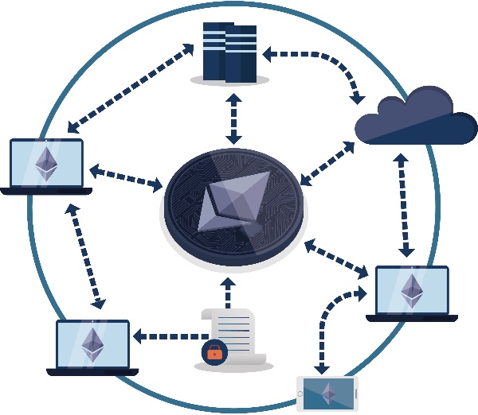
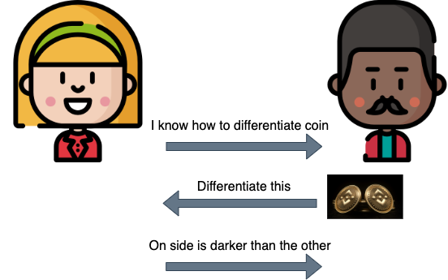
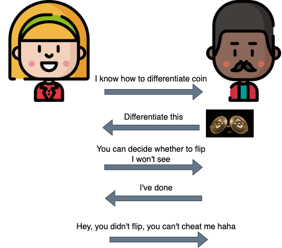

# Zero-Knowledge Proof and Its Application in Blockchain
Since the birth of Bitcoin, the blockchain has evolved from a simple ledger to encompass trustworthy computation, storage, and even web applications. It's amazing to think that the successor of the first von Neumann machine, the modern computer, brought us many fascinating applications such as AI, VR, games, and the web. Most of these advancements were made possible by improving the computational power of computers.

|                                |                                                                                                |
| ------------------------------ | ---------------------------------------------------------------------------------------------- |
|             |                                                                              | This is the text that will appear next to the images. |
| [First Von-Neuman Machine)[1]] | [Blockchain Virtual Machine[2]](https://decbc.com/blog/glossary/evm-ethereum-virtual-machine/) |

While our current decentralized virtual machine on the blockchain is slow, expensive, and transparent, it still garners great attention and interest due to its trustworthy properties. If the computational power of the blockchain virtual machine were to be massively improved, it's believed that a huge evolution would come. This is where interesting cryptography schemes like "interactive proof" and "zero knowledge proof" come into play. They could significantly contribute to improving the computational power of the blockchain virtual machine and pave the way for even more exciting applications in the future.

In addition to ensuring the integrity of data, the consensus mechanism in blockchain does not provide any confidentiality guarantees by default. However, by using advanced cryptography techniques, such as zero knowledge proofs, confidentiality can be achieved on the blockchain virtual machine. Zero knowledge proof is an essential cryptographic tool that can help protect sensitive information on the blockchain, ensuring that only authorized parties have access to it. With zero knowledge proofs, the confidentiality of data is maintained, while still preserving the transparency and security of the blockchain network.

## Interactive Proof vs Zero knowledge Proof
In the exciting and ever-changing world of cryptocurrency, you might come across the abbreviation "ZK". Typically, this refers to "zero knowledge", which is often associated with something called "zero knowledge proofs". However, it's important to note that in some cases, "ZK" might actually stand for "interactive proofs". This can be confusing for those who aren't familiar with the difference between the two.

To provide a concrete illustration of the concept, consider the following scenario: Imagine that you make a claim to your friend that you possess the ability to differentiate the two faces of any coin. To put your assertion to the test, your friend hands you a random coin and asks you to demonstrate your ability by describing how you differentiate the two faces. After several rounds of this exercise, your friend becomes convinced that you possess the ability to distinguish the two sides of a coin.

In this example, your friend serves as the verifier, seeking to determine whether your claim of coin differentiation is genuine. You, on the other hand, act as the prover, seeking to convince your friend of your ability without revealing the details of your method. This scenario resembles an interactive proof, in which the verifier challenges the prover to demonstrate their knowledge, and the prover responds with evidence that satisfies the verifier's demands.

On the other hand, zero knowledge proofs are a little different. This time you do not want to reveal how you differentiate the two faces. In this case, you and your friend both know the initial state of the coin, and you turn away while your friend decides whether to flip the coin or leave it in its current state. When you turn back, your friend asks you whether or not the coin has been flipped. If you can consistently answer correctly, your friend becomes convinced of your ability to differentiate the two faces of the coin.

|                   |                      |
| ----------------- | -------------------- |
|  |    | This is the text that will appear next to the images. |
| Interactive Proof | Zero Knowledge Proof |

So, the next time you see "ZK" in the world of cryptocurrency, remember that it might refer to either zero knowledge proofs or interactive proofs. While they're both important concepts in cryptography, they're not quite the same thing!

Another commonly seen fascinating term is **SNARK** (Succinct Non-interactive Argument of Knowledge), which can be broadly understood as those zero knowledge proofs with cheap communication and computational cost for the verifier. Do you know what "zk-SNARK" means? Yes, you are right - it refers to SNARK with zero knowledge properties. For further elaboration, the zk-SNARK (Zero-Knowledge Succinct Non-Interactive Argument of Knowledge) protocol embodies the following characteristics:

- Zero-Knowledge: The proof does not reveal any information about the knowledge itself.
- Non-interactive: The proof can be conveyed in a single message from the prover to the verifier, eliminating the need for back-and-forth interaction.
- Argument: The interaction between the prover and verifier is limited, consisting of only a few rounds and minimal communication cost.
- Knowledge: The proof demonstrates that the prover possesses certain knowledge or information, without revealing the information itself.

Together, these features make zk-SNARKs a powerful tool for verifying the authenticity and validity of claims, while preserving the privacy and security of sensitive information. 

## Interactive Proof/SNARK in Blockchain
Smart contracts provide a trusted computing solution where they execute exactly as programmed, and the results cannot be tampered with by any party. However, this process can be slow and costly in some cases. In such situations, it may be more efficient to verify answers rather than computing/searching by themselves. Interactive proof can be used in the blockchain virtual machine to achieve faster computation and reduce costs. The smart contract includes a trusted verification function for incoming advice, and untrusted machines prove the validity of the computation to the verifier on-chain.
### 1. SNARK improves scalability
Blockchain technology has been gaining a lot of attention due to its decentralized and immutable nature. However, one of the major challenges of blockchain is scalability. As more users join the network and more transactions are added, the processing time and costs increase exponentially. This can lead to a slow and expensive network, which is not practical for mass adoption.

SNARK helps reduce the transaction size by compressing the amount of data required for verification. In a traditional blockchain system, each transaction is accompanied by a set of data, including the public key of the sender, the signature, and the hash value. This data is required to verify the validity of the transaction.

However, with SNARK, the transaction data can be compressed into a shorter proof. The proof is then used to verify the transaction, instead of the full data set. This makes the transaction much smaller in size, as only the proof needs to be stored on the blockchain.

By reducing the transaction size, SNARK helps improve the scalability of blockchain. As more transactions can be processed in a shorter amount of time, the overall speed and efficiency of the network is improved.

Moreover, smaller transactions also mean lower transaction fees, making the network more accessible to a wider range of users. This can further drive adoption and increase the value of the blockchain network.

### 2. SNARK on Layer2 blockchain
Layer 2 solutions are a popular approach for scaling blockchain technology. These solutions sit on top of the main blockchain and are designed to improve the speed and efficiency of transactions. One such solution is the use of sidechains or state channels. However, to ensure the security and privacy of the underlying data, these solutions require a robust proof system. SNARK is one such technology that can help to achieve this goal.

In a sidechain implementation, SNARK technology generates proofs that validate transactions on the sidechain, without revealing the underlying data. These proofs are then sent back to the main blockchain to ensure the transactions are accurate and valid. This approach helps to reduce the load on the main blockchain, allowing for a greater number of transactions to be processed.

Similarly, in state channel implementations, SNARK can be used to create a trustless channel between two parties. This enables them to conduct multiple transactions off-chain, reducing the number of transactions that need to be processed on the main blockchain. The channel is secured by a deposit held on the main blockchain, and SNARK is used to generate proofs of the transactions, which can be verified by the main blockchain at any time.
## ZKP/zk-SNARK in Blockchain

ZKP plays a crucial role in enhancing the privacy and security of blockchain networks and many contributors on this new field to enhance the privacy of Web3.0 with ZKP.
In overview here are some ways ZKP is used in blockchain:

### 1. Identity Verification
In a blockchain network, Zero-Knowledge Proofs (ZKPs) can be used to confirm a user's identity without disclosing any personal information. This is especially valuable in decentralized systems, where anonymity is essential.

Consider this scenario: Alice needs to prove that she is over 18 years old to a third party, but she doesn't want to reveal her actual age or any other sensitive information. Typically, Alice would have to show some form of identification that includes her age and potentially other personal details. However, with ZKPs, Alice can demonstrate her age without compromising her privacy.

Here's how it works: Alice creates a unique digital identity on the blockchain network and generates a ZKP that verifies she is over 18 without revealing her exact age. Alice and the third party engage in a series of interactive computations that demonstrate her age is greater than 18. The third party can then verify the accuracy of the proof without learning Alice's actual age or any other personal information.

This approach to identity verification is highly relevant in industries such as finance, healthcare, and voting where privacy and security are crucial. By using ZKPs, individuals can safeguard their personal information while still proving their identity to third parties.
### 2. Zero Knowledge Transaction Verification
ZKP can also be used to verify the validity of a transaction without revealing any sensitive information about the transaction. This is particularly useful in financial transactions, where privacy is a top concern. ZKP can be used to prove that a transaction is valid without revealing the amount or the parties involved. Recall that zero knowledge proof is interactive proof with zero knowledge properties, it's the in the same manner as the interactive proof for transaction verification but with confidentiality guaranteed.

### 3. Verifiable Random Function
Verifiable Random Functions (VRF) are cryptographic functions that produce random outputs while providing a proof that the output is truly random. ZKP can be used to create a VRF that provides a secure, decentralized, and transparent system, ideal for various cryptographic applications.

The VRF is generated using a secret key and a seed value. The ZKP generates a short proof that the VRF output is based on the seed and the secret key, without revealing any information about either value. This proof can then be used to verify the randomness of the VRF output, without requiring the verification party to know the secret key or the seed value.

The use of ZKP in VRF ensures that the output is random, non-predictable, and fair, making it an ideal solution for various use cases, including blockchain-based systems, where fairness and security are essential.

# Conclusion
In conclusion, ZKP is a powerful tool for enhancing the privacy and security of blockchain networks. It enables blockchain networks to verify identities, transactions, and smart contracts without revealing any sensitive information. As blockchain technology continues to evolve, ZKP is expected to play an increasingly important role in ensuring the privacy and security of these networks.
