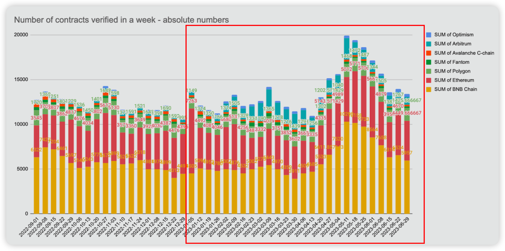
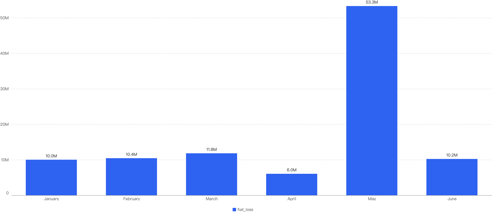
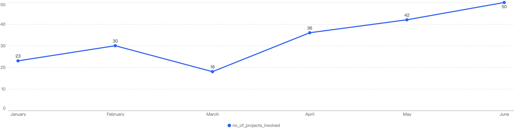
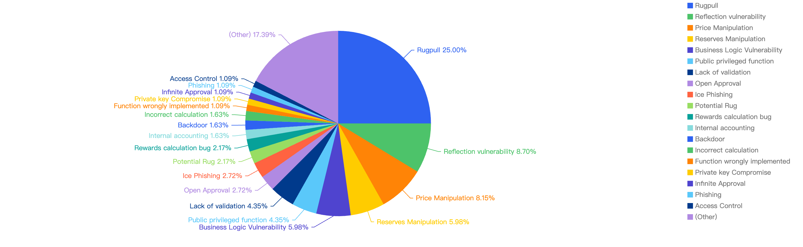

## Overview

This report delves into the security events occurring on BNB Smart Chain (BSC) during 2023 H1. It analyzes the types of projects that were targeted and whether they shared common attack techniques. Additionally, the report examines the financial implications of these occurrences.

#### Disclaimer

The financial data presented in this report has undergone thorough verification through our internal monitoring system, ensuring its accuracy. The data is derived from the $USD valuation of the cryptocurrency at the time of the incident. It's important to note that due to the inherent volatility of cryptocurrency prices, there may be variations in the total amount lost based on current token valuations.

Furthermore, the financial data might not fully reflect the true “exploited amount” of the incident. This is especially true for scams where the total scammed amount is usually mixed with an initial base amount injected by the scam project party.

#### BSC Innovations
The first half of 2023 has been an exciting journey for BNB Smart Chain (BSC), marked by continuous innovation and the tireless efforts of the BNB Chain team in crafting and advancing cutting-edge technologies.

Just to name a few in H1:

- The [Greenfield Testnet](https://greenfield.bnbchain.org/en) went Live: The Greenfield testnet, is an open-source project aimed at providing a scalable and efficient data availability layer for decentralized applications (dApps).

- [Reduced Transaction Costs](https://forum.bnbchain.org/t/a-proposal-for-adopting-a-lower-transaction-fee-cost-on-bnb-smart-chain-to-enhance-competitiveness/): Following extensive discussions, BSC validators have lowered transaction costs from **5 Gwei to 3 Gwei**. This reduction in fees will help drive network adoption, making BNB Chain an even more attractive platform for developers and users. 

- [BSC Validators Self-Stake Update](https://docs.bnbchain.org/docs/BSC-FAQs-validator): Thanks to an on-chain governance proposal, validators significantly reduced the cost to become a BNB Smart Chain validator, fostering a more diverse and robust ecosystem. This change greatly benefits the community by improving entry cost to be a BSC validator. Self-Staked moved from **10,000 BNB** to **2,000 BNB**.

- BNB Chain exhibited a significant rise in market share, demonstrating steady growth in the percentage of verified smart contracts. Its market share increased from **38%** at the beginning of Q2 to **45%** by the end of H1. This performance underscores BNB Chain's dominance and the high level of trust placed in its infrastructure by developers and users.

Figure 1: Number of contracts verified weekly across chains (Refer to the Red box for 2023 H1 data)

- [opBNB](https://opbnb.bnbchain.org/en) and [zkBNB](https://zkbnb.bnbchain.org/): These dynamic layer 2 solutions are poised to revolutionize the BNB Chain ecosystem by further enhancing the capabilities of BNB Chain’s ecosystem; offering developers a boundless horizon to pioneer groundbreaking advancements. 

[Refer to the blogs [1](https://www.bnbchain.org/en/blog/bnb-chain-q1-tech-updates-innovations-and-opportunities-for-developers/), [2](https://www.bnbchain.org/en/blog/web3-in-numbers-verified-smart-contracts-surged-in-q2-2023-despite-bear-market/) released by BNBChain for more information]

## 2023 H1 in focus

### General

A comprehensive overview reveals that security incidents on BSC resulted in an aggregate loss of nearly $101.84 million. An examination of the monthly breakdown highlights notable patterns. Specifically, the months of May, March, and June emerged as pivotal periods, witnessing the highest recorded losses.  

Figure 2: Amount of stolen funds in dollars per month in 2023 H1

This chart shows the number of projects impacted by exploits in 2023 H1.

Figure 3: Number of different project impacted by exploits

In total, there were 199 incidents on BSC.

As seen in Figure 3, the highest number of security incidents took place in June.

### Comparison with H1 previous years

When we compare the data with H1 of previous years, there is a decreasing trend, which can signify that the security posture of BNB Chain has improved over the years.

Figure 4: Financial Loss across the previous H1 of 2020 - 2023

### Type of attack vectors
Out of the 199 security incidents, hacks took up 66.3%, 33.2% were scams. However,  1 particular incident (0.5%) was a white-hat hack. The white-hat [hack](https://cointelegraph.com/news/hashflow-users-made-whole-after-600k-exploit) is related to a Hashflow project, where an old contract had an Open Approval, this means that any users that have approved funds to the victim contract can have his existing funds stolen.

Figure 5: Proportion of different type of exploits

However, it is interesting to note that even when the number of hacks are nearly doubled to that of scams, the financial impact of hacks were less significant than the ones related to the scams. The total financial loss of hacks ($35m) was nearly half of the loss to scams ($66m), as shown below in Figure 6 below.

Figure 6: Financial impact measured in dollars comparing different types of incidents

Looking at the comparison with 2022 H1, we observed that this trend was actually reversed! In 2022, the number of scam incidents was double that of hack cases, with the financial loss of hacks being double that of scams. You can refer to our previous [report]((https://hashdit.github.io/hashdit/blog/bsc-2022-end-of-year-report/)) for more information.

The observed trend potentially signifies an escalating presence of scammers within the crypto space. Their tactics continuously evolve, challenging users' vigilance. Furthermore, smaller, lesser-known projects may exhibit comparatively lower emphasis on security measures. This underscores the pressing need for heightened awareness and diligence across the ecosystem to safeguard against emerging threats. 

### Specific attack vectors

Figure 7 displays the specific attack vectors against its financial loss in 2023 H1.

Figure 7: Proportion of the funds lost comparing the different type of vulnerabilities

Looking at the breakdown, the most common loss of funds was attributed to Rugpulls (25%),  while the second most common attack vector was due to  Reflection Vulnerability. Several token smart contracts deployed on BSC utilize the Reflection mechanism for token holders to gain dividends, however the reflection implementation might be flawed, leading to its liquidity pool being drained by malicious actors. The third most common attack vector was Price Manipulation at 8.2%. This is common as well since poorly designed smart contracts rely on the instantaneous price of liquidity pools, and hence can be easily manipulated by a large Swap trade or Flash Loan by hackers.

### Type of projects

When comparing the types of project with the observed financial loss, a whopping 98.8% of financial loss were attributed to DeFi projects.
The second most common type of projects that were targeted wasBridge projects at 0.6%, followed by GameFi and Metaverse projects at 0.3% and 0.2% respectively.

Figure 8: Proportion of funds lost comparing the type of project 

With a large proportion of fiat loss associated with DeFi projects, this  that DeFi projects are still the most common type of crypto project in the space. At the same time, it shows how important it is for users to only invest in reputable and well audited projects, and to stay clear of potential rugpulls and vulnerabilities.

### Top 10 incidents in 2023 H1

The following were the top 10 security incidents in terms of financial loss in 2023 H1. 

Figure 9: Top exploits measured in dollars in 2023 H1 on the BNB Smart Chain

#### Fintoch - $31.6 Million Loss

On 25-May-2023, Fintoch, a Ponzi platform was reported to have rugpulled $31.6 million USD. The funds were since bridged to multiple addresses on Tron and Ethereum. Its users reported that they could not withdraw their funds.

Fintoch advertises themselves as a blockchain financial platform built by Morgan Stanley, and users can get 1% return on investment every day. The team’s page on the Fintoch website refers "Bobby Lambert'' as their CEO, when in fact he did not exist and was, in fact,  a paid actor. Earlier, the Singaporean government and Morgan Stanley both [issued](https://www.morganstanley.com/content/dam/msdotcom/global-offices/pdf/Indonesia/Indonesia_Fintoch_Important_Notice.pdf) warnings about this “investment plan”.

#### ippswap - $14.5 Million Loss

On 26-May-2023, a scam project, ippswap was found to have rugpulled $14.5 million USD. The ippswap project executed a concerning action by exploiting a privileged backdoor method, takeToken(), within the staking contract. This unauthorized maneuver allowed the project party to transfer IPPSwap LP Tokens, which had been staked by users, directly to their own account.  Liquidity was then subsequently removed using the above LP tokens to gain $14,535,741.86 USDT.

Some of the USDT funds flowed onto Binance exchange where the funds have been frozen by the Binance team.

#### Safemoon - $8.9 Million Loss

The Safemoon project was exploited for $8.9 million USD on 29-Mar-2023. The Safemoon liquidity pool was compromised after a code upgrade introduced a bug, a public burn() function. The hacker was able to burn the SFM tokens in the liquidity pool, artificially inflating the price of the SFM tokens, and then sold sufficient tokens to wipe out all the WBNB in the pool.

On April 20, the SafeMoon attacker returned 80% of the stolen funds, and transferred 21,804 BNB (approximately $7.2 million) to the SafeMoon vault wallet, taxing the remaining 20% as a bounty.

#### SwapX - $7.3 Million Loss

SwapX, a DeFi project, faced an Open Approval issue starting from 27-Feb-2023, resulting in users losing more than $7.3 million USD. Users of BSCex / SwapX, a DEX on BNB Chain, had their funds stolen from their wallets. Vulnerabilities were found in four old contracts (deployed on Jan. 2021, May. 2021, July 2021, and Oct. 2021) belonging to the DEX. Many users still have active approvals to these contracts, even though they have not used it for a long time. Affected users remain at risk as long as they have not revoked their approvals.

#### Atlantis Loans - $3.5 Million Loss

On 12-June-2023, Atlantis Loans faced a malicious Governance proposal takeover, coupled with the abandonment by the core team whichresulted in ~$3.5 million USD loss. On April 12, its official TG channel was deleted and a backup channel was created instead, with multiple users of the community claiming that the project had been abandoned and that they are trying to build it up again. A malicious proposal was then submitted to take over the core contracts of Atlantis Loans which was successfully shut down by the new project party.

However, a similar proposal was submitted on June 12, and was not blocked this time, which resulted in the hacker stealing funds from users that have approved the Atlantis Loans core contracts.

#### $FUT - $2.7 Million Loss

Early this year on 4-Jan-2023, the $FUT project team conducted a rugpull for $2.7 million USD. The project party was able to invoke the privileged function withdrawSushiReward() of the Masterchef contract to transfer all the FCS to another controlled wallet. He then subsequently swapped all his FCS for $FUT before exiting for USDT. Once again, this shows the risk of over-centralization by the project party, as they have too many privileges and can easily backdoor funds from users.

#### Circulate - $2.3 Million Loss

On 12-Jan-2023, the Circulate Ponzi managed to scam around $2.3 million USD from users. The CirculateBUSD and CirculateWBNB contracts promised users high APR by depositing funds with them. When users deposit funds, they invoke the startTrading() method of the contract, this in turn calls a third party dependency: SwapHelper contract which is unverified. However, upon decompiling the code, we noticed that there was a hardcoded condition that when the contract reached $2m of staked funds, the funds will be immediately transferred to a designated project team’s address.

Although it is currently unknown how the scammer in this incident was able to get large investment into their recently created contracts (~2 days), it is highly likely that the contracts were scams from the beginning due to design bugs in the SwapHelper contract.
On the whole, third party dependencies in smart contracts present a security risk. Whilst reliance on third parties such as the use of oracles is sometimes unavoidable, developers should avoid these dependencies as much as possible. 

#### YieldRobot - $2.1 Million Loss

On 17-Jan-2023, YieldRobot scammed users of around $2.1 million USD. For context, YieldRobot is a De-Fi protocol which promises to give yield for users that deposit BUSD.
Two days prior to the incident, the YieldRobot contract deployer wallet set the signer to a new EOA (0x3f531). The signer address is needed to approve the redemption of coupons.

In order to redeem a coupon it must pass a check to verify it has the correct signer. Once approved, the coupon is added to the user’s reward balance. In this incident, 0x8f2DB called setCoupon() which credited them 2.1m BUSD.

The new signer approved the malicious coupon redemption, as such he was able to claimRewards of the contract’s BUSD balance and drain all the BUSD funds.

#### LianGo Protocol - $1.6 Million Loss

On 7-Feb-2023, the LianGo protocol was exploited for $1.6 million USD, roughly 6,148,859 LGT reward coins were stolen. For context, LianGo is a decentralized payment consumption and LGT is their main token.

The reason for the theft was that the owner administrator of LGTPool created a fake LP token pledge pool (pool 3), and then the thief put a large amount of LP tokens into the pool, pledged and obtained 6.14 million LGT reward tokens. 

Based on on-chain data, the thief has been preparing for the theft for a long time. 58 days before the incident, the stealer’s address obtained the gas fee from Tornado Cash, and deployed the fake LP contract 32 days before the incident.

Then on the same day the LianGoPay project deployed the trading pair contracts of LGT tokens and WBNB on Pancake. This contract address is very similar to the address of the fake LP contract that was deployed earlier -- the 4 letters before and after are the same, which can be easily confused. As such, it is likely a private key compromise to the project’s back end system.

The administrator of the LGTPool contract initiated three consecutive transactions to create pledge pools, the first two of which also created a real one when creating two fake LP token pledge pools (pools 3 and 4). LP token pool for WBNB and LGT. Because the front and rear four digits of the real and fake LP token contract addresses are the same, it is difficult for users to detect that the first two created LP pools are fake LP pools. 

Then the attacker launched an attack, first deploying an attack contract. When the contract was initialized, a huge amount of fake LP tokens was pledged for the fake No. 3 LP pledge pool - up to 614885935211982505426257800000000.

Then the attacker initiated a redemption transaction and received the rewarded LGT tokens. Because of the huge amount of pledged principal, 6.14 million LGT rewards were generated. These reward tokens were exchanged for 1.62 million BSC-USD tokens and transferred to an address starting with 0xCb65 (this address used to receive gas fees from Tornado Cash 58 days before the incident).

#### DeusDAO (DEI) - $1.3 Million Loss

On 6-May-2023, the DeusDAO (DEI) project was hacked for slightly more than $1.3 million USD due to a wrong contract upgrade. The project was hacked on 3 different chains: Ethereum, Arbitrum and on the BNB Chain. The upgrade bug introduced a public burn vulnerability, which allowed attackers to steal funds from other wallets that have DEI tokens.

The issue was specifically in the burnFrom method, which wrongly swapped the 2 parameters of msg.sender and the account to be granted approval. The hacker essentially approved DEI tokens to a whale account with a large amount of DEI tokens, and then invoked the wrongly implemented burnFrom method with 0 tokens. This approves all the DEI tokens to the caller instead, where he can just simply call transferFrom and steal all his tokens.

## Conclusion

BSC continues to be a strong competitor, outperforming Ethereum in terms of daily active users and verified contracts. However, it is undeniable that 2023 H1 has proven to be a challenging year for both investors and developers due to the continued bear market trend and exploit incidents. Below we have some final advice for investors and developers:

For investors:

- Understand what you're signing, do not blindly sign random signatures/transactions (never sign signatures outside of official websites)
- Always double check that you are on the official website of the dApp
- Be wary of new/trending projects or projects that guarantee High APYs / use MEV bots, and always verify the project team’s authenticity
- Use multiple wallets for different activities (hot wallet for frequent transactions; cold wallet to store high value funds)
- Ensure you are interacting with an open-source contract and revoke approval once interaction is done
- Check the security and risk scores of interacted contracts (e.g when using Trust wallet) 
  If _High Risk_ is flagged, we strongly advise to stay away

**Feel free to reach out to our team if you have any doubts about a certain project / contract address / transaction / risk score!**

For developers:

- Verify & open-source all relevant contracts on-chain (to ensure transparency and trust within the space)
- Ensure the project is audited by at least 2 well-known security companies and fix all issues where applicable (Including auditing newly added code)
- Incorporate / Implement a bug-bounty program to upkeep the security posture of the project and encourage the community to ensure the code remains secure
- Ensure security is at the core of the business: run sufficient testing / stress-testing / simulations such as (1) adverse token price fluctuations, (2) edge cases
- Prevent centralization risks by using multi signature wallets and not a single EOA wallet to run operations
- Minimize contract upgradeability and only apply to contracts when necessary
- Ensure funds are stored securely (key management, fund distribution)
- Implement safeguards in the event of a hack (formulate an Incident Response plan, introduce time lock / pausing within the smart contract)
- Constant monitoring of system parameters e.g Exchange Rate of a token

#### Hashdit

HashDit’s core mission is to provide the essential threat intelligence for the everyday crypto investors, helping them to make informed decisions. Our methodology includes a variety of automated and manual techniques to evaluate a dApp project. The team has optimized its product offerings and improved its accuracy in 2023 H1.

Products at Hashdit currently:

- **Risk assessment**: All-in-one collection of security rating framework, auto-scan tools, and corresponding APIs, which are able to deliver accurate detection for potential rugpull/exploit risks based on a smart contract address. This is integrated with platforms like [Trust Wallet](https://trustwallet.com/) and [PancakeSwap](https://pancakeswap.finance/), to leverage their reach and protect more users.

  It is able to detect multiple other risks, besides the usual SWC bugs, such as Tornado Cash interaction, risky functions encompassing ERC20 or ERC721 token standards (such as Migrate() or Blacklist() ), HoneyPot detection, etc. This can help users gain a better understanding of the smart contract, if it could be a scam.

- **Audit service**: Comprehensive code audits following extensive and detailed best practices for smart contracts and discovering code loopholes / security vulnerabilities before they are deployed on-chain, guaranteeing users’ safety on BSC.

- **Monitoring**: Detecting sensitive events / transactions that happen on-chain to quickly respond and minimize any additional financial losses. At the same time, Hashdit warns users early by sharing any information we found on our [Twitter](https://twitter.com/hashdit?s=21&t=U4gLkKc72FyZ1zfJDsWzqg)

- **Blog**: Our goal is to share our security knowledge for builders, investors and users in the Web3 community. With all the players in the industry equipped with the security knowledge needed and adopting a security-first mindset, only then will the Web3 ecosystem be a safer place for everyone.

