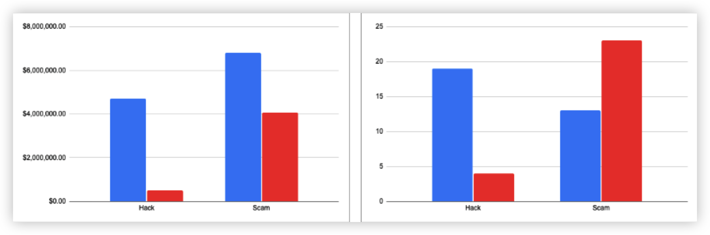
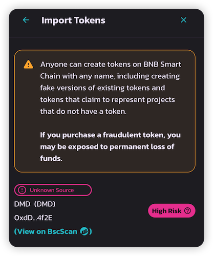

## Introduction

According to Hashdit, the amount of losses on BNB Smart Chain (BSC) in August 2023 have greatly decreased compared to July. 

In August, there were over 27 typical security incidents, with a total loss of approximately $4.5 million, a decrease of about 60% compared to July. 

In general, the data has trended downwards from July to August, which is a good sign.

The total amount involved in Hack incidents dropped to $507k from $4.7 million, a decrease of about 89% compared to July.
The total amount involved in Scam incidents dropped to $4 million from $6.8 million, a decrease of about 40% compared to July.

The number of Hacks decreased to 4 from 19, a 78% decrease from July.
The only data that trended upwards was the  number of Scams increased from 13 to 23, a 76% increase from July.

Figure 1: Comparisons between July (Blue) and August (Red) in terms of Amount Loss ($$) and Number of Incidents

The largest security incident this month occurred with a fake LayerZero token, resulting in a loss of approximately $1 million. There has been an increase in exit scam incidents this month, with notable cases including a $680k rugpull by the NFT_SalesRoom (ASN) team. Additionally, there has been an increase in fake tokens that conducted a rugpull such as 2 Fake $CIRCLE tokens, 1 Fake $Zksync token and 1 Fake $X token.

## Security Control Improvements in the BSC Ecosystem
1. HashDit has integrated its security API with Prominent and Leading brands on BSC such as [PancakeSwap](https://pancakeswap.finance/), [TrustWallet](https://trustwallet.com/), [BscScan](https://trustwallet.com/) to improve the security control across the ecosystem.
- @PancakeSwap: Auto-scans tokens & displays risk scores

- @TrustWallet: Notifies users of high risks before transactions

- @bscscan: Displays risk warnings in the explorer

2. New risks flagged in [RedAlarm](https://dappbay.bnbchain.org/red-alarm)

A total of 319 dApps and 64 addresses were added to Hashdit's RedAlarm in August alone.
This amounts to a total of 1679 smart contracts on RedAlarm currently.

## Word of Advice
With the current trends in the BSC security landscape, Hashdit advices the community to:
1. Do Your Own Research (DYOR) before participating in any trending projects to mitigate the risk of financial losses, especially when the token name and symbol is an impersonation of the real token.
2. Place greater emphasis on security, adopt a Zero-Trust security mentality and be careful of phishing scams 

Meanwhile, HashDit promises to continue to keep the BSC community and its users safe!

