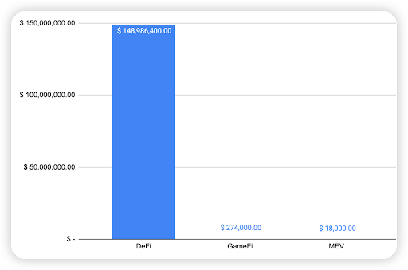
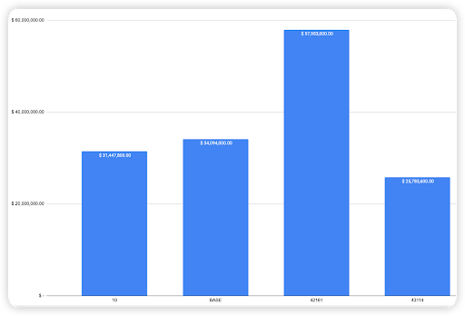
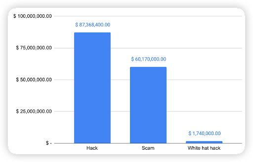
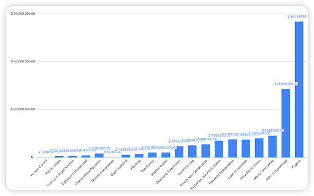
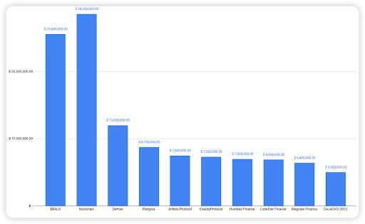

## TL;DR
This incident report aims to aggregate all the incidents that have happened on Layer 2.
For context, the Layer 2 chains considered in this report are respective to Ethereum Layer 1 blockchain.
- Optimism
- Arbitrum
- Avalanche
- BASE
 
In total, there were a total of 57 cases, 52 incidents in 2023 and 5 incidents in 2022.
 
An examination of the yearly breakdown highlights that the total loss in 2022 and 2023 amounts to $149,278,400, namely 13.07% was for 2022 and 86.93% for 2023.

 
## Type of projects​
When comparing the types of project with the observed financial loss, a whopping 99.8% of financial loss were attributed to DeFi projects. The second most was a GameFi project at 0.18% (TalesofElleria – Signature compromised), followed by MEV at 0.01% (an unknown MEV contract had a lack of validation bug).

With a large proportion of fiat loss associated with DeFi projects, this shows that DeFi projects are still the most common type of crypto project on L2 chains.
 
 
 
 
## Chain comparison
 
According to our data, 38.82% of financial loss was from the Arbitrum chain (~$57.95m).
BASE being a new chain, accounted for 22.84% (~$34m). This is followed by Optimism and lastly Avalanche.

 
On Optimism, there were 7 hacks and 1 scam cases.
On Arbitrum, there were 23 hacks (including a White-hat) and 9 scam cases.
On Avalanche, there were 9 hacks (including a White-hat) 2 scam cases.
On BASE, there were 2 hacks and 4 scam cases.
 
## Attack Type analysis
 
 
The next chart shows the attack type analysis for all the security incidents on L2 chains. 58.53% was because of Hacks, 40.31% was due to Scams, while 1.17% was rescued by a White hat.

The next chart shows the specific attack vector analysis.

As seen in the chart above, the highest financial loss attributed to rugpulls with $56.75m, $28.6m was due to MPC compromise (Multichain incident), and $9m was due to Internal accounting.
 
Further analyzing the top 3 attack vectors,
Rugpulls - 13 cases (Most notably the $BALD case).
MPC compromise - 3 cases (1 Multichain incident across 3 chains).
Internal accounting - 2 cases (Mostly due to the Platypus case).

## Top 10 incidents on L2 thus far
The following were the top 10 security incidents on L2, 3 of them were scams while the other 7 were exploit cases.
 

 
### [BALD](https://twitter.com/BaldBaseBald) - $25.6 Million Scam
On 1-Aug-2023, BALD, a meme token on BASE was reported to have rug pulled $25.6 million USD from investors.
Method: The liquidity of the BASE tokens were held by an EOA account, hence the account could remove liquidity at any time.
Although the Base network is meant to be used for developer testing, some people have tried to trade on the network before its official launch
https://decrypt.co/150647/bald-coin-based-ethereum-base-layer-2-coinbase 
Since removing liquidity though, he has appeared to still be adding/removing small chunks of liquidity (probably still trying to garner traffic)
https://basescan.org/token/0x4200000000000000000000000000000000000006?a=0xfcd3842f85ed87ba2889b4d35893403796e67ff1 
 
### [Multichain](https://dappbay.bnbchain.org/detail/multichain) - $28.6 Million Exploit
On 10-July-2023, a Bridge project, Multichain had its MPC account compromised by an unknown entity. The MPC account had authority over the bridged funds of users, and transferred all the funds to his own wallet, on 3 chains: Arbitrum, Optimism and Avalanche. Since the MPC account appears as a normal EOA on-chain, it is unclear how the MPC account was compromised on the backend.
 
 
### [Defrost](https://twitter.com/Defrost_Finance) - $12 Million Scam
The Defrost project was rugged for a total of $12 million USD on 23-Dec-2022. The incident happened on Avalanche.
Method: The privileged owner was an EOA which could change the address of the oracle, in a market contract. He changed the address maliciously to one that returns fake prices, to liquidate their users and seize their funds.
At that point of time, it looked pretty obvious that it was a rugpull. However, the project party claimed that they were hacked 4 days later and stated that the exploiter has returned 100% of funds to them https://medium.com/@Defrost_Finance/hacked-funds-returned-to-defrost-71b9d2d1b458 
In this case, it appears that they were caught so they returned the funds back.
 
### [Platypus](https://twitter.com/platypusdefi) - $8.75 Million Exploit
On 17-Feb-2023, Platypus, a Lending/Borrowing project, was exploited, resulting in users losing more than $8.75 million USD. The incident happened on Avalanche.
Root cause: The project party overlooked the EmergencyWithdraw() method and forgot to include a check for borrowed funds https://twitter.com/danielvf/status/1626340324103663617?s=61&t=gr5sMl7K7qjCB7l3zmh53w 
Method: The hacker deposited funds, borrowed funds and then exited his position with EmergencyWithdraw(), allowing him to keep the borrowed funds
 
### [Jimbos](https://twitter.com/BaselineMarkets) - $7.5 Million Exploit
On 2023-05-28, Jimbos Protocol on Abitrum was exploited, which resulted in ~$7.5m funds loss.
Root cause: The protocol did not have proper measures to manage price changes during operations that shift liquidity.
This oversight allows the protocol's own liquidity to be put into a distorted price range, which allows attackers to make "profit" via a reverse swap.
Method: 1) The hacker initially flash loaned 10,000 WETH
2) Subsequently swaps them for $JIMBO, inflating its price
3) Called the shift() method in JimboController to manipulate reserves and imbalance the pool
4) Following the manipulation, the attacker converted the acquired Jimbo tokens back into ETH
 
### [Exactly](https://twitter.com/ExactlyProtocol) - $7.32 Million Exploit
Exactly Protocol, a Lending/Borrowing platform was hacked on Optimism for $7.32m.
Root cause: Lack of validation -> allowed the attacker to steal users’ collateral assets
 
 
 
The attacker was able to bypass the permit check in the leverage function of the DebtManager contract by directly passing a fake market address without validation
  
Untrusted external call done with the fake market address -> the attacker reentered the crossDeleverage function in the DebtManager contract and stole the collaterals from the _msgSender.

Secondly, the Permit calldata p can be externally controlled too, changing the _msgSender to the victim address (user EOA address).
 
### [Hundred Finance](https://twitter.com/HundredFinance) - $7 Million Exploit
Hundred Finance, a Lending/Borrowing platform was hacked on Optimism for $7m. The hack was due to a known bug in Compound V2 code.
 
Root cause: The exchange rate can be manipulated because of a rounding issue in the redeemFresh of CToken pool contract (The attacker strictly controls the input quantity every time they call the redeemUnderlying function. This leads to a situation where the calculated result becomes 1.99999999999... but is rounded down to 1 by default.)
 
### [Lodestar Financ](https://twitter.com/LodestarFinance)  - $6.9 Million Exploit
Lodestar Finance, a Lending/Borrowing project, was hacked on Arbitrum for $6.9m. This attack vector is 1 variation of the donation-bug vulnerability.
 
The attacker first manipulated the exchange rate of the plvGLP contract to 1.83 GLP per plvGLP, "an exploit that by itself would be unprofitable", said the company.
 
Then, the attacker supplied plvGLP collateral to Lodestar and borrowed all available liquidity, cashing out part of the funds "until the collateralization ratio mechanism prevented a full liquidation of the plvGLP."
 
Following the hack, "several plvGLP holders also took advantage of the opportunity and also cashed out at 1.83 glp per plvGLP." The hacker was able to burn a little over 3 million in GLP, making profit on the "stolen funds on Lodestar - minus the GLP they burned.", noted the DeFi platform.
 
### [Magnate Finance](https://twitter.com/MagnateFi) - $6.4 Million Scam
Magnate Finance, a scam project, rug pulled for $6.4m. Incident was on the BASE blockchain.
Moments before the rug, it was found that its deployer address is directly linked to the Solfire $4.8M exit scam. 
 
The project team manipulated the price oracle value, so he could drain all the locked funds in the market contract.
 
### [Deus DAO (DEI)](https://twitter.com/DeusDao) - $5 Million Exploit
On 6-May-2023, the DeusDAO (DEI) project was hacked for slightly more than $5 million USD due to a wrong contract upgrade. The project was hacked on Arbitrum. The upgrade bug introduced a public burn vulnerability, which allowed attackers to steal funds from other wallets that have DEI tokens.
 
The issue was specifically in the burnFrom method, which wrongly swapped the 2 parameters of msg.sender and the account to be granted approval. The hacker essentially approved DEI tokens to a whale account with a large amount of DEI tokens, and then invoked the wrongly implemented burnFrom method with 0 tokens. This approves all the DEI tokens to the caller instead, where he can just simply call transferFrom and steal all his tokens.

## Conclusion:

L2 blockchains offer several advantages over traditional L1 chains such as Increased Scalability, Lower Fees and Faster Transaction Times. However, the issues that plague L1 chains do persist on L2 chains as well. 

Therefore, we advise the opBNB community to pay more attentions on the below segments.
1. Developers' concerns
2. Users' concerns

### Developers should
1. Pay special attention to over-centralization. Privileged roles should be transferred to a multisig or timelock.
2. Pay attention to oracle / price manipulation attacks. Ensure the oracle is a trusted source, and use a backup oracle to check discrepancy so that prices will not deviate too much.
3. For lending/borrowing projects, pay close attention to exchange rates to ensure the rate cannot be manipulated by forceful donation and breaking any invariants.
4. Ensure all state-changing functions have proper checks for all parameters so there will not be a situation of having unexpected inputs not validated.
5. Ensure all token standards are followed.
6. Ensure contract upgrades are done after review from a trustable auditor.
 
### Users should
1. Invest in trustable tokens, instead of over centralization and hype meme coins as such projects are high risks and might result in it being scams.
2. Invest in projects that have partnered with 3rd party security companies.

For further inquiries or clarifications, do drop us an email at **support@hashdit.io**! Stay safe!

