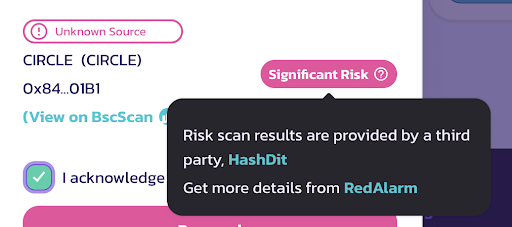
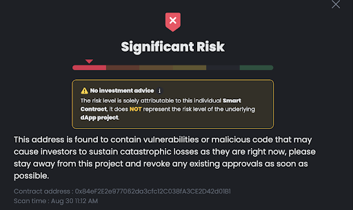
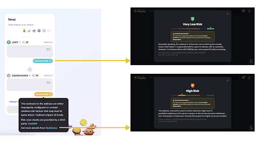

## Disclaimer 

***The information provided through the BNB Chain community does not constitute advice or recommendation for investment or trading. Projects are listed in no particular order below. BNB Chain does not take responsibility for any of your investment decisions. Please seek professional advice before taking financial risks.***

***Contract names are there for reference only, there may be legitimate contracts which share the same name, always double check The contract addresses which are the unique identifier of any smart contract.***

## Overview
[PancakeSwap](https://pancakeswap.finance/) is the most popular decentralized exchange native to BNB Chain. You can swap tokens, invest in yield farms and liquidity pools, and buy and sell collectibles. It is part of the ever-growing world of decentralized finance protocols. 

[PancakeSwap](https://pancakeswap.finance/) stands tall as the flagship DeFi platform within the BNB Smart Chain (BSC) ecosystem, however, risks exist in every DEX and blockchain ecosystem. HashDit diligently checks projects every week to identify potential threats within the PancakeSwap landscape, ensuring your trading experience is protected. Consider HashDit as a trusted guide that helps you navigate in DeFi by highlighting potential hazards and keeping your journey secure. Remember, vigilance and a proactive approach are vital for a safe and successful DeFi experience.

## High Risk TVL protocol on PCS

In this week, there were **17** newly identified risky addresses.
**Trending** newly identified risky addresses: 

| Address      | 	ContractName |	Weekly Active Transactions |
| ----------- | 	----------- |	----------- |
|0x71cce0035d82c21cf4b908bcd8f1117fff0fa623|	bitcoin (bitcoin)|	427|
|0x2b3559c3dbdb294cbb71f2b30a693f4c6be6132d|	Lucky star Currency (LSC)|	350|
|0x872a34ebb2d54af86827810eebc7b9dc6b2144aa|	RocketVaultRocketX (RVF)|	215|
|0x0a92285241b0ea93eff4195db4530af1a4bcfe0c|	CRYPTO_STREET (CST)|	179|
|0x16e79e09b3b56bcbba83667aff88dc6ca727af2e|	BART SIMPSON COIN ($BART)|	162|
|0x4673f018cc6d401aad0402bdbf2abcbf43dd69f3|	French connection finance (FCF)|	100|
|0x3c1748d647e6a56b37b66fcd2b5626d0461d3aa0|	DinoX Coin (DNXC)|	23|
|0x123458c167a371250d325bd8b1fff12c8af692a7|	DRAC Token (DRAC)|	17|
|0xb6b91269413b6b99242b1c0bc611031529999999|	CALO (CALO)|	15|
|0x8424b4c691473c873067b65d5f40f3ff0bf7463e|	SHIBKING INU (Shibking)|	9|

### Key themes on high risks:

1. Almost three-quarter of the newly identified risky addresses (70%) were through **threat intelligence**. These addresses are either confirmed rugpulls (project has already removed rugged) or scam tokens that have high risk of rugs. 

2. **Red Alarm projects** are manually identified by our security team for being potential scams. These are identified from a project level, for example projects that utilize fake social media marketing, or create scam meme projects. They are labeled under the DApps section of this [page](https://dappbay.bnbchain.org/red-alarm)(11%)

3. Another theme for these contracts is that they showed **scam** features. This means that it could be a Ponzi, Honeypot or fake token. This portion represents 11% of the total newly identified risky addresses.

Refer to this [link](https://github.com/hashdit/hashdit/blob/main/gitbook_source_code/data/10192023_most_popular_risky_address.csv) for the full list.

Tip: Filter by Top_TVL_Risky_Pool / Trending_Risky_Pool / Trending_Risky_Tokens to retrieve the risky addresses from different sources.

## Integrations with PancakeSwap
Hashdit has partnered with PancakeSwap to integrate the DappBay’s Red Alarm. The risk score level reflects how risky the interacted token is, helping users make better informed decisions.

Example: Fake Circle Token - 0x84ef2e2e977062da3cfc12c038fa3ce2d42d01b1

The RedAlarm keyword will link to the risk scanner as seen in the image below.

Please take note that the risk level in Pancake & Risk Scanner might be different, because [Hashdit](https://www.hashdit.io/en) use more conservative strategies for PancakeSwap than [DappBay](https://dappbay.bnbchain.org/) risk scanner.

## Stay Safe!
[HashDit](https://www.hashdit.io/en) advises you to act with caution in general, but ask that you take particular care when dealing with the projects we highlight as risky on our weekly update. Continue enjoying the BNBChain ecosystem and most importantly, stay SAFU!

## About HashDit?
[HashDit](https://www.hashdit.io/en) is building a safe blockchain ecosystem on BNB Chain by providing threat intelligence, code auditing and instant analysis for smart contracts. In the vast and ever-evolving world of Defi investing, [HashDit](https://www.hashdit.io/en) stands as a beacon of trust and knowledge for everyday investors.  [HashDit](https://www.hashdit.io/en) is a member of [AvengerDAO](https://www.bnbchain.org/en/blog/introducing-avengerdao-the-security-initiative-protecting-users-from-malicious-actors/), which is a community-driven initiative created to protect users and projects on BNB Chain from malicious actors and activity.

