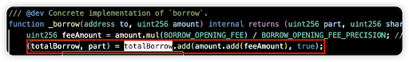
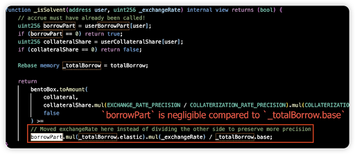
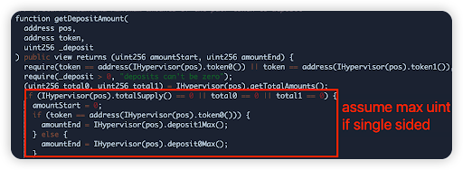

## Monthly Incident Sharing (Jan 2024)

### Introduction

In this monthly series, HashDit is sharing the monthly security incidents in the crypto space and what we can learn from them.

For this Jan 2024 edition, the total losses mounted up to $153 million, showing a staggering 453% increase compared to January 2023. 

### Top 5 DApps incidents

#### Orbit Chain - $81.5m
Orbit Chain is a Bridge protocol, which uses the model of locking collateral on the source chain to mint wrapped tokens on the destination chain. In this attack, the hacker was able to compromise 1 of the bridge’s vault and steal its funds. [Hack tx](https://etherscan.io/tx/0xd8ca42941a0a2c25669267ad8d61f7f9f4118252cb502316602fe16624b80ac8)

Root cause: Backend compromise. The hacker was able to produce 15 correct Signer keys (v, r, s values), although the threshold needed was just 7. 

Vulnerable code snippet:

#### Magic Internet Money (MIM) - $6.5m
Magic Internet Money is a DeFi protocol which allows lending and borrowing of funds. In this attack, the attacker was able to compromise 1 of the protocol’s markets and steal funds. [Hack tx](https://etherscan.io/tx/0x26a83db7e28838dd9fee6fb7314ae58dcc6aee9a20bf224c386ff5e80f7e4cf2)

Root cause: The borrow function in CauldronV4 contracts was vulnerable to manipulation of the part parameter (the user’s share of total debt) via repeatedly borrowing and repaying an asset, taking advantage of the rounding error. 

Vulnerable code snippet:

#### Gamma Strategies - $4.6m
Gamma Strategies is a DeFi protocol which allows active liquidity management and market making strategies. In this attack, the attacker was able to compromise 1 of the protocol’s vaults and steal funds. [Hack tx](https://arbiscan.io/tx/0x6116f311ac199d6f608c52e44c93a0e6961f10380fd379873b8bf27c92402462)

Root cause: The liquidity ratio checker function erroneously allowed for deposits in any ratio so long as the contents within the vault were single-sided. This allowed for a disproportionate amount of token 0 being deposited, gaining more shares than expected. A second issue was there was no check for the current tick to be within the base position’s lower and upper tick (only a check for the tick change)

Vulnerable code snippet:

#### Radiant - $4.4m 
Radiant is a DeFi protocol which allows lending and borrowing of funds across chains. In this attack, the attacker was able to compromise 1 of the protocol’s markets and steal funds. [Hack tx](https://arbiscan.io/tx/0x1ce7e9a9e3b6dd3293c9067221ac3260858ce119ecb7ca860eac28b2474c7c9b)

Root cause: "New/empty market" exploit. It is a known vulnerability to the combination of a rounding error and a totalSupply value of 0. Bug introduced in recent upgrade. 

Vulnerable code snippet:

#### Socket Dot Tech - $3.3m 
Socket Dot Tech is an Interoperability protocol bringing seamless connectivity across blockchains. In this attack, the attacker was able to compromise 1 of the protocol’s vaults and steal funds. [Hack Tx](https://etherscan.io/tx/0x591d054a9db63f0976e533f447df482bed5f24d7429646570b2108a67e24ce54)

Root cause: Unsafe call in the performAction() function. The attacker constructed calldata in the swapExtraData parameter to call transferFrom() of arbitrary tokens, transferring tokens approved to the contract by other users to the attacker's address. Bug was introduced in the recent proxy upgrade. 

Code snippet:

### Key lessons for developers

1. Keys should be properly secured, rotated regularly and have some level of decentralization. Adopt a **zero-trust model**. 
Conduct proper background checks for new employees in view of insider compromises.

2. Validation is important - **ensure all possible user inputs are checked for state changing** methods. This is especially true for calldata parameters where attackers can craft any data and when the protocol contract handles users’ approvals.

3. Rounding in Solidity always rounds down. As such, it is important to perform multiplication before division and to round down for the user during withdrawals, and round up during deposits. Consider **increasing precision** during calculations to avoid unexpected manipulation attacks.

    However, in the latest donation attacks for lending protocols, we see that the usual rule to favor protocol for calculations is no longer sufficient. There must be better **health checks for bad debt** as well, at the end state of a transaction.

4. For projects utilizing lending protocols:
    * When deploying a new market (especially for Compound / Aave v2 forks), ensure that it is first **initialized with 0 Collateral Factor** and **deploy with small deposit to lock dead shares**.
    * Disallow deposits when the pool price is out of the base range of liquidity.
    * Increase precision on price change thresholds and deposit ratios.
    * For those allowing single-sided pool deposits, add a conditional statement to **prevent deposits of any ratio of assets** so long as vault is single-sided.

5. Always engage a security auditor to **review all code upgrades before they are deployed on chain**. This prevents new bugs from being introduced.

Feel free to contact us at support@hashdit.io for any support needed! Stay safe!

