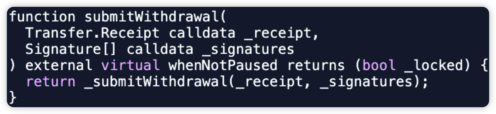
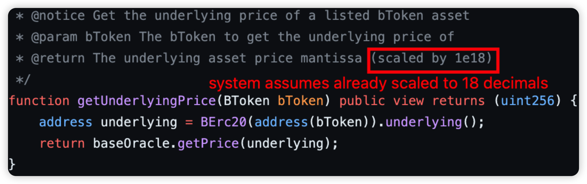

## Monthly Incident Sharing (Feb 2024)

### Introduction

In this monthly series, HashDit is sharing the monthly security incidents in the crypto space and what we can learn from them. For this Feb 2024 edition, the total losses mounted up to $132 million, showing a 141% increase compared to February 2023. 

Of which, they are split across 3 sections: DApps ($65m), CEXs ($62m) and Phishing ($5m).

In this sharing, we focus on the DApps incidents. Below are the top 5 DApps incidents that DApp Developers should pay attention to.

### Top 5 DApps incidents

#### PlayDapp - $30m - Private Key Compromise
PlayDapp is a GameFi and Web3 Service protocol. In this attack, the hacker was able to compromise the original Minter account. As such, a malicious minter account was added and he minted 200m $PLA tokens, before dumping them on the open market.

Since then, the token transfer method has been paused and the token is planning to be migrated to a new address $PDA.

Root cause: The hacker was able to compromise the private key of the original Minter account. It is unclear if it was an internal or external attack.

Onchain information:

[Add Malicious Minter tx](https://etherscan.io/tx/0xe834f28377b79759ac5495a91975a01e0876af9aae312228c1ac525846406170)

[Malicious Mint tx](https://etherscan.io/tx/0xe8be05f6a3360f63b9e78a30b4ba16ea4c7d0b530a8abf99390f1c831851fb7e)

Vulnerable code snippet:

#### Ronin Network’s Jihoz - $10m - Private Key Compromise
Ronin Network is a bridge protocol allowing cross chain of funds. In this attack, Ronin Network’s cofounder Jihoz had his wallet compromised. However, the attack is limited to only personal accounts, and does not affect operations of Sky Mavis and the Ronin chain.

Root cause: The hacker was able to compromise the private key of Jihoz’s wallet. As such, his assets were stolen from there.

Onchain information:

- Ronin:
    https://app.roninchain.com/tx/0x206bc24404b66f9a4424c7515bd6da92ce95640fae66fe217784a0edd71334dd 
    https://app.roninchain.com/tx/0x93977df7f34204a88ed12ddb591e2e58a0aad6edfd009ca6db4491e14f9f38d9 
    https://app.roninchain.com/tx/0x9784ad2501cff282fa98a87272a9ac4379170fb80a2da92e5c7195fa5af274f1 
    https://app.roninchain.com/tx/0x7fb315e8c27d78f6a3c4bd812b2afcf0b3b3e80fd36c8db3ab3d0e9dfa58c291 

- Ethereum:
    https://etherscan.io/tx/0x4962a88dfd49e49d3df0f290ae7d4b73632b2afc943a7ea5c2ee45140de7ad93 
    https://etherscan.io/tx/0x517dac8e59ca0d5e7017323a75dd732b2d48b07c9de20c2bfcaf1cee22cd7d7b 
    https://etherscan.io/tx/0x5cd2b28d70b79d7f1d92f7273234f2a4ce3b153731ef44dffedac425de311201 
    https://etherscan.io/tx/0xcdd35d3c3a1b584dfa86732a61d5f42f6c5b0c03c6805ccd97294c6f1a0163f5 

Vulnerable code snippet:

#### Shido - $3.3m - Private Key Compromise
Shido is a L1 blockchain protocol which combines the interoperability of Cosmos, and the development power of EVM and WASM. In this attack, the attacker was able to compromise the StakingV4Proxy owner's wallet on Ethereum, upgrading to a malicious logic, withdrawing $SHIDO tokens and dumping them on the open market. 

Root cause: The hacker was able to compromise the private key of StakingV4Proxy’s owner wallet. It is unclear if it was an internal or external attack.

After transferring ownership to a malicious owner, he immediately upgrades the StakingV4Proxy contract with a malicious withdrawToken() function that withdraws all $SHIDO tokens from the contract.

Onchain information:

[StakingV4Proxy owner transfer tx](https://etherscan.io/tx/0xaa76ea503fadddf775b1ef7f195676440fdc3ac46ab642798ab6fa7ae3aafcbe)

[StakingV4Proxy upgrade tx](https://etherscan.io/tx/0x5d4056cdf40d09a6715fd0f26895d0c60038899b45620f0a6a402c4cd425b672)

[Withdraw all $SHIDO tokens tx](https://etherscan.io/tx/0xed3000ddd8b4feb0902107f97a91815ecee8d7ccb57de9a9dbc50a4c07593cb3)

Vulnerable code snippet:

#### Seneca - $3.1m - Lack of Validation 
Seneca Protocol is a DeFi lending platform and stablecoin issuer. In this attack, the attacker was able to compromise approximately 1,385 PT-Kelp rsETH from a Seneca collateral pool. He subsequently swapped these tokens for approximately $3 million worth of ETH.

Root cause: There is a lack of validation check for the user input data in the performOperations() function. This bug allows any account to call the function while specifying OPERATION_CALL as the action to be performed, allowing an exploiter to arbitrarily invoke external calls to steal funds from approving users.

Onchain information:

[Hack tx on Ethereum](https://etherscan.io/tx/0x6da8f7cb19d6e56cd9b74298677986b3b55cb9db902175c2627b7d57a85e820d) 

[Hack tx on Arbitrum](https://arbiscan.io/tx/0x5e9c14e30ff1d56da37c17d84378650881095bda2802f0a0bff90fd3a8b11e31)

Vulnerable code snippet:

#### BlueberryFDN - $1.6m - Oracle Misconfiguration 
BlueberryFDN is a DeFi protocol which allows lending and borrowing of funds across chains. In this instance, the attack was front-runned by a whitehat, c0ffeebabe.eth. The vulnerability was due to the lending contract's incorrect handling of price decimals. As such, the attacker was able to borrow all the liquidity of three lending pools (OHM, USDC, WBTC) with extremely low collateral, since the assets borrowed are under-estimated, due to the non-normalized price.

Root cause: There was an incorrect usage of the oracle because the oracle always returns prices scaled to 18 decimals, thus causing assets that have less than 18 decimals to be undervalued significantly when being borrowed. 

On Ethereum, WETH has a decimal of 18, OHM has a decimal of 9, USDC has a decimal of 6, and WBTC has a decimal of 8. Since BlueberryProtocol’s price oracle scales all token prices based on a decimal of 18, this caused the value of OHM to shrink by 1e9, USDC by 1e12, and WBTC by 1e10. As a result, the attacker managed to borrow assets worth 460 ETH by only collateralizing 1 ETH.

Onchain information: 

[Hack tx](https://etherscan.io/tx/0xf0464b01d962f714eee9d4392b2494524d0e10ce3eb3723873afd1346b8b06e4 ) 

Code snippet:

### Key lessons for developers

1. Keys should be properly secured, rotated regularly and have some level of decentralization. Adopt a **zero-trust model**. 
Conduct proper background checks for new employees in view of insider compromises.

2. Validation is important - **ensure all possible user inputs are checked for state changing** methods. This is especially true for calldata parameters where attackers can craft any data and when the protocol contract handles users’ approvals.

3. Proper handling of decimals in different tokens used in the protocol is fundamental, particularly when calculating token price values. Furthermore, guaranteeing that the **price oracles used in the protocol are normalized to the expected decimals** is critical. Price oracles provide current and accurate token prices, thus any discrepancies might lead to significant errors in token pricing and overall system operations.

Feel free to contact us at support@hashdit.io for any support needed! Stay safe!

