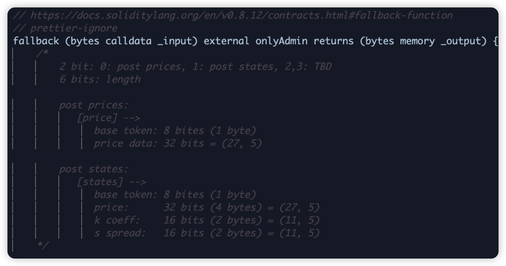
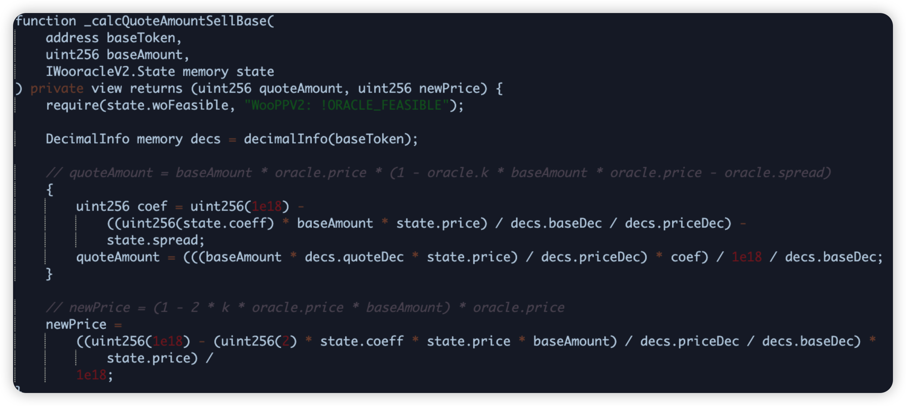
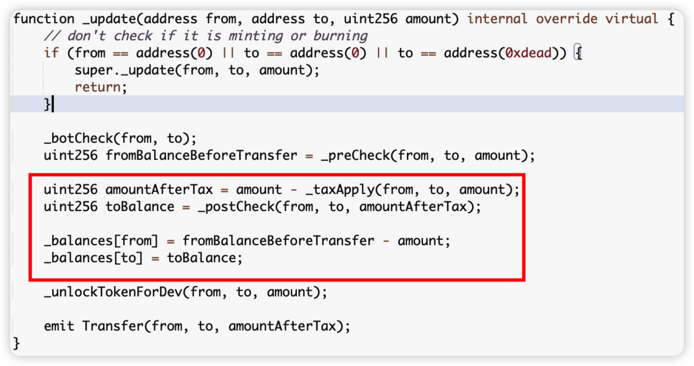
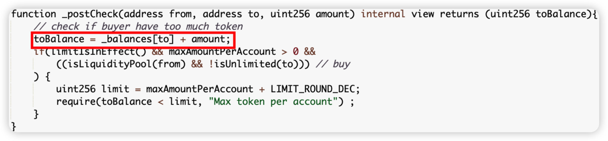

## Introduction

In this monthly series, HashDit is sharing the monthly security incidents in the crypto space and what we can learn from them. For this Mar 2024 edition, the total losses mounted up to $146 million, showing a 50% decrease compared to March 2023. 

Of which, they are split across 2 sections: DApps ($114m) and Phishing ($32m).

In this sharing, we focus on the DApps incidents. Below are the top 5 DApps incidents that DApp Developers should pay attention to.

## Top 5 DApps incidents

### Munchables - $62.5m - Insider Attack

Munchables is a GameFi and NFT protocol. In this attack, it was confirmed to be an Insider Attack where a rogue employee was malicious, gaining access to a privileged account. After malicious logic was introduced in a proxy contract upgrade, 62M funds were transferred out by the attacker. Thankfully, after some negotiation and investigation, the funds were eventually returned.

**Root cause**: Malicious developer was hired and suspected to be linked to DPRK, and had bad intentions right from the start. It was found that the malicious logic was already introduced during deployment and the bad actor used manual manipulation of the getLocked storage slot to assign himself an enormous Ether balance in the contract, so that his locked amount would bypass the withdrawal checks.

**Onchain information**:

[Hack tx](https://blastscan.io/tx/0x9a7e4d16ed15b0367b8ad677eaf1db6a2a54663610696d69e1b4aa1a08f55c95)

[Malicious contract upgrade](https://blastscan.io/tx/0xea1d9c0d8de4280b538b6fe6dbc3636602075184651dfeb837cb03f8a19ffc4f)

**Code snippet**:

Unverified contract

### PrismaFi - $12m - Lack of Validation

PrismaFi is a DeFi protocol, which is known as a non-custodial and decentralized Ethereum LST & LRT backed stablecoins. In this attack, the hackers bypassed the migrate function and called the flash loan directly with carefully crafted input data.

The flash loan's callback function, onFlashloan(), was called. The lack of proper checks allowed the hackers to close a trove owner's Trove and immediately reopen it within the same TroveManager. The transaction caused the owner's position to be closed and reopened, resulting in the trove owner having a new position with the same debt but less collateral and the difference in collateral sitting in the zap contract.

The hackers then opened a new Trove and used the MigrateTroveZap contract to migrate it, effectively using the remaining collateral for their own Trove.
Finally, the hackers closed their Trove and took the profits.

**Root cause**: The root cause of the vulnerability was twofold:

1. By directly calling the onFlashloan() function, the user could manipulate other trove managers positions.
2. The contract allowed for a mismatch between the collateral in the initial position and the collateral in the new position, with the difference being susceptible to being taken.

**Onchain information**:

[Hack tx 1](https://etherscan.io/tx/0x00c503b595946bccaea3d58025b5f9b3726177bbdc9674e634244135282116c7)

[Hack tx 2](https://etherscan.io/tx/0xce3cdc7c29eb7dfc565f5d99034789e80c1cd3278adafa26af6f3d21c8412c59)

[Hack tx 3](https://etherscan.io/tx/0x0e38dd693ddbc2f62282932f36a4b8de75f8ea1da530532af26698b4eda9a110)

**Code snippet**:

### WooFi - $8.7m - Price Manipulation

WooFi is a DeFi protocol which operates as a DEX, allowing users to swap tokens. In this attack, the attacker was able to compromise the WooPPV2 contract on Arbitrum. The exploit consisted of a sequence of flash loans that took advantage of low liquidity to manipulate the price of WOO in order to repay the flash loans at a cheaper price.

**Root cause**: There were 2 configuration issues. 
1. A previously unidentified error resulted in the price being adjusted far outside of the expected range ($0.00000009) 
2. The fallback check, normally executed against Chain Link, didn’t cover the WOO token price.

**Onchain information**:

[Hack tx 1](https://arbiscan.io/tx/0x40e1b8c78083fc666cb7598efcecd0ae0af313fc41441386e4db716c2808ce07)

[Hack tx 2](https://arbiscan.io/tx/0xe80a16678b5008d5be1484ec6e9e77dc6307632030553405863ffb38c1f94266)

**Code snippet**:

### SSS_HQ - $4.8m - Function wrongly implemented

SSS_HQ or Super Sushi Samurai is a GameFi platform on Blast chain. In this attack, thankfully a White Hat was able to spot the bug before any malicious actor, where he increased his own balance by repeatedly transferring to himself. He subsequently swapped these tokens in the liquidity pool and protected the liquidity of ~$4.8m.

**Root cause**: The tax transfer logic is wrongly implemented in the _update method of the SSS.sol code. The _balances[to] value is incremented before the _balances[from] value is updated (done within the _postCheck method), seen in the first picture. As such, the balance of the to address uses the stale value i.e original balance, seen in the second picture. This is summed with the amount variable, stored in the toBalance variable and subsequently overwriting the _balances[from] in the last statement, almost doubling the sender’s balance.

**Onchain information**:

[White-hat Hack tx](https://blastscan.io/tx/0x62e6b906bb5aafdc57c72cd13e20a18d2de3a4a757cd2f24fde6003ce5c9f2c6)

**Code snippet**:

### Unizen - $2.1m - Lack of Validation

Unizen is a DeFi protocol which operates as a DEX across multiple chains. In this instance, the attack happened on Ethereum, just 5 hours after the victim proxy was upgraded to a vulnerable logic contract. The vulnerable contract introduced a function 0x1ef29a02 which allowed arbitrary calldata to be sent. 

**Root cause**: Lack of validation in a Swap related function (which allowed arbitrary transferFrom calls, specifying the From, To and Amount parameters). As such, victims that have approved their funds to this contract will be affected.

**Onchain information**:

[Hack tx](https://etherscan.io/tx/0xc12a4155c2c90707138e4aef8883c8f724371145823e2f661f19b93e5b3a9d6e)

**Code snippet**:
Unverified contract

## Key lessons for developers

1. In light of potential insider compromises, it's crucial to apply thorough background checks for new employees. Specifically, keep an eye out for potential red flags including:

    * **Preference for certain platforms:** Malicious developers seem to favor using Github, often impersonating user profiles such as SuperTalentedDev726 or CryptoKnight415.

    * **Use of numbers:** Both email addresses and Github usernames often contain numerical sequences. It's suspected they use this as a method for tracking the identities they impersonate.

    * **Asian identities:** There's a tendency toward choosing Japanese (and possibly Korean) identities, often claiming prior education in Japan.

    * **Prominent educational background:** The falsified credentials often include elite universities in Japan, Hong Kong, and Singapore. Such institutions may include Singapore State University, Nanyang Technological University, University of Hong Kong or Hong Kong University of Science and Technology.

    * **Codebase theft:** While not always the case, these imposters often steal existing projects from GitHub and recondition the commit messages to reflect their assumed usernames.

    * **Multiple applications:** They tend to apply repeatedly for the same job, resorting to multiple email addresses for their submissions.

    * **Premature expertise:** They often claim experience in Solidity/EVM too early (such as in 2015), which is an unlikely scenario giving the nascent state of blockchain technology at the time.

2. Input validation is a crucial process - it's essential to verify all potential user inputs, especially when these inputs affect changes to the state of the system. This holds particularly true in the below scenarios:

    * **Calldata Parameters:** Given that attackers have the ability to craft any data, extra validation steps must be in place for calldata parameters.

    * **User Approvals:** During the process where the protocol contract manages users' approvals, meticulous input checks are paramount to prevent potential malicious activities.

3. To guard against price manipulation, it's essential to ensure that updated prices cannot be influenced to reflect unexpected values. Oracles, both on-chain and off-chain types, can be employed by developers. Here's how:

    * **Set Boundaries:** Implementing limits can block prices from being abruptly manipulated to an impossible value, regardless of the oracle type in use.

    * **Fallback Oracle:** Integrate a secondary oracle as a fallback measure. This ensures that if the initial oracle fails, there is a backup in place to verify the consistency of prices. By doing so, it ensures continuous, reliable price feeds, and safeguards against single point of failure.

4. Ensuring that the deployed function aligns with the intended objective is a critical requirement, especially for high-stakes operations such as accounting. This assurance can be achieved through:

    * **Thorough Testing:** Execute comprehensive fuzz testing and edge case analysis. This doesn't solely ensure correct function logic, it also helps to identify potential flaws and security vulnerabilities that might otherwise be overlooked.

    * **Use Trusted Templates:** Consider using trusted codebases, such as Openzeppelin, as a foundation for your code. These established libraries have been vetted extensively by the developer community, reducing the likelihood of introduction of unexpected bugs or issues.

Feel free to contact us at support@hashdit.io for any support needed! Stay safe!

*Unverified contracts screenshots courtesy of Dedaub’s decompiler!

