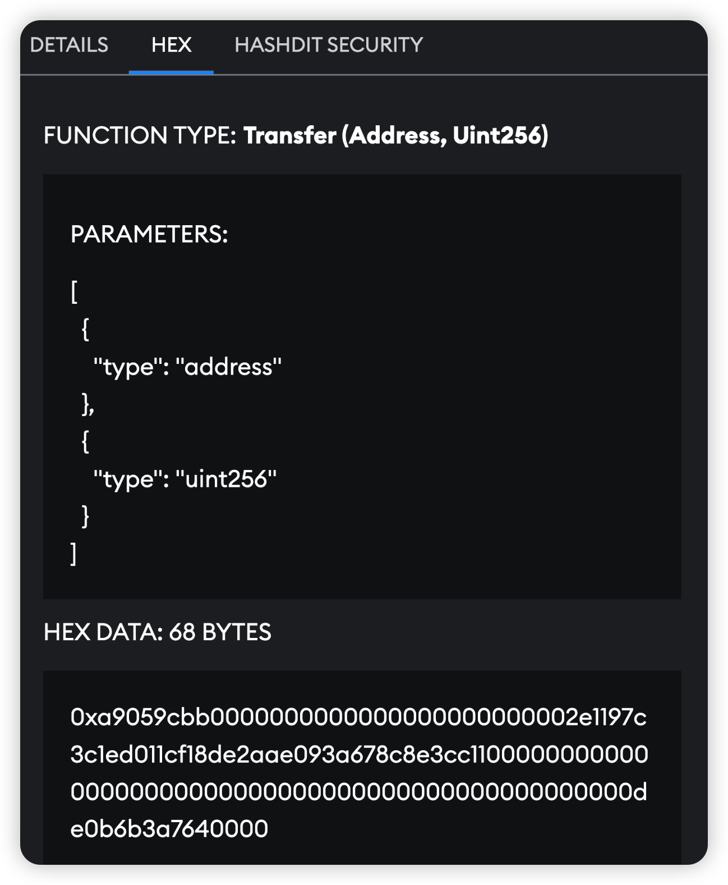

## Getting Started with HashDit Snaps: A Step-by-Step Guide

### Introduction
Meet HashDit Snaps, a revolutionary MetaMask extension designed to dramatically boost your security when interacting with smart contracts. 
HashDit snap aims to protect users by screening transactions before they are executed through transaction insights. This include warnings against interactions with:
* Ponzi Schemes
* Risky Smart Contract Interactions
* Phishing Websites and Addresses
* Scam Websites and Addresses

HashDit snap also provides clear details about the function and arguments invoked during a smart contract interaction.

### Installation

**Installing MetaMask**

As a pre-requisite, MetaMask must be installed on your browser before installing HashDit Snaps. 

<u> Metamask Installation Link </u>

MetaMask Snaps is currently only supported on the browser version, and not the mobile version.

Installing The Snap
On the HashDit Snap website, start the installation process by clicking the Add to MetaMask button.

**Installing The Snap**

On the HashDit Snap website, start the installation process by clicking the **Add to MetaMask** button.

**Permissions**
Continue through the install and accept the requested permissions. The requested permissions are required to allow HashDit Snap to work properly.

* Access the internet: Allow HashDit Snap to access the internet. This is used to both send and receive data with the HashDit API.
* Access the Ethereum provider: Allow HashDit Snap to communicate with MetaMask directly, in order for it to read data from the blockchain and suggest messages and transactions.
* Allow websites to communicate directly with HashDit Security: Allow websites to send messages to HashDit Security and receive a response from HashDit Security.
* Fetch and display transaction insights:  Allow HashDit Snap to decode transactions and show insights within the MetaMask UI. This is used for all the security features.
* See the origins of websites that suggest transactions: Allow HashDit Security to see the origin (URL) of websites that suggest transactions. This is used by the URL screening feature.
* Store and manage its data on your device: Allow HashDit Security to store, update, and retrieve data securely with encryption. Other snaps cannot access this information. The only data stored is the signed hash of the security message (see below). 

The HashDit snap does not have access to the user's private keys. Furthermore, the only transaction initiated by the Snap is a signature request dispatched during installation.

**Signature Request**

Upon completion of the installation process, the user will be prompted to sign a security message. Note that this is only used to authenticate the HashDit API. Rejecting the signature request will **prevent** HashDit's features from working. 

If the signature request is rejected, it can be re-prompted by just reinstalling the snap.

If you attempt to use HashDit snap without signing the security message, an error screen will be displayed.

Reinstalling the snap will resolve this issue.

**Reinstalling The Snap**

To update the snap or re-sign the signature request, users simply need to click the 'Reconnect' button, which triggers a new installation prompt.

### How To Use HashDit Snap

Using HashDit Snap is simple!
Once the HashDit Snap is installed, the security features are entirely automatic. The HashDit Snap will provide transaction insights before a transaction is executed by a user. In the transaction screen, a user can switch to the **HashDit Security tab** to view the risks involved with their transaction.

The features of HashDit Snap are currently supported on the **Binance Smart Chain Mainnet** and **Ethereum Mainnet**. Other networks will only support URL screening.

### Features

**Transaction Screening and Destination Screening**

**Transaction Screening**

The **Transaction Screening** insight offers a risk assessment before interacting with a smart contract. This assessment provides users with three values that shed light on potential risks associated with their transaction:
**Overall Risk** - The overall risk level of the transaction, which can be one of three levels
·	Low Risk
·	Medium Risk 
·	High Risk
**Risk Overview** - The recommended action
**Risk Details** - Details explaining the output of the overall risk

**Destination Screening**

The **Destination Screening** insight scans a transaction's destination address against HashDit's database of blacklisted and whitelisted addresses. This database encompasses known scamming, phishing, and trusted addresses. This assessment provides users with three values that shed light on potential risks of interaction:

**Overall Risk** - The overall risk level of the transaction can be one of three levels
·	Low Risk
·	Medium Risk 
·	High Risk
**Risk Overview** - The recommended action
**Risk Details** - Details explaining the output of the overall risk

**URL Screening**

The URL Screening insight scans the website origin of the transaction and compares it against HashDit's database of whitelisted and blacklisted URLs. Our database includes sites flagged as scams, deemed high-risk, and whitelisted. The insight will provide users with a risk level, ranging from -1 to 4.

| Risk Level | Risk Explanation |
| ----------- | 	----------- |
| -1 | Unknown Risk |
| 0 | No Risk |
| 1 | Low Risk |
| 2 | Medium Risk - Suspicious Website|
| 3 | Medium Risk - Dangerous Website|
| 4 | High Risk - Dangerous Website|

**Function Call Information**

The Function Call insight provides clear and explicit details about the function and arguments invoked during a smart contract interaction. The aim is to offer more readable parameters than Metamask's current 'Hex' tab. This is achieved by displaying each function argument, its type, and its corresponding value.

### Links
Official Website: https://www.hashdit.io/en/snap 

Documentation and FAQ: https://hashdit.gitbook.io/hashdit-snap

GitHub Repo: https://github.com/hashdit/metamask-snap

MetaMask Snap Page: https://snaps.metamask.io/snap/npm/hashdit-snap-security/

