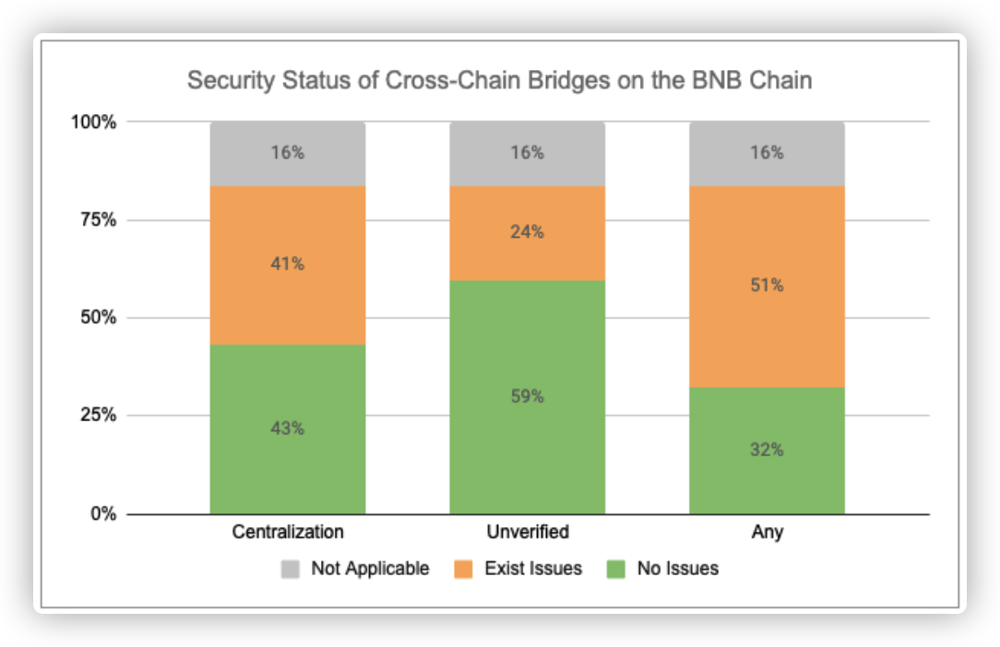

## Security Scan Summary Report for Cross-Chain Bridges on the BNB Chain

### Background
A cross-chain bridge is a decentralized application that helps to transfer assets from one blockchain to another. The cross-chain bridge is a core component of Web3 infrastructure. For users, the cross-chain bridge can facilitate the seamless movement of tokens and messages between chains. Undeniably, while cross-chain bridges are vital for unleashing exponential innovation in Web3, they simultaneously open up potential avenues for exploitation by malicious entities. Bridges have become a new target for cryptocurrency crime. Vulnerabilities in these bridges are under attack, and hacking incidents are becoming increasingly notable.

To ensure the safety of users on the BNB chain, we have conducted security scans on 37 active bridge projects on the BNB chain. The scans mainly focus on two aspects:
1. The degree of centralization in the privileged roles of the project.
2. The open-source status of the project's smart contracts.

#### 1.Degree of Centralization in the Project’s Privileged Roles

The main focus here is on whether privileged role management follows good security practices. The examination includes whether a privileged role is an EOA (Externally Owned Account). When an EOA is used in a privileged role, it exposes an attack surface. If the corresponding private key is exposed, the attacker may gain control over the privileged functions, endangering the project's economic ecosystem and user funds. Therefore, it is generally considered a better practice with a higher degree of decentralization to use multi-signature wallets, MPC (multi-party computation), or time lock contracts as privileged addresses. Using an EOA as a privileged role in a smart contract signifies a higher degree of centralization in the project. 
The assessment also checks whether the threshold or other parameters for privileged roles that have already used multi-signature wallets are set reasonably. If the threshold is not set properly, the multi-signature wallet cannot reduce the degree of centralization and still carries a centralization risk.

In the real world, notable cross-chain bridge vulnerabilities due to poor security practices for privileged roles are common:

- Harmony Bridge (June 2022) - Two out of five private keys required to promote, approve, and execute transactions on the Harmony Bridge multi-signature were exposed. Here, the mult-sig wallet threshold is less than 51%, which is relatively low.
- Multichain Bridge Hack (July 2023) - The bridge's private key was exposed, leading to unauthorized withdrawals, all under the control of the Multichain CEO.
- QANplatform (October 2022) - The cross-chain bridge project was attacked, suspected to be due to a private key leak. It resulted in a loss of approximately $1.9 million, causing the price of the QANX token to plummet.

Centralized bridge projects are not only vulnerable to attacks but also enable centralized participants to unilaterally control all funds. Decentralized privileged roles help mitigate centralization risks by requiring any potential attacker (including the bridge operator) to compromise the private keys of multiple independent entities to carry out any malicious activity, thus serving as an effective form of security.

#### 2. The Open-Source Status of the Project's Smart Contracts

This scan primarily focuses on the open-source nature of a project's smart contracts. 

Since the principal function of cross-chain bridges is the transfer of value from one blockchain to another, all cross-chain protocols necessarily involve smart contracts. In most cross-chain use case scenarios, smart contracts across multiple chains are employed to facilitate functions like token minting, burning, locking, or unlocking – all crucial to efficient cross-chain movement.

Smart contracts function as both a safeguard against vulnerabilities and a potential technical risk in the event of flawed implementation. Usually, smart contracts provide a valuable mechanism for cross-chain bridges to perform integral security checks, such as ensuring the amount a user withdraws doesn't exceed their deposits and enforcing rate limitations. On the other hand, poorly written, or unaudited smart contract code can have a substantially adverse effect: vulnerabilities within the smart contract code can be exploited by malicious hackers, who could potentially steal massive volumes of data from the cross-chain bridge.

If a cross-chain bridge smart contract on a blockchain explorer is closed source, users would not be able to understand the cross-chain logic by examining the smart contract. Similarly, it would be more difficult for users to judge the quality of the code or identify potential vulnerabilities within the smart contract. Even worse, nefarious project parties may potentially create backdoor functions within closed-source bridge smart contracts, which could lead to user funds becoming irretrievably locked. Using or approving unverified smart contracts inherently exposes users to significant financial risk.

Contrary to what some project teams may believe, failing to open-source project contracts does not necessarily prevent potential hacker attacks. In truth, experienced hackers can still make attempts on closed source project smart contracts, which impedes normal user interaction and breeds mistrust. Open-sourcing contract code not only promotes project transparency, but also helps prevent the inclusion of malicious code, ultimately fostering increased user trust. Hence, open-sourcing smart contracts is often considered to be best practice in the industry.

### Security Check Results

The scan results show:
- Out of 37 projects, 12 (32%) were found to have no apparent security risks in these two aspects;
- 15 (41%) out of 37 projects had issues of privileged roles centralization; 9 (24%) out of 37 projects had issues related to closed-source smart contracts.
- 5 (13%) projects had security issues in both aspects;
- The remaining 6 (16%) projects are not applicable to our scanning. 2 of the projects do not use smart contracts, instead they use Externally Owned Accounts (EOA) to transfer tokens on the chain combined with off-chain programs for cross-chain transfers. The other four projects did not develop their own cross-chain bridges, they simply provide routing selection for multiple cross-chain bridges, so our scanning doesn't hold much significance for these types of bridge aggregators.

We found a total of 239 issues with the centralization of privileged roles and 67 issues with closed-source smart contracts.

We have identified the below types of risks, which include:

1. In some bridge projects, closed-source smart contracts exist on BSCSCAN.
2. In some bridge projects, the smart contracts have applied the proxy pattern. While their proxy contracts are open-source, the corresponding logic contracts are closed-source.
3. In some bridge projects, closed-source smart contracts are used as privileged roles in certain smart contracts.
4. In some bridge projects, Externally Owned Accounts (EOAs) are used as key privileged roles in smart contracts, possessing various privileged functions.
5. In some bridge projects, although multi-signature wallets have been used as privileged roles in smart contracts, the multi-signature wallets have set unreasonable/low thresholds (<51%).
6. In some bridge projects, despite the use of multi-signature wallets as privileged roles in smart contracts, the number of owners set for the multi-signature wallet is unreasonable, such as only consisting of one owner. This essentially means that the degree of centralization is equivalent to that of an EOA.

Through our communication and initiatives, thus far, at least four project teams have completely or partially addressed the existing issues. Therefore, currently, there are 16 projects that have implemented good security practices in these two respects. We are still actively communicating with the remaining projects.

In general, nearly 50% of the cross-chain bridge projects on the BSC chain currently have a good degree of on-chain code openness and a high level of decentralization of privileged roles. In the remaining projects, most project teams have actively responded to our scanning results, showing a willingness to continuously optimize and improve in these two aspects, and are already taking steps to do so. Therefore, the security situation of bridge projects on the BSC chain is quite optimistic. Comparatively speaking, in many other blockchains, the BSC ecosystem has a relatively high overall security for its bridges.

### Best Practice Recommendations

#### Best Practices for Addressing Centralization in Privileged Roles  
Decentralization is critical for providing security against single points of failure. We recommend solutions such as multi-signature wallets, time-lock contracts, and MPC wallets for use as privileged roles in smart contracts to reduce the level of centralization. 

- Multi-signature is abbreviated as multisig and requires multiple private key holders to sign a transaction, usually used to prevent one party from controlling the wallet.  
- A time-lock can lock certain functions of a smart contract for a specified period. It can significantly improve the security of smart contracts. For example, consider a scenario where a hacker has compromised a bridge project's multi-signature wallet and is preparing to withdraw money from the vault, but the vault contract has a two-day lock period. Thus, from the initiation of the withdrawal transaction to the actual withdrawal of funds, the attacker will need to abide by this two-day lock period. During this period, the project team can find countermeasures, and investors can sell out their tokens preemptively to reduce losses.
- MPC wallets are a subset of crypto wallets created using multi-party computation methods. They allow multiple users to create a joint wallet to store digital assets without any single point of failure. In this way, MPC wallets can ensure safety and mitigate risks, because compromising the system requires substantial effort from multiple parties. 

We suggest combining one or more of the above solutions as privileged roles. However, please note that whether it is a multisig wallet, a timelock contract, or an MPC wallet, reasonable parameter settings must be applied in order to truly play a role and reduce the level of centralization.

- The popular/industry standard interface currently employed for multi-signature wallets is [GnosisSafe](https://hashdit.github.io/hashdit/blog/smart-wallet-migration-guide/). When using a multi-signature wallet, it's important to ensure a reasonable threshold is applied. The appropriate threshold for a multi-sig wallet should depend on the number of share owners and their level of trust, and it can vary based on various practical situations. There's always a balance between absolute security and convenience. If you set an overly high signature requirement, wallet operation can become overly complex and cumbersome. On the other hand, setting too low of a signature requirement may invite risks of wallet misappropriation.
Common settings include a 2-3-4 mode (a 3-person wallet requiring 2 signatures or a 4-person wallet requiring 3 signatures), which can ensure that, in the case of a participant's private key being stolen or the participant being inaccessible, others can continue to operate the wallet without reducing the wallet's financial security. Generally speaking, the threshold should not be lower than 51% of the total number of owners, but the total number of owners should not be less than 2.

- Determining a reasonable lock time for a time lock contract depends on several factors, such as the specific needs of the project, the level of risk tolerance, and functionality requirements.
However, it's important to remember that the right lock time for a specific project may vary. For high-risk operations or projects in volatile markets, longer lock times may be necessary. Conversely, for lower-risk operations or stable markets, a shorter lock time might suffice. If the lock time is too short, say a few minutes, the project team may not have enough time to take any action, and then this locking procedure would be essentially in vain.
Typically, the length of lock time chosen should provide sufficient time for the contract's stakeholders to react to changes in the contract. Popular choices are often between 24 to 72 hours for many DeFi projects, as this provides an acceptable trade-off between security and operational efficiency.

#### Best Practices for Smart Contract Codes

When using cross-chain protocols, risks associated with smart contracts are practical. The safest cross-chain bridges continuously test their codebases through private and competitive audits, along with various internal security tests such as fuzzing, static analysis, formal verification, symbolic execution, etc.

Assessing the times of a codebase has been audited and by whom can serve as a reliable signal that the cross-chain bridge in use has protection against technical attacks. Additionally, layered security measures (like enabling emergency pauses and updates, and implementing rate limits) can mitigate the impact of any smart contract errors. 

With all these measures in place, open-source code benefits the project by enhancing transparency and boosting user trust. Typically, closed-source project contracts imply potential risks or even hidden malicious code, backdoor functions, and a risk of rug pulling.

It's best to open source all contracts within the project ecosystem. This is to ensure transparency for users and to allow code auditors/white hats to verify the security of the code.

An often overlooked case of an unverified contract is when a smart contract uses a proxy pattern. A proxy contract is a contract which delegates calls to another contract. To interact with the actual(logic) contract users have to go through the proxy, and the proxy knows which contract to delegate the call to (the logic).
A proxy pattern is often used when project parities want upgradability for their contracts. This way the proxy contract stays immutable, but they can deploy a new logic contract behind the proxy contract - simply change the logic address inside the proxy contract. So that the proxy contract indeed delegates its functionality to the logic contract. Therefore, it's dangerous when only the proxy contract is verified and the logic contract isn't as it can't be guaranteed that the logic contract isn't malicious. As a best security practice, it's better to open source not only the proxy contract but also the logic contract.

When the privileged roles of a smart contract are unverified contracts, the unverified contracts might hold some potential backdoors or malicious external interactions, it's best to open source that smart contract code of the privileged role.

How to open source contracts:
- On BNB chain: https://bscscan.com/verifyContract   
- On opBNB chain: https://opbnbscan.com/verifyContract  

Furthermore, always maintain transparency with your investors - for example, create Medium articles, informing users of the addresses or updates of key contracts, etc.

### Recommendation for users
Before using a cross-chain bridge, users also need to conduct due diligence to ensure that they choose a bridge with effective security measures. Here are some key points:

1. **Security**: Check whether the cross-chain bridge has passed multiple in-depth security audits, and whether the audit results didn't show any major issues. Also, consider how they have responded to and rectified any identified issues.
2. **Transparency**: It's important that the bridge protocol's source code is open source and easily accessible. This can help users understand how the protocol works and identify any potential issues.
3. **Decentralization**: If you have a certain understanding of smart contracts, you can check whether privileged roles in the smart contract use highly decentralized multi-signature wallets or time-lock contracts; and whether the threshold of the multi-signature wallet or the lock duration of the time-lock contract is rationally set.
4. **Community support**: An active and engaged community can help keep the bridge protocol updated, adaptable to market changes, and capable of solving any problems that may arise.
5. **Performance**: Observing the performance of the cross-chain bridge, including transaction speeds and costs, is also an important step. A bridge with strong performance and low cost ensures a better user experience.
6. **User Experience**: User experience is another significant factor, including the usability of the interface, whether there is a comprehensive user guide, and customer support availability.
7. **Partnerships and ecosystem**: It's beneficial for users to check whether the cross-chain bridge has many partners and supports many chains, to assess the extent and maturity of its ecosystem.

For cross-chain investments, due diligence is essential. You should look at official documents, white papers, security audit reports, consider community reviews, listen to expert opinions, and if possible, test their services. Find out more about it from forums, communities, or Q&A websites, and conduct a comprehensive evaluation from all aspects. Don't lightly believe in unverified information.

### Glossary

- **EOA**: Externally Owned Accounts are accounts that are controlled by a private key and have no coding associated with them. If you hold the private key associated with an EOA, you can send coins and messages from it. (E.g a Metamask account).

- **Rugpull**: A rugpull in the crypto industry is when a development team suddenly abandons a project and sells or removes all its liquidity. The name comes from the phrase to pull the rug out from under (someone), meaning to withdraw support unexpectedly.

- **Privileged Role**: In smart contracts, "privileged roles" often refer to certain roles or accounts within the contract that have special permissions. These accounts have the authority to perform actions that regular users cannot execute in the contract. For example, privileged roles might be able to change contract parameters, upgrade the contract, or pause the contract in emergency situations.
When designing and deploying smart contracts, these privileged roles should be managed and controlled very carefully, as they have potential risks that may be misused or abused. For instance, if a bad actor gets control of a privileged role, they might have the ability to cause abnormal contract behavior or make destructive operations, such as stealing assets stored in the contract.
Sometimes, privileged roles in a smart contract may be assigned to a multi-signature wallet, controlled collectively by multiple entities, increasing complexity and security.

- **Multi-Sig Wallet**: A multi-signature (multi-sig) wallet is a type of digital wallet that requires approval from multiple parties to authorize a cryptocurrency transaction. This type of wallet is designed to provide increased security, as it minimizes the risk of single-point failures or attacks. The 'multi-signature' aspect refers to the multiple cryptographic keys involved: each co-owner of the wallet has a unique key, and a preset number (the 'threshold') of these keys must be used in concert to authorize a transaction.

- **MPC(Multi-Party Computation)**: A Multi-Party Computation (MPC) wallet utilizes multi-party computation technology, in which each party holds a piece of the private key, and computations are collaboratively concluded without revealing individual inputs. This introduces a new level of security as no single party has access to the entire private key, and transactions require authorization from multiple parties, making it extremely difficult for attackers. MPC is used in various applications such as privacy-preserving data analytics, secure voting, secret sharing, etc., including enhancing the security of crypto wallets and transactions. 
Compared to multi-signature wallets, the method provided by MPC for ensuring security is different; an MPC wallet offers security through private key sharing without needing to execute a multi-party transaction on the blockchain, while multi-signature wallets offer security by approving transactions with multiple keys executed on the blockchain (leading to typically higher gas fees).

