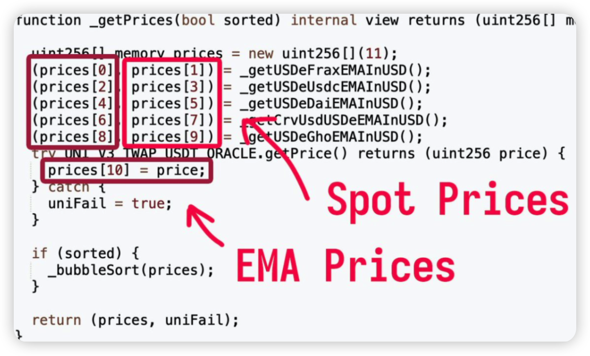
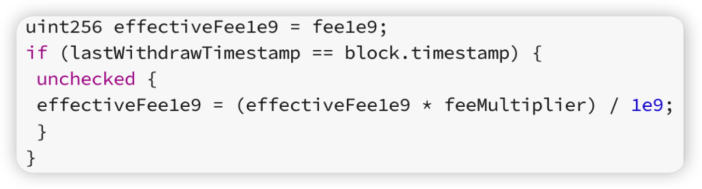
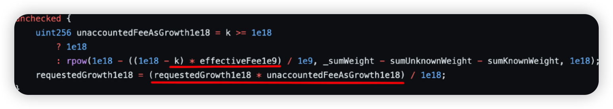
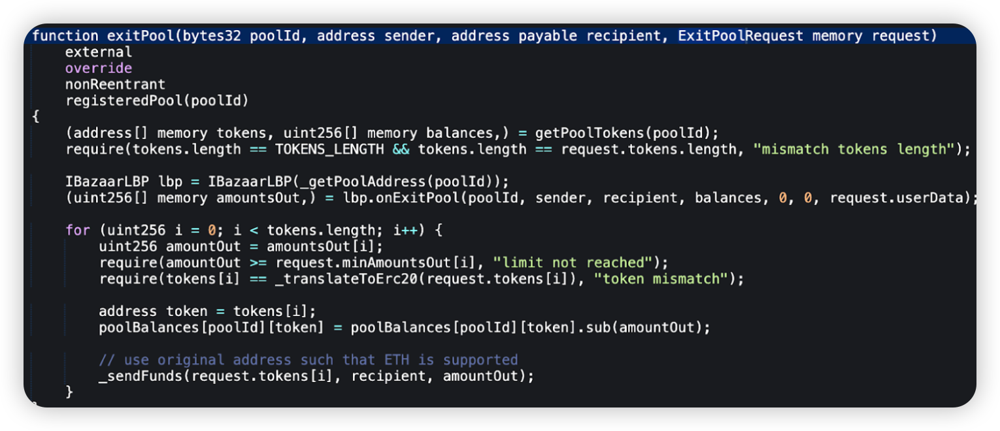

## Introduction

In this monthly series, HashDit is sharing the monthly security incidents in the crypto space and what we can learn from them. For this June 2024 edition, the total losses amounted to $56.4 million, showing a 276% increase compared to June 2023 ($15 million). 

In this sharing, we focus on the DApps incidents. Below are the top 5 DApps incidents that DApp Developers should pay attention to.

## Top 5 DApps incidents

### Uwulend - $23.7m - Price Manipulation

Chain: Ethereum

Uwulend is a DeFi protocol where users can participate as depositors, borrowers or LP stakers. Depositors provide liquidity to the market to earn a passive income, while borrowers are able to borrow in an overcollateralized (perpetually) fashion. On June 10 2024, in this incident, the Market contracts used an unreliable averaged-out oracle which resulted in an initial compromise of $20 million.

After the project paused and unpaused the protocol, they were once again exploited for another $3.7 million just 3 days later.

**Root cause**: The price oracle used took 11 different prices, and used the median price as the price oracle. However, 5 of these prices were spot prices and directly under the control of the attacker. This meant that only one EMA price needed to be manipulated.

The second issue is that the input prices are in USDE, but the oracle output is in sUSDE, which currently trades around 1.08. The oracle converts between them with an owner controlled conversion factor. This conversion was set to 1.03 three months ago, and has been steadily more wrong over time as the price of sUSDE goes up with yield.

**Onchain information**:

[Hack tx](https://etherscan.io/tx/0x242a0fb4fde9de0dc2fd42e8db743cbc197ffa2bf6a036ba0bba303df296408b)

Code snippet:

### Velocore - $6.8m - Lack of validation

Chain: Linea & Zksync

On the 2nd of June, 2024, Velocore is a Layer-2 protocol that leverages ZK technology to enhance Ethereum scalability. Due to a Lack of validation vulnerability in the smart contract, Velocore experienced a security breach on June 2nd, 2024, resulting in financial losses approximating $6.8 million in ETH.

**Root cause**: The root cause of this compromise was due to vulnerabilities within the Balancer-style CPMM pool contract, specifically the ‘velocore__execute’ function. The vulnerability here is that `effectiveFee1e9` was allowed to exceed 100% - that is 1e18 (take note of the ‘unchecked’ block). This resulted in an underflow, changing a withdrawal into a large deposit.

**Onchain information**:

[Hack tx](https://bscscan.com/tx/0x47e123af93add709bc2516f6a5db057dfbb1d66a75b693cd7980cd3eb28c7357)

[Malicious upgrade tx](https://www.bscscan.com/tx/0x55bb186c80834ffe00ac673b02fb1e70ac4fad56d4407afcf8bf4f1d716f579e)

Code snippet:

### Loopring - $5m - Social Engineering

Chain: Ethereum

Loopring is a zkRollup Layer 2. It allows for high-throughput, low-cost trading and payment on Ethereum. On June 9, 2024, in this attack, some Loopring Smart Wallets were targeted in a security breach. Subsequently, the attacker transferred assets out of the affected wallets. This resulted in a loss of approximately $5 million across the wallets.

**Root cause**: The attack succeeded by compromising Loopring's 2FA service, allowing the hacker to impersonate the wallet owner (by obtaining the right signature) and gain approval for the Recovery from the Official Guardian.

**Onchain information**:

[Hack tx](https://etherscan.io/tx/0xf0a02e3dc32e380f5fbc832981963277f7b2ce9345040ddf1f3016724b84e251 )

Code snippet:

### Bazaar - $1.4m - Lack of Validation

Chain: Blast

On June 10, 2024, Bazaar, a DeFi project, had its BazaarVaultBlast contract compromised, resulting in a loss of ~$1.4 million. In this attack, there was a lack of validation issue which allowed anyone to withdraw funds from the vulnerable contract.

**Root cause**: The vulnerable function exitPool() did not validate its caller, which means that a malicious actor could invoke this method and parse another user’s balance to withdraw their funds to himself.

**Onchain information**:

[Hack tx](https://blastscan.io/tx/0x7fdd140f7631f62d62f7256ee4a38af51a4723ad5d66adc9b9685bf78f750f2d )

Code snippet:

### Holograph - $1.3m - Insider Attack

Chain: Ethereum

Holograph is an omnichain tokenization protocol, enabling asset issuers to mint natively composable omnichain tokens. On June 13, 2024, the incident involved a misused HLG created on Mantle that was activated through Layerzero bridge. There was a Falsified packet that was executed on Mantle which resulted in a large mint of 1 billion HLG tokens on Ethereum, valued around $1.3 million at the time.

**Root cause**: It was a private key compromise that was later on confirmed by Holograph, this was an insider attack. A former contractor exploited Holograph Protocol to mint additional HLG. The malicious actor deployed an unverified contract on Mantle, which was used to mint additional HLG.

**Onchain information**:

[Large mint tx](https://etherscan.io/tx/0x0cc143ccf3316d47b36a2e45577922f4ebe2374966bb22c1e9cf49c747d46396)

[Mantle packet tx](https://explorer.mantle.xyz/tx/0x845dafdac3d55238e8cf005ae2daaac5f651ff4b3eaf56945377a7f6c8366449 )

Transaction snippet:

## Key lessons for developers

1. In light of potential insider compromises, it's crucial to apply thorough background checks for new employees. Specifically, keep an eye out for potential red flags including:

    * **Preference for certain platforms:** Malicious developers seem to favor using Github, often impersonating user profiles such as SuperTalentedDev726 or CryptoKnight415.

    * **Use of numbers:** Both email addresses and Github usernames often contain numerical sequences. It's suspected they use this as a method for tracking the identities they impersonate.

    * **Asian identities:** There's a tendency toward choosing Japanese (and possibly Korean) identities, often claiming prior education in Japan.

    * **Prominent educational background:** The falsified credentials often include elite universities in Japan, Hong Kong, and Singapore. Such institutions may include Singapore State University, Nanyang Technological University, University of Hong Kong or Hong Kong University of Science and Technology.

    * **Codebase theft:** While not always the case, these imposters often steal existing projects from GitHub and recondition the commit messages to reflect their assumed usernames.

    * **Multiple applications:** They tend to apply repeatedly for the same job, resorting to multiple email addresses for their submissions.

    * **Premature expertise:** They often claim experience in Solidity/EVM too early (such as in 2015), which is an unlikely scenario giving the nascent state of blockchain technology at the time.

2. To guard against price manipulation, it's essential to ensure that updated prices cannot be influenced to reflect unexpected values. Oracles, both on-chain and off-chain types, can be employed by developers. Here's how:

    * **Set Boundaries:** Implementing limits can block prices from being abruptly manipulated to an impossible value, regardless of the oracle type in use.

    * **Fallback Oracle:** Integrate a secondary oracle as a fallback measure. This ensures that if the initial oracle fails, there is a backup in place to verify the consistency of prices. By doing so, it ensures continuous, reliable price feeds, and safeguards against single point of failure.

3. Input validation is a crucial process - it's essential to verify all potential user inputs, especially when these inputs affect changes to the state of the system. This holds particularly true in the below scenarios:

    * **Calldata Parameters:** Given that attackers have the ability to craft any data, extra validation steps must be in place for calldata parameters.

    * **User Approvals:** During the process where the protocol contract manages users' approvals, meticulous input checks are paramount to prevent potential malicious activities.

4. Here are five key tips to protect against social engineering attacks that compromise 2FA for Web3 protocol teams:

    * **Educate and Train Team Members** 

        * **Awareness Programs**: Regularly conduct training sessions to educate team members about the various types of social engineering attacks, such as phishing, vishing (voice phishing), and smishing (SMS phishing).

        * **Simulated Attacks**: Perform simulated social engineering attacks to test and improve the team's response to real threats.

    * **Use Strong 2FA Mechanisms** 

        * **Hardware Tokens**: Encourage the use of hardware-based 2FA tokens (e.g., YubiKey) instead of SMS-based 2FA, which is more susceptible to SIM swapping attacks.

        * **App-Based 2FA**: If hardware tokens are not feasible, use app-based 2FA solutions like Google Authenticator or Authy, which are more secure than SMS.

    * **Monitor and Respond to Suspicious Activity** 

        * **Anomaly Detection**: Implement systems to detect and alert on unusual login attempts or behavior that could indicate a compromised account.

        * **Immediate Response**: Have a clear incident response plan in place to quickly address and mitigate any suspected social engineering attacks.

    * **Secure Communication Channels** 

        * **Encrypted Communication**: Use encrypted communication channels for sensitive information and authentication processes.

        * **Verification Protocols**: Establish protocols for verifying the identity of individuals before sharing sensitive information or performing critical actions.

    * **Limit Access and Permissions** 

        * **Role-Based Access Control (RBAC)**: Implement RBAC to ensure that team members only have access to the information and systems necessary for their role.

        * **Regular Audits**: Conduct regular audits of access permissions to ensure they are up-to-date and appropriate.

Feel free to contact us at support@hashdit.io for any support needed! Stay safe!

