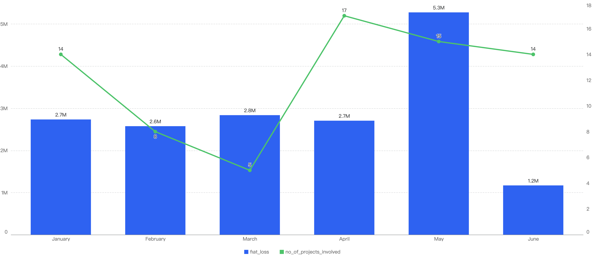
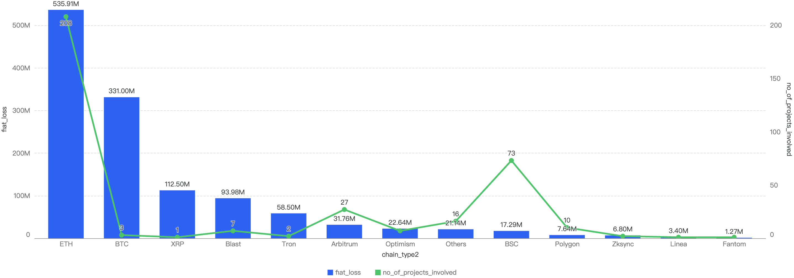
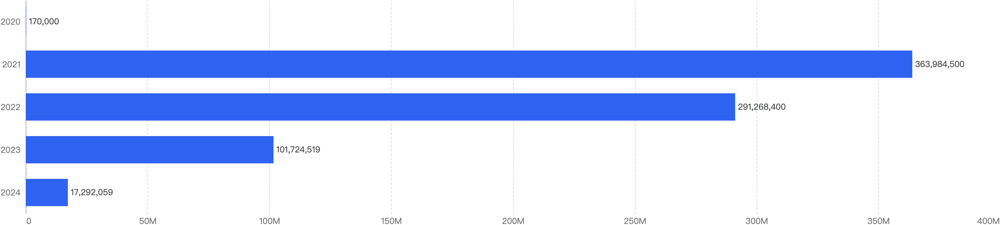
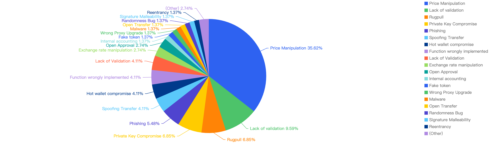
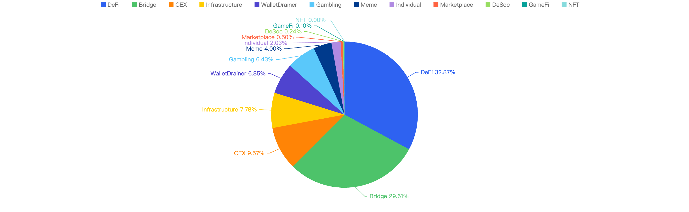
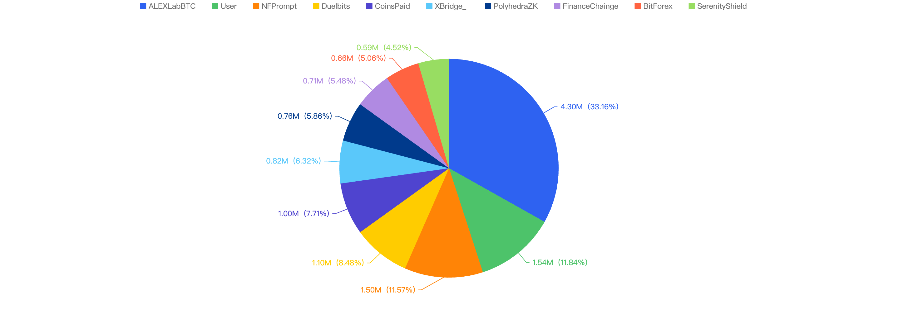

# Hashdit 2024 BNB Smart Chain (BSC) H1 Security Report

## Overview
This report focuses on security events that happened on BSC in 2024 H1, analyzing the type of projects targeted and sharing the common attack techniques used in 2024 H1, with respect to the financial loss of the incidents.

### Disclaimer
The financial data provided here is accurate based on our own monitoring system and based on the $USD amount of the cryptocurrency involved at the time of the incident. Due to the fluctuating price nature of cryptocurrencies, the total amount loss might differ with the current token valuations.

Furthermore, the financial data might not fully reflect the true “exploited amount” of the incident. This is especially true for scams where the total scammed amount is usually mixed with an initial base amount injected by the scam project party.

## 2024 H1 in focus

### General

In 2024 H1, approximately $17.29 million were lost to 73 security incidents on BSC. By observing the monthly chart below, the months with the top amount loss were May, March followed by January. The highest number of security incidents took place in April at 17.

Figure 1: Amount of stolen funds in dollars and number of incidents per month in 2024 H1

### Against other chains

Figure 2: Financial Loss and number of exploits across chains for 2024 H1 
(Smaller chain incidents are grouped under “Others”)

In the first half of 2024, BSC recorded $17.29 million in losses across 73 incidents, accounting for 1.4% of the total losses. Among all blockchains, BSC ranked 8th in terms of financial losses and 2nd in the number of exploits.

In contrast, Ethereum experienced the highest losses and the greatest number of attacks. Continuing the trend from 2023, Ethereum remained the blockchain with the largest loss amount in the first half of 2024. There were 208 exploits on Ethereum, resulting in $535 million in losses, which represented 43% of the total losses.

### With H1 previous years

When we compare the data with H1 of previous years, there is a decreasing trend of financial losses (excluding 2020), which can signify that the security posture of BNB Chain has improved over the years. 

Figure 3: Financial Loss across the previous H1 of 2020 - 2024

In 2021, the decentralized finance (DeFi) market experienced unprecedented growth, with numerous protocols launching without adequate security measures. This lack of security awareness allowed malicious actors to exploit vulnerabilities.

Since then, there has been a stronger emphasis on security for DeFi protocols, leading to a significant reduction in impactful exploits. As a result, financial losses in the first half of 2024 dropped by 83% compared to the same period in 2023 ($101 million), marking a substantial improvement.
Attack vectors analysis

Out of the 73 security incidents, hacks take up 80.82%, while 19.18% are scams.

Figure 4: Proportion of different type of exploits

This correlates to the financial loss of hacks and scams in the first half of 2024. The total financial loss of hacks ($14.9m) is nearly 7x that of notable scams ($2.3m), as shown below in Figure 5 below.

Figure 5: Financial impact measured in dollars comparing different types of incidents

### Specific attack vectors analysis
Figure 6 displays the specific attack vectors against its number of exploits in 2024 H1.

Figure 6: Proportion of the funds lost comparing the different type of vulnerabilities

Looking at the breakdown of attack vectors, 35% of the attacks were attributed to price manipulation vulnerabilities. The second most common attack vector was due to a lack of validation, while the third most common attack vector was private key compromise, accounting for 8.15% of the attacks.

### Loss by Project Type

When focusing on the project type vs financial loss, 32.87% of financial loss are attributed to DeFi projects. 

The 2nd most project type targeted was Bridge projects at 29.61%, followed by CEX or Centralized Exchanges at 9.57%.

Figure 7: Proportion of funds lost comparing the type of project 

### Top 10 incidents in 2024 H1

The following were the top 10 security incidents in terms of financial loss in 2024 H1. 

Figure 8: Top exploits measured in dollars in 2024 H1 on the BNB Smart Chain

The top 10 exploits resulted in a total loss of $12.98 million. Notably, 7 out of these 10 incidents were due to private key compromises, which collectively accounted for $9.91 million, representing a significant 76% of the total losses. This highlights a concerning trend in the nature of exploits, emphasizing the critical need for enhanced security measures to protect private keys.

#### AlexLabBTC - $4.3 Million Loss
Attack type: Private key compromise 

On May 15, the AlexLabBTC bridge on Binance Smart Chain (BSC) was compromised. The attacker gained control of the bridge upgrader role's key and executed a malicious proxy upgrade. This upgrade introduced a harmful withdrawal method, which allowed the hacker to drain the bridge's funds.

#### User - $1.54 Million Loss
Attack type: Social Engineering and Phishing 

In the first half of the year, users on Binance Smart Chain (BSC) have incurred losses amounting to at least $1.54 million in cryptocurrency. These losses are predominantly attributed to social engineering and phishing attacks, which have been disseminated through fake social media accounts, fraudulent websites, and phishing emails. A significant contributor to these attacks is Inferno Drainer, a malicious wallet drainer that specifically targets and steals funds from ordinary users.

#### NFPrompt - $1.5 Million Loss
Attack type: Private key compromise 

On March 14, NFPrompt, a DeFi protocol, experienced a security breach. The attack targeted one of its Swap contracts containing USDT and NFP. The hacker compromised the owner's private key, enabling them to invoke an owner-privileged withdrawal function. This allowed the attacker to retrieve all the funds held in the contract.

#### Duelbits - $1.1 Million Loss
Attack type: Hot wallet compromise

On February 14, the gambling platform Duelbits was attacked, resulting in the theft of approximately $1.1 million worth of cryptocurrency. The stolen funds were subsequently bridged to Ethereum and deposited into Tornado Cash. The primary cause of the breach was the compromise of a Duelbits hot wallet.

#### CoinsPaid - $1.0 Million Loss
Attack type: Hot wallet compromise 

On January 6, the cryptocurrency exchange CoinsPaid was attacked, resulting in the theft of approximately $1 million worth of BNB funds.

#### XBridge - $0.82 Million Loss
Attack type: Wrong Proxy Upgrade

On April 24, XBridge, a product of SaitaChainCoin, was attacked, resulting in a total loss of approximately $0.82 million. The breach occurred due to the project team introducing an incorrect mapping, which allowed anyone to assume a privileged role and withdraw tokens from the bridge contract.

#### PolyhedraZK - $0.76 Million Loss
Attack type: Private key compromise 

On March 13, PolyhedraZK, an infrastructure project, was compromised, resulting in a loss of approximately $0.76 million. The hacker gained control of the key for the bridge upgrader role and executed a malicious proxy upgrade. This upgrade introduced a malicious withdrawal method, allowing the attacker to drain the bridge funds.

#### FinanceChainge - $0.71 Million Loss
Attack type: Lack of validation

On April 15, FinanceChainge was attacked, resulting in a loss of $0.71 million. The breach was primarily due to a validation bug in a contract, which allowed the hacker to steal approved funds.

#### BitForex - $0.66 Million Loss
Attack type: Hot wallet compromise

On February 26, the cryptocurrency exchange BitForex was compromised, resulting in the theft of approximately $0.66 million worth of funds.

#### SerenityShield - $0.59 Million Loss
Attack type: Private key compromise 

On February 27, the infrastructure project SerenityShield had one of its hot wallets compromised, which resulted in approximately $0.59 million worth of funds stolen. 

## Conclusion

In the first half of 2024, total losses caused by hacks, phishing scams, and rug pulls dropped to $17.2 million, compared to $101 million in the same period in 2023. This significant reduction indicates an overall improvement in the security situation on Binance Smart Chain (BSC).

In 2023, the most damaging attack vector was rug pulls. However, in 2024, the most damaging attacks have shifted to price manipulation. This change underscores the critical need for web3 projects to avoid reliance on the instantaneous price of liquidity pools and not depend solely on the balance of tokens in a contract. It is essential to consider the risks associated with flash loans and direct transfers that can impact token prices. To enhance security, projects should consider using entity oracles like Chainlink for a secure price feed.

Below we have some final tips for investors and developers:

For investors:
1. **Understand What You're Signing:** Never blindly sign random signatures or transactions. Always ensure signatures are from official websites.
2. **Verify Official Websites:** Double-check that you are on the official website of the DApp.
3. **Exercise Caution with New/Trending Projects:** Be wary of projects that guarantee high APYs or use MEV bots. Always verify the project team’s authenticity.
4. **Use Multiple Wallets:** Utilize different wallets for various activities—hot wallets for frequent transactions and cold wallets for storing high-value funds.
5. **Interact with Open-Source Contracts:** Ensure you are interacting with open-source contracts and revoke approval once the interaction is complete.
6. **Check Risk Warnings:** Use tools like Metamask Snaps and HashDit Extension to check risk warnings of transactions.
7. **Heed Warnings on Trust Wallet and PancakeSwap:** Pay attention to warnings about phishing sites, malicious contracts, and dangerous tokens. If flagged as high risk, it is strongly advised to stay away.

For developers:
1. **Verify & Open-Source Contracts:** Ensure all relevant contracts are verified and open-sourced on-chain to maintain transparency and trust.
2. **Conduct Audits:** Have the project audited by at least two well-known security companies and address all identified issues, including newly added code.
3. **Implement a Bug-Bounty Program:** Encourage the community to help maintain the security of the code by offering rewards for identifying vulnerabilities.
4. **Prioritize Security:** Run sufficient testing, stress-testing, and simulations for scenarios such as adverse token price fluctuations and edge cases.
5. **Prevent Centralization Risks:** Use multi-signature wallets instead of a single EOA wallet for operations.
6. **Minimize Contract Upgradeability:** Limit contract upgradeability and apply changes only when necessary.
7. **Secure Fund Storage:** Ensure funds are stored securely through proper key management and fund distribution.
8. **Implement Safeguards:** Formulate an incident response plan and introduce time locks or pausing mechanisms within smart contracts to mitigate the impact of hacks.
9. **Monitor System Parameters:** Continuously monitor system parameters, such as the exchange rate of tokens.

Hashdit is a leading Web3 security firm dedicated to monitoring and protecting against hacks and scams. Our mission is to deliver top-tier products that safeguard users and assist developers within the Web3 space.

If you have any doubts or concerns about a specific project, contract address, transaction, or risk score, please do not hesitate to reach out to our team for assistance.

