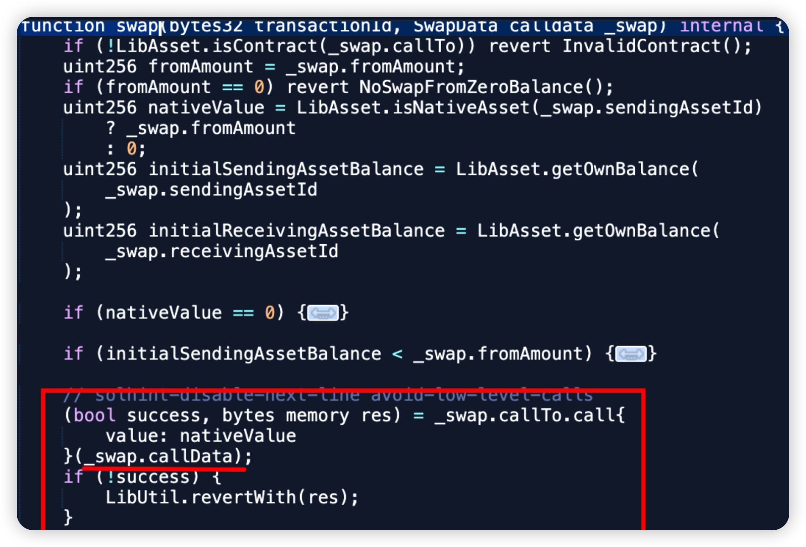
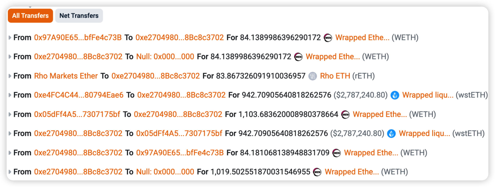

## Introduction

In this monthly series, HashDit is sharing the monthly security incidents in the crypto space and what we can learn from them. For this July 2024 edition, the total losses amounted to $282.5 million, showing a 25% decrease compared to July 2023 ($377.2 million). 

In this sharing, we focus on the DApps incidents. Below are the top 5 DApps incidents that DApp Developers should pay attention to.

## Top 5 DApps incidents

### Li.Fi protocol - $10m - Lack of Validation

Chain: Ethereum

Li.Fi protocol is a bridge aggregation protocol with DEX connectivity and cross-chain data messaging capabilities. On July 16 2024, in this incident, the GasZipFacet contract was upgraded, introducing a vulnerable code which resulted in a compromise of approximately $10 million.

Interestingly, a similar exploit 2 years ago, when Li.Fi was also compromised for the same vulnerability. 

**Root cause**: The primary cause of the incident was no validation of swapCallData in the LibSwap.sol library. This calldata can be externally controlled in the outer function depositToGasZipERC20 method. This allows arbitrary calls whereby funds approved to this victim contract can be abused and stolen.

**Onchain information**:

[Hack tx](https://etherscan.io/tx/0x602d810c47a9022b422cf2fa32ec973f887a72df78d40e448d511e82eba5a38a)

Code snippet:

### Rho Markets - $7.6m - Oracle Manipulation

Chain: Scroll

Rho Markets is a liquidity platform built on Scroll, based on an overcollateralized lending model (which is a fork of Compound Finance). On July 19, 2024, in this incident, a misconfigured oracle provided the wrong price of $ETH for the rETH market ($BTC price was fed instead). Thankfully, an MEV bot front ran the original hacker and was able to safeguard the $7.6 million and return them back to the project party.

**Root cause**: On July 16, 2024, after updating the smart contract for a new market, Rho Markets found that ETH and BTC price oracles were giving contradictory feeds due to a deployment script misconfiguration. This reversed BTC and ETH prices, creating arbitrage opportunities for MEV bots. Incorrect oracle pricing led to assets(USDC, USDT, wstETH, STONE, and wrsETH) being borrowed up to their caps. 

**Onchain information**:

[Oracle misconfiguration tx](https://scrollscan.com/tx/0x30879b0dbee84ba41aa1fc6ef71e81a8985bf8509796ca45f30ec4640b338db4)

[Hack tx](https://scrollscan.com/tx/0x0a7b4c6542eb8f37de788c8848324c0ae002919148a4426903b0fb4149f88f05 )

Transaction snippet:

### DoughFina - $1.8m - Lack of Validation

Chain: Ethereum

On July 12, 2024, DoughFina, a DeFi project, had its ConnectorDeleverageParaswap contract compromised, resulting in a loss of ~$1.8 million. In this attack, there was a lack of validation issue which allowed anyone to withdraw funds from the vulnerable contract.

**Root cause**: The primary cause of the incident was that there is lack of validation in the flash loan call back data which leads to a WETH transfer.

After invoking the flashloan method of the ConnectorDeleverageParaswap contract, the flash loan call data allowed multiple operations to be executed afterwards.

This allowed the hacker to burn AaveWETH from one of Dough’s pools. WETH is then approved to the Victim contract which can then be transferred from out to the hacker.

**Onchain information**:

[Hack tx 1](https://etherscan.io/tx/0x92cdcc732eebf47200ea56123716e337f6ef7d5ad714a2295794fdc6031ebb2e)

[Hack tx 2](https://etherscan.io/tx/0x28a934816ed0371a3fbb2f89986eecf87a22937c40309ff2f58697792215b4da)

Code snippet:

### Minterest - $1.4m - Exchange rate manipulation

Chain: Mantle

Minterest is a blockchain cross-chain DeFi lending protocol that redistributes 100% of the value captured back to users. On July 15, 2024, its MUSDYToken_Mantle contract was compromised, leading to an estimate loss of ~$1.4m on Mantle (ETH and Taiko not affected).

**Root cause**: The exchange rate of the Minterest is dependent on the token cash balance (updated immediately during token transfers, instead of at the end of the state).

Reentrancy vulnerability in which an attacker could loan out tokens that they had previously just borrowed from the protocol.

**Onchain information**:

[Hack tx](https://explorer.mantle.xyz/tx/0xb3c4c313a8d3e2843c9e6e313b199d7339211cdc70c2eca9f4d88b1e155fd6bd)

Code snippet:

### Monoswap - $1.3m - Social Engineering

Chain: Blast

Monoswap is a community-driven and yield-focused v3 Decentralized Exchange built to facilitate the Blast ecosystem.. On the 24th of July, 2024, due to a social engineering exploit of one of its developers, the deployer wallet was compromised, resulting in financial losses approximating $1.3 million in ETH. 

**Root cause**: One of Monoswap developers installed phishing software from https[:]//kakaocall[.]kr. The scammer pretended to be a VC institution to deceive the developer's trust and carried out phishing attacks.

**Onchain information**:

[Hack tx 1](https://blastscan.io/tx/0xc78fdbaa98e7652a3495df6fcdb5797d8ecf949e014b11c72fe1421e3f806272) 

[Hack tx 2](https://blastscan.io/tx/0x348bee9fb6ceb6512f7b095702f6e0616870b7c1befbe94c5e42a86b48eaa9c7) 

[Hack tx 3](https://blastscan.io/tx/0x430efd649ef7a5273f2fa084dc330d1326766a4811e2c35d568a83bd0bc9bfd8)

Transaction snippet:

## Key lessons for developers

1. Given the risk of social engineering attacks, it is essential for employees to install only trusted software and exercise heightened caution when working with third parties. Specifically, be vigilant for potential red flags, including:

    * **Educate and Train Team Members:** 
    
        * **Awareness Programs**: Regularly conduct training sessions to educate team members about the various types of social engineering attacks, such as phishing, vishing (voice phishing), and smishing (SMS phishing).

        * **Simulated Attacks**: Perform simulated social engineering attacks to test and improve the team's response to real threats.

        * **Trusted Software**: Always verify the source before installing any software. Ensure that you download applications only from official websites or trusted platforms, and avoid using pirated or cracked versions. Additionally, check for reviews and ratings, and consult with your IT department if you are unsure about the legitimacy of the software.

    * **Secure Communication Channels:** 

        * **Encrypted Communication**: Use encrypted communication channels for sensitive information and authentication processes.

        * **Verification Protocols**: Establish protocols for verifying the identity of individuals before sharing sensitive information or performing critical actions.

    * **Limit Access and Permissions:** 

        * **Role-Based Access Control (RBAC)**: Implement RBAC to ensure that team members only have access to the information and systems necessary for their role.

        * **Regular Audits**: Conduct regular audits of access permissions to ensure they are up-to-date and appropriate.

2. Input validation is a crucial process - it's essential to verify all potential user inputs, especially when these inputs affect changes to the state of the system. This holds particularly true in the below scenarios:

    * **Calldata Parameters:** Given that attackers have the ability to craft any data, extra validation steps must be in place for calldata parameters.

    * **User Approvals:** During the process where the protocol contract manages users' approvals, meticulous input checks are paramount to prevent potential malicious activities.

3. To guard against price manipulation, it's essential to ensure that updated prices cannot be influenced to reflect unexpected values. Oracles, both on-chain and off-chain types, can be employed by developers. Here's how:

    * **Set Boundaries**: Implementing limits can block prices from being abruptly manipulated to an impossible value, regardless of the oracle type in use.

    * **Fallback Oracle**: Integrate a secondary oracle as a fallback measure. This ensures that if the initial oracle fails, there is a backup in place to verify the consistency of prices. By doing so, it ensures continuous, reliable price feeds, and safeguards against single point of failure.

    * **Test scripts**: Test scripts can be designed to check the integrity of the data being fed into the Oracle system. By running these scripts, you can ensure that the data is accurate, complete, and consistent with the expected format and values. This helps in identifying and correcting any discrepancies early in the process.

4. Tips to Prevent Exchange Rate Manipulation:

    * **Educate and Train Team Members:** Use multiple, independent oracle sources to fetch exchange rates. Aggregating data from various sources can help ensure accuracy and reduce the risk of manipulation from a single compromised source.

    * **Use Strong 2FA Mechanisms:** Implement validation checks to ensure the consistency and accuracy of exchange rate data. Cross-verify rates with other reliable sources to detect anomalies.

    * **Monitor and Respond to Suspicious Activity:** Ensure that exchange rate data is transmitted securely using encryption protocols. This helps prevent interception and tampering of data during transmission.

    * **Secure Communication Channels:**  In the context of exchange rate systems, a reentrancy attack could be particularly damaging. For example, if an exchange rate contract is vulnerable to reentrancy, an attacker could exploit this to manipulate the exchange rates.

        * **Checks-Effects-Interactions Pattern:** Ensure that state changes are made before any external calls. This reduces the risk of reentrancy attacks.

        * **Reentrancy Guards:** Implement reentrancy guards, such as mutexes, to prevent multiple calls to a function before the first call is resolved.
   

Feel free to contact us at support@hashdit.io for any support needed! Stay safe!

