

## Overview
This report focuses on security events that occurred on BNB Smart Chain (BSC) in Q3 of 2024. It analyzes the types of projects targeted, the common attack techniques used and the financial losses that resulted from the incidents.

### Disclaimer
The financial data provided here is accurate based on our own monitoring system and based on the $USD amount of the cryptocurrency involved at the time of the incident. Due to the fluctuating price nature of cryptocurrencies, the total amount loss might differ with the current token valuations.

Furthermore, the financial data might not fully reflect the true “exploited amount” of the incident. This is especially true for scams where the total scammed amount is usually mixed with an initial base amount injected by the scam project party.

## TL;DR

1. **Q3 sees increase in fiat losses compared to Q2**

Fiat losses increased by approximately 50%, rising from $9.1 million in Q2 to $14.2 million in Q3. Interestingly, this increase in losses was observed despite a decrease in the number of hacks, with Q3 experiencing 34 hacks compared to 46 in Q2.

2. **BSC ranks second in Q3 fiat losses when compared to other chains**

In Q3, BSC (Binance Smart Chain) accounted for 2.8% of the total fiat losses across all chains, ranking second. Ethereum took first place, representing 88% of the total fiat losses. In terms of incident count, BSC also ranked second with 27%, trailing behind Ethereum.

3. **Price Manipulation and Lack of Validation bugs were the two most substantial types of exploit, with DeFi type of projects being the most targeted**

32% of total fund losses were due to price manipulation attacks, often caused by poorly designed smart contracts relying on liquidity pool prices. The second leading attack vector was lack of validation, accounting for 23.53%, due to developers not checking input validation in smart contracts, leading to compromised contracts. Other issues included reentrancy, spoofing, and rug pulls.

## Q3 Comparisons

### BSC Comparisons

#### YoY Comparison

When we compare the data with Q3 of previous years, there is a decreasing trend. Q3 financial losses dropped by a large 68% between 2023 and 2024.

This suggests that the security of the BNB Chain has improved significantly over the years.

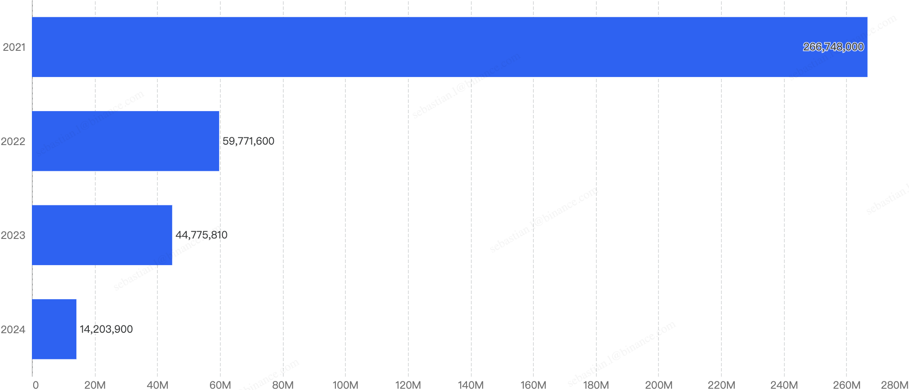

Figure 1: Q3 financial losses from 2021 - 2024

#### 2024 Q3 vs 2024 other quarters 

##### Fiat Losses

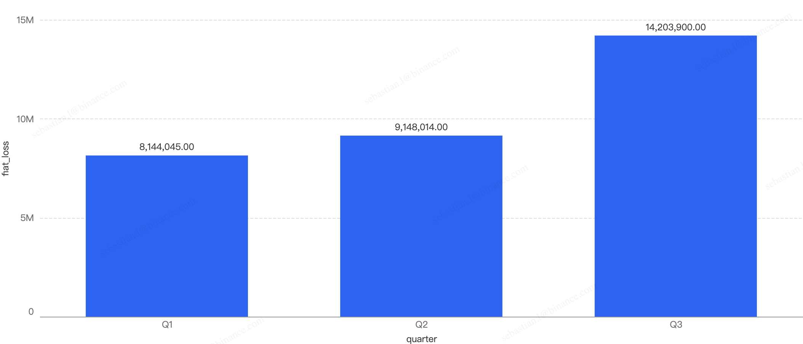

Figure 2: Financial losses across the first 3 quarters in 2024

* Q3 have the highest financial losses in a quarter in 2024

* ~50% increase in amount lost to exploits from Q2 to Q3

##### Number of Incidents

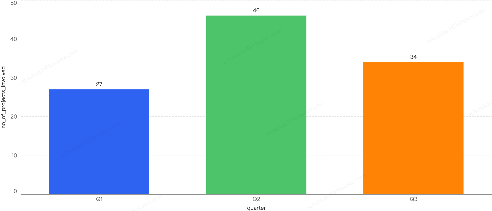

Figure 3: Number of incidents across the 3 quarters in 2024

In terms of incident count, that number dropped by 26% from Q2 to Q3 to 34 incidents this quarter.

Notable Trends

Q3 accounted for 45.10% of amount losses in 2024 so far

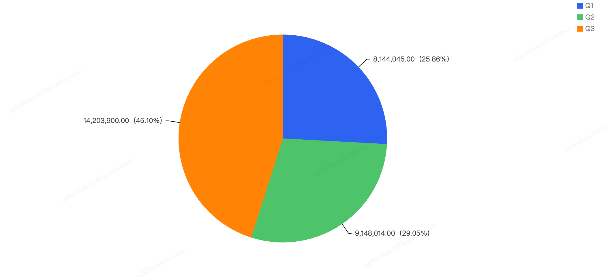

Figure 4: Amount lost to exploits across the previous quarters in 2024

## Chain Comparisons

### Q3 Comparison to Other Blockchains

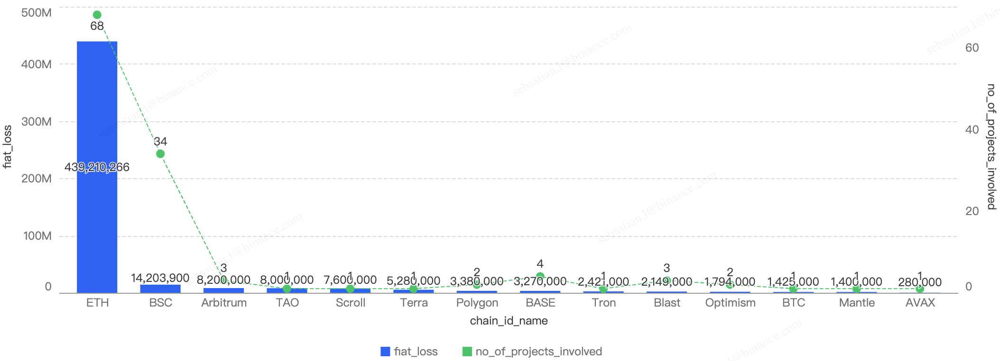

Figure 5: Proportion of funds loss across all chains in Q3

As seen in Figure 5, BSC accounts for 2.8% of total funds loss and 27% of total incident count. The top chain affected is Ethereum with 88% of the total losses in Q3 of 2024 and 55% of total incident count

### QoQ Analysis

Fiat Losses

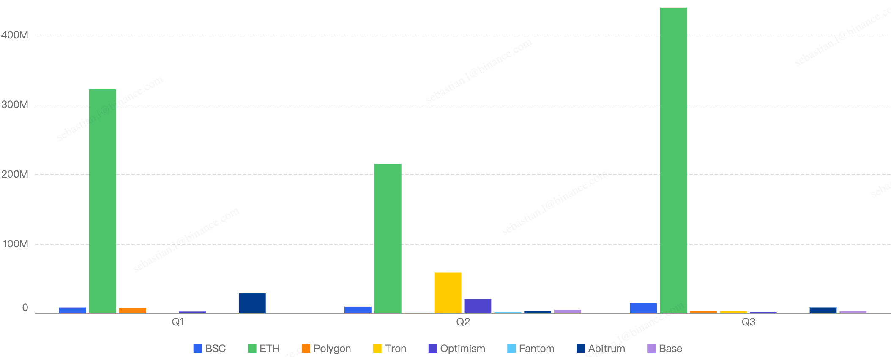

Figure 6: Proportion of incidents across all chains from Q1-Q3 in 2024

Noticeably, Ethereum still had the highest number of financial losses in each quarter of 2024 thus far. Generally, Q2 has the lowest amount of losses in 2024 across all chains, although it had security incidents across all chains in that quarter.

## Deep Dive on 2024 Q3 Incidents on BSC

In total, roughly $14.2 million was lost as a result of security incidents on BSC in Q3. As demonstrated by Figure 7, the month with the greatest losses was October which stands at $9.4 million. 

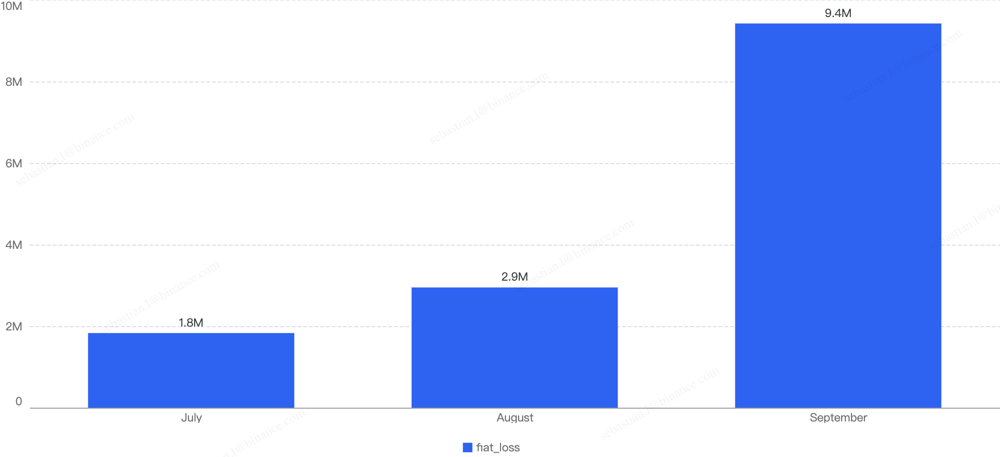

Figure 7: Amount of stolen funds in dollars per month in Q3 of 2024

Figure 8 shows the number of projects impacted by exploits in Q3 .

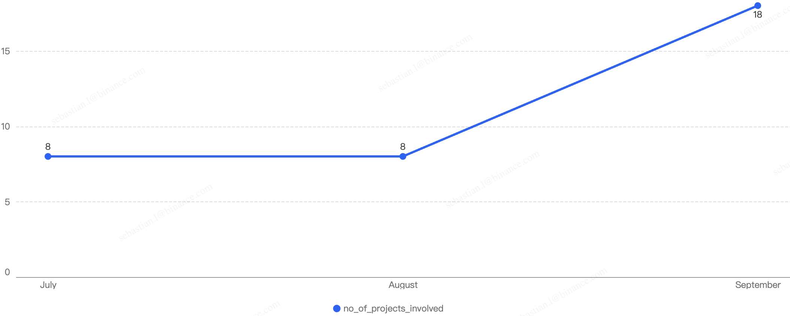

Figure 8: Number of project impacted by exploits

The highest number of security incidents took place in October. In total, there were 34 incidents on BSC in Q3 2024. Similarly in September, there was the highest number of security incidents at 18.

### Attack vectors analysis

Out of the total 34 security incidents, hacks made up 79.41%. The remaining percentage were a result of scams. 

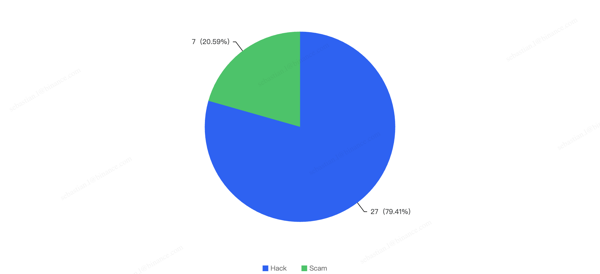

Figure 9: Proportion of types of exploits

Proportional to the attack vector count, the financial impact of hacks was greater as well. The total financial loss of hacks was $12.7m and the total financial loss from hacks was $1.4m, as shown in Figure 10.

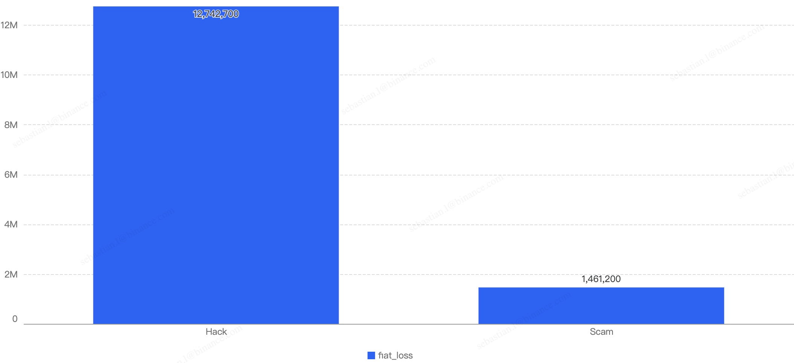

Figure 10: Financial impact measured in dollars comparing different types of incidents

This might suggest that there is a good emphasis on scam security for general BSC users. 

#### Specific attack vectors analysis
Figure 11 shows the specific attack vectors and their corresponding financial losses in Q3 of 2024. 

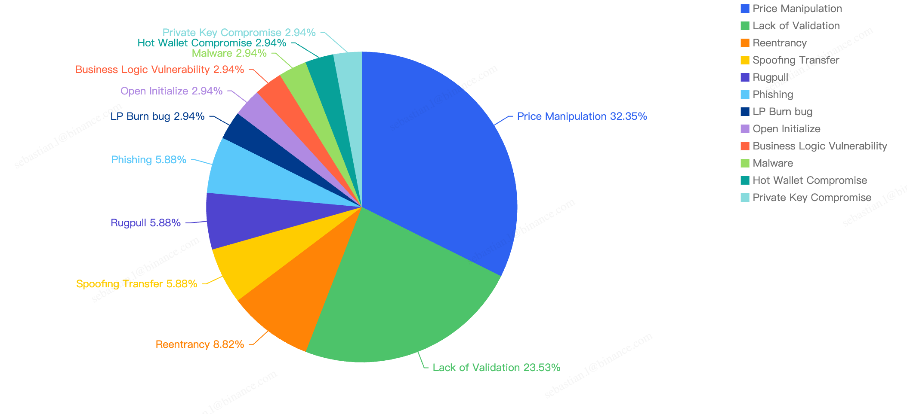

Figure 11: Proportion of funds lost across different types of exploits

In Q3, 32% of the total funds loss were attributed to Price Manipulation attacks. This could be due to poorly designed smart contracts relying on the instantaneous price of liquidity pools, making them easier to manipulate with a large swap trade or flash loans by hackers.

The second leading attack vector was Lack of Validation, which accounted for 23.53%. This is still a main cause of concern as we noticed developers not checking for input validation within poor designed smart contracts. This can result in untrusted calls that result in contracts being compromised.

### Loss by Project Type

When comparing the project type against financial loss, 61.76% of financial losses were attributed to DeFi projects. 

The second most targeted type was Unknown contracts at 11.76% which are obscure and unknowing contracts, where their project name could not be identified. This is followed by Individuals at 11.76% which are likely a result of general users being scammed.

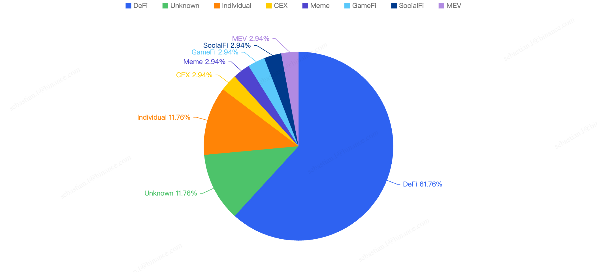

Figure 12: Proportion of funds lost against the type of project 

The large proportion of fiat losses associated with DeFi projects suggests that DeFi remains the most common type of crypto project on BSC. It also shows how important it is for users to only invest in reputable and well audited projects, and for developers to take precautions for Price Manipulation and Lack of Validation issues.

At the same time, the constant trend of Individuals getting scammed should serve as a critical reminder for users to only sign transactions that they understand and use security plug-ins where suitable.

## Top 10 Incidents in Q3 of 2024 

The following were the top 10 security incidents in terms of financial losses in Q3 of 2024. 

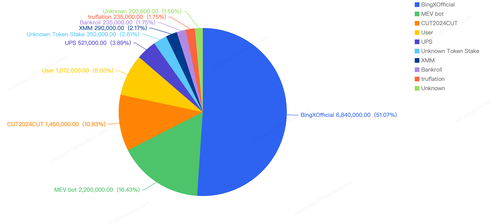

Figure 13: Top exploits measured in dollars in 2024 Q3 on BNB Smart Chain

### BingXOfficial - $6.8 Million Loss
Attack type: Hot Wallet Compromise

On September 20, 2024, BingXOfficial, a centralized exchange (CEX), experienced a security breach in its hot wallet across multiple chains. On the Binance Smart Chain (BSC), the impact was approximately $6.8 million.

The root cause of the security breach at BingX was likely related to unauthorized access to the exchange's hot wallet. Since hot wallets are connected to the internet, they are inherently more vulnerable to cyberattacks.

### MEV Bot - $2.2 Million Loss
Attack type: Internal Breach

On August 22, 2024, an unknown MEV bot was compromised, resulting in a loss of approximately $2.2 million.

Typically, this MEV bot contract is designed to exploit price differences in liquidity pools. However, the vulnerability in this case was due to a lack of validation of the pool contract supplied within the victim contract. This allowed the attacker to use a fake pool contract to perform a "swap," tricking the contract into transferring funds to the attacker's contract.

Interestingly, only Executors can call the vulnerable function, and the hacker was one of the validated addresses added during the setup. This suggests that an internal breach could be a likely scenario in this case.

### CUT2024CUT - $1.4 Million Loss
Attack type: Price Manipulation

On September 10, 2024, CUT2024CUT, a token DeFi project, was exploited due to a price manipulation attack, resulting in losses exceeding $1.4 million USD on the Binance Smart Chain (BSC).

The CUT project had implemented a vulnerable reward calculation system that depended on the pool reserves. This vulnerability allowed attackers to deplete the liquidity pool (LP) reserves.

### User - $1.07 Million Loss
Attack type: Phishing

Throughout this quarter, we detected multiple instances of users falling victim to phishing attacks, resulting in total losses exceeding $1.07 million.

Two primary types of phishing transactions were observed:
1. **Wallet Drainers**: Scammers trick users into visiting phishing websites, where they are then deceived into signing transactions that transfer funds directly to the attackers.
2. **Spoofing Cases**: Users are deceived into transferring funds to a recipient that appears to be legitimate but is actually a copycat.

### UPS - $0.52 Million Loss
Attack type: Price Manipulation

On July 21, 2024, the UPS project was compromised, resulting in a loss of approximately $0.52 million worth of funds.

The root cause of the hack was a vulnerability in the UPS token's transfer mechanism. When transferring tokens to a PancakeSwap pair, the UPS token burns tokens at the pair and calls the "sync" function. The hacker exploited this mechanism to reduce the UPS reserves in the PancakeSwap pair, causing a reserves imbalance. As a result, the UPS reserve became very small, allowing the hacker to drain BUSD from the pair using only a few UPS tokens.

### Unknown Token Stake - $0.35 Million Loss
Attack type: Price Manipulation

On August 6, 2024, an unknown Token Stake contract was exploited due to a price manipulation attack, resulting in a loss of $0.35 million.

The root cause of the exploit was the Token Stake contract's reliance on an instantaneous price oracle. This made it susceptible to price oracle manipulation, allowing the attacker to profit from the Token Stake contract.

### XMM - $0.29 Million Loss
Attack type: Price Manipulation

On September 14, 2024, the XMM project was hacked, resulting in a loss of approximately $0.29 million.

The hacker exploited a flaw in the transfer function that allowed the recipient to mint tokens. This vulnerability enabled the hacker to mint a large amount of XMM tokens at the start of the attack, allowing them to profit by dumping the tokens into the liquidity pool.

### Bankroll - $0.23 Million Loss
Attack type: Business Logic Vulnerability

On September 23, 2024, the Bankroll DeFi project was attacked due to a business logic vulnerability, resulting in a loss of approximately $0.23 million.

The root cause of the attack was a flaw in the `BuyFor` function, which allowed the invoked contract to be used as the `customerAddress`. This vulnerability enabled the attacker to transfer WBNB back into the victim contract, inflating the `profitPerShare_` value significantly in the distribute routine.

### Truflation - $0.23 Million Loss
Attack type: Malware Scam

On September 25, 2024, the Truflation project, a decentralized infrastructure project, was exploited for approximately $0.23 million due to a malware scam.

The project's multisig wallet had a 1 out of 1 threshold, making it highly vulnerable. The holder of the private key was easily compromised through malware as a result of social engineering. This allowed the malicious actor to scam the team into transferring funds to their account.

### Unknown project - $0.2 Million Loss
Attack type: Reentrancy

On September 25, 2024, an unknown project was exploited for approximately $0.2 million. The root cause was identified as a reentrancy vulnerability.

Interestingly, after the initial attack transaction, the deployer invoked the victim contract's `emergencyWithdrawUSDT` function multiple times, each for a small amount rather than withdrawing all the funds at once. This allowed the attacker to make small, repeated profits.

## Conclusion

Below we have some final tips for investors and developers:

### For investors:

1. **Understand What You're Signing:** Never blindly sign random signatures or transactions. Always ensure signatures are from official websites.
2. **Verify Official Websites:** Double-check that you are on the official website of the DApp.
3. **Exercise Caution with New/Trending Projects:** Be wary of projects that guarantee high APYs or use MEV bots. Always verify the project team’s authenticity.
4. **Use Multiple Wallets:** Utilize different wallets for various activities—hot wallets for frequent transactions and cold wallets for storing high-value funds.
5. **Interact with Open-Source Contracts:** Ensure you are interacting with open-source contracts and revoke approval once the interaction is complete.
6. **Check Risk Warnings:** Use tools like Metamask Snaps and HashDit Extension to check risk warnings of transactions.
7. **Heed Warnings on Trust Wallet and PancakeSwap:** Pay attention to warnings about phishing sites, malicious contracts, and dangerous tokens. If flagged as high risk, it is strongly advised to stay away.

### For BNB Chain Developers:

1. **Verify & Open-Source Contracts:** Ensure all relevant contracts are verified and open-sourced on-chain to maintain transparency and trust.
2. **Conduct Audits:** Have the project audited by at least two well-known security companies and address all identified issues, including newly added code.
3. **Implement a Bug-Bounty Program:** Encourage the community to help maintain the security of the code by offering rewards for identifying vulnerabilities.
4. **Prioritize Security:** Run sufficient testing, stress-testing, and simulations for scenarios such as adverse token price fluctuations and edge cases.
5. **Prevent Centralization Risks:** Use multi-signature wallets instead of a single EOA wallet for operations.
6. **Minimize Contract Upgradeability:** Limit contract upgradeability and apply changes only when necessary.
7. **Secure Fund Storage:** Ensure funds are stored securely through proper key management and fund distribution.
8. **Implement Safeguards:** Formulate an incident response plan and introduce time locks or pausing mechanisms within smart contracts to mitigate the impact of hacks.
9. **Monitor System Parameters:** Continuously monitor system parameters, such as the exchange rate of tokens.

### About Hashdit

HashDit’s core mission is to provide the essential threat intelligence for the everyday crypto investors to make informed decisions. Our methodology includes a variety of automated and manual techniques to evaluate a DApp project. 

Hashdit Products:
- **HashDit extension**: A chrome web extension which utilizes the HashDit API to warn users for potential risky urls and risky addresses. HashDit’s pop-up warning window is displayed on the frontend to immediately alert users to take extra caution.
- **Risk assessment**: All-in-one collection of security rating framework, auto-scan tools, and corresponding APIs, which are able to deliver accurate detection for potential risks based on an address / dApp / transaction / signature. This is integrated with core platforms like Trust Wallet and PancakeSwap, to leverage their reach and protect more users. 
- **Audit service**: Comprehensive code audits following extensive and detailed best practices for smart contracts and discovering code loopholes/security vulnerabilities before they are deployed on-chain, guaranteeing users’ safety on BSC. 
- **Monitoring**: The combination of real-time on-chain monitoring, off-chain social media monitoring, and public alerts via Twitter makes this service a valuable tool for enhancing security and awareness in the blockchain space. By detecting sensitive events and compromised social media accounts early, we can quickly respond to minimize financial losses and provide immediate guidance for account recovery. This comprehensive approach ensures that both financial transactions and communication channels are protected, helping to build transparency and trust within the community.
- **Prevention**: Transaction Prevention Solution, a proactive defense strategy for threat detection and handling. This solution enables project teams to promptly address attacks, control fund disposal, secure user assets, and establish a robust multi-layer protection system. It currently includes four strategies that can be used in combination, aiming to provide a comprehensive risk recognition and risk disposal transaction prevention system
- **Education**: The goal is to share security knowledge for builders, investors and users in the Web3 community. With all the players in the industry equipped with the security knowledge needed and adopting a security-first mindset, only then will the Web3 ecosystem be a safer place for everyone. 

If you have any doubts or concerns about a specific project, contract address, transaction, or risk score, please do not hesitate to reach out to our team for assistance.

