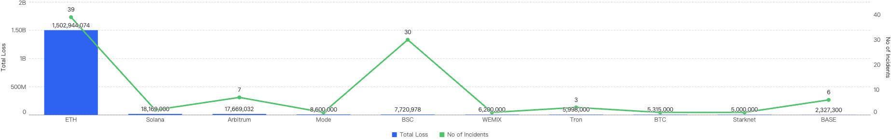
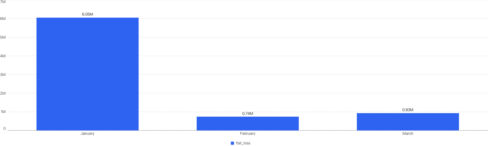
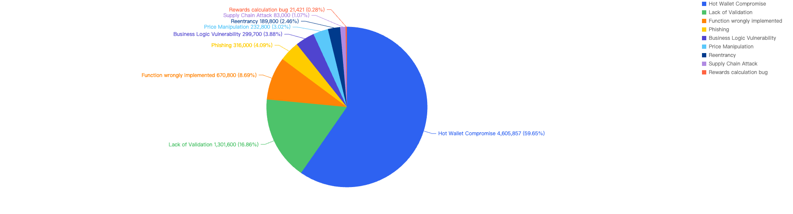
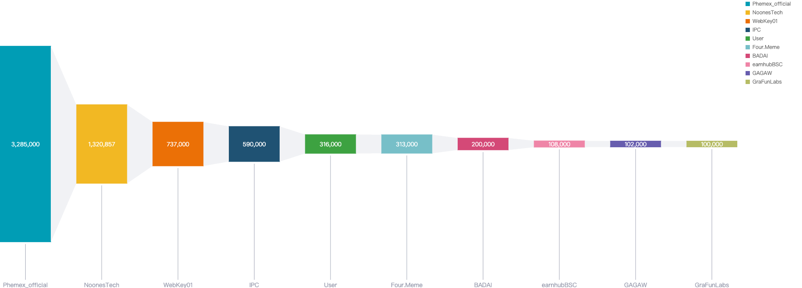

## Overview
This report focuses on security events that occurred on BNB Smart Chain (BSC) in Q1 of 2025. It analyzes the types of projects targeted, the common attack techniques used and the financial losses that resulted from the incidents.

### Disclaimer
The financial data provided here is accurate based on our own monitoring system and based on the $USD amount of the cryptocurrency involved at the time of the incident. Due to the fluctuating price nature of cryptocurrencies, the total amount loss might differ with the current token valuations.

Furthermore, the financial data might not fully reflect the true “exploited amount” of the incident. This is especially true for scams where the total scammed amount is usually mixed with an initial base amount injected by the scam project party.

## TL;DR

1. **Q1 sees decrease in fiat losses and incident losses count compared to 2024 Q4**

Fiat losses decreased by approximately 75%, dropping from $31.9 million in 2024 Q4 to $7.7 million in 2025 Q1. At the same time, a decrease in the number of security incidents was observed, with 2024 Q4 experiencing 44 incidents compared to 30 in 2025 Q1.

2. **BSC ranks fifth in Q1 fiat losses when compared to other chains**

In 2025 Q1, BSC (Binance Smart Chain) accounted for 0.49% of the total fiat losses across all chains, ranking fifth across other chains. Ethereum took first place, representing 95% of the total fiat losses. In terms of incident count, BSC ranked second with 32%, trailing behind Ethereum.

3. **Hot Wallet Compromises and Lack of Validation bugs were the two most substantial types of exploit, with CEX type of projects being the most targeted**

59% of total fund losses were due to Hot Wallet Compromises, often caused by phishing attacks, malware, weak passwords, etc. The second leading attack vector was lack of validation, accounting for 16%, due to developers not checking input validation in smart contracts, leading to compromised contracts. Other issues included Business Logic Flaws, Phishing, and Price Manipulation issues.

## Q1 Comparisons

### BSC Comparisons

#### YoY Comparison

When we compare the data with Q1 of previous years, there is a decreasing trend since 2021 except for an outlier Q1 in 2022. Q1 financial losses dropped by a smaller margin of 5.2% between 2024 and 2025, as compared to the difference between 2023 and 2024.

This suggests that the security of the BNB Chain has continued to improve *steadily* over the years.

Figure 1: Q1 financial losses from 2020 - 2025

#### 2025 Q1 vs Past 3 Quarters 

##### Fiat Losses

Figure 2: Financial losses across 2025 Q1 and the past 3 quarters in 2024

* 2024 Q4 have the highest financial losses in a quarter

* ~75% decrease in amount lost to exploits from 2024 Q4 to 2025 Q1

##### Number of Incidents

Figure 3: Number of incidents across 2025 Q1 and the past 3 quarters in 2024

In terms of incident count, that number dropped by 31% from 2024 Q4 to 30 incidents this quarter.

## Chain Comparisons

### Q3 Comparison to Other Blockchains

Figure 4: Proportion of funds loss across chains in Q1

As seen in Figure 4, BSC ranks 5th amongst other blockchains for losses to security incidents this quarter. It accounts for 0.49% of total funds loss and 32% of total incident count. The top chain affected is Ethereum with a staggering 95% of the total losses (largely due to the largest Hack in Crypto History being the $1.5b Bybit Hack) and 42% of total incident count.

### QoQ Analysis

Fiat Losses

Figure 5: Proportion of incidents across chains from 2025 Q1 and the past 3 quarters in 2024

Noticeably, Ethereum still had the highest number of financial losses in each quarter of Figure 5 thus far, except for 2024 Q2 where Japanese crypto exchange DMM Bitcoin lost $308 million on BTC. 

## Deep Dive on 2024 Q3 Incidents on BSC

In total, roughly $7.7 million was lost as a result of security incidents on BSC in 2025 Q1. As demonstrated by Figure 6 below, the month with the greatest losses was January which stands at $6.05 million. 

Figure 6: Amount of stolen funds in dollars per month in Q1 of 2025

Figure 7 shows the number of projects impacted by exploits in Q1.

Figure 7: Number of projects impacted by exploits

In total, there were 30 incidents on BSC in Q1 2025. The highest number of security incidents took place in January, before going on a downward trend through the Quarter, ending with a mere 6 incidents in March.

### Attack vectors analysis

Out of the total 30 security incidents, hacks made up 96%. Only 1 notable security incident was due to scams which was a single $316k phishing incident.

Figure 8: Proportion of types of exploits

Proportional to the attack vector count, the financial impact of hacks will be greater as well as seen in Figure 8.

However it is important to note that Phishing scams still continue to plague not just BNB Chain but other blockchains as well. According to our data, there have been at least 18k Phishing transactions detected on BNB Chain in 2025 Q1.

#### Specific attack vectors analysis
Figure 9 shows the specific attack vectors and their corresponding financial losses in Q1 of 2025. 

Figure 9: Proportion of funds lost across different types of exploits

In Q1, 59% of the total funds loss were attributed to Hot Wallet Compromises. Hot wallet compromises often occur due to phishing attacks, malware, weak passwords, social engineering, software vulnerabilities, unsecured networks, insider threats, lack of two-factor authentication (2FA), outdated software, improper key management, and API exploits. 

The second leading attack vector was Lack of Validation, which accounted for 16%. This is still a main cause of concern as we noticed developers not checking for input validation within poor designed smart contracts. This can result in untrusted calls that result in contracts being compromised.

### Loss by Project Type

When comparing the project type against financial loss, 43% of financial losses were attributed to CEX projects. 

The second most targeted type was DeFi projects at 25%. This is followed by Payments at 17% which are likely a result of general users being scammed.

Figure 10: Proportion of funds lost against the type of project 

The large proportion of fiat losses associated with CEX and DeFi projects. It also shows how important it is for users to only invest in reputable and well audited projects, and for developers to take precautions for Key Management and Lack of Validation issues.

At the same time, the constant trend of individuals getting scammed should serve as a critical reminder for users to only sign transactions that they understand and use security plug-ins where suitable.

## Top 10 Incidents in Q1 of 2025 

The following were the top 10 security incidents in terms of financial losses in Q1 of 2025.

Figure 11: Top exploits measured in dollars in 2025 Q1 on BNB Smart Chain

### Phemex_official - $3.2 Million Loss
Attack type: Hot Wallet Compromise

Date: January 23, 2025

Incident Overview:
Phemex_official, a centralized exchange (CEX), experienced a significant security breach affecting its hot wallet across multiple blockchain networks. The breach on the Binance Smart Chain (BSC) resulted in an estimated loss of approximately $3.2 million.

Root Cause Analysis:
The security breach at Phemex_official is believed to have been caused by unauthorized access to the exchange's hot wallet. Preliminary investigations suggest that the attack may have been orchestrated by actors from the Democratic People's Republic of Korea (DPRK). Hot wallets, being connected to the internet, are inherently more susceptible to cyberattacks, making them a prime target for malicious activities.

### NoonesTech - $2.2 Million Loss
Attack type: Internal Breach

Incident Overview:
NoonesTech, a payment service provider, experienced a security compromise that led to a loss of approximately $2.2 million.

Platform Response:
Following the incident, NoonesTech announced maintenance activities on the platform. However, no official statement was released regarding the security breach.

### WebKeyDAO - $0.7 Million Loss
Attack type: Lack of Validation

Incident Overview:
WebKeyDAO, a DeFi project, was exploited due to a lack of validation attack, resulting in losses exceeding $0.7 million USD.

Exploit Details:
The attacker exploited an unprotected function within the WebKeyDAO contract to purchase wkeyDao tokens at a significantly low price. These tokens were then sold on a decentralized exchange (DEX) for profit. The vulnerability arose because the contract did not validate the token price against the DEX price.

### IPC - $0.59 Million Loss
Attack type: Business Logic Vulnerability

Incident Overview:
IPC, a Token DeFi project, was exploited due to a vulnerability in the implementation of a function, leading to losses exceeding $0.59 million USD.

Exploit Details:
The exploit was a frontrun attack utilizing the Puissant: Payment method. The root cause of the vulnerability was found in the transfer() function, which burns tokens from the pair when selling. The function was supposed to include a timelock for transfers, preventing newly bought tokens from being sold for at least 30 minutes. However, the attacker managed to bypass this check by exploiting a logic error in the _isRemoveLP() function. This was achieved through flash swapping both tokens from the pair, allowing the attacker to circumvent the intended timelock.

### User - $0.31 Million Loss
Attack type: Phishing

Throughout this quarter, multiple instances of users falling victim to phishing attacks were detected, resulting in total losses exceeding $0.31 million.

Two primary types of phishing transactions were observed:
1. **Wallet Drainers**: Scammers trick users into visiting phishing websites, where they are then deceived into signing transactions that transfer funds directly to the attackers.
2. **Spoofing Cases**: Users are deceived into transferring funds to a recipient that appears to be legitimate but is actually a copycat.

### Four.meme - $0.31 Million Loss

Incident Overview:
The Four.meme project was compromised twice this quarter, resulting in total losses of approximately $0.31 million worth of funds.

First Incident:

Date: February 11, 2025
Type: Business Logic Vulnerability Hack
Attack Process:
The attacker maliciously initialized the PancakeSwap V3 Pool with an extreme price, causing the pool price to tilt.
A migration transaction added liquidity at the price after malicious initialization: 1 Wei token + the rest of WBNB was added.
The attacker drained liquidity with a very small number of tokens and exchanged most of the WBNB.
Cause of Attack:
The platform contract neither created nor initialized the PancakeSwap V3 Pool in advance, nor did it check its sqrtPriceX96.
Second Incident:

Date: March 18, 2025
Type: Front Running Attack
Attack Process:
The hacker front ran by minting LP first, then once liquidity was added by the team, they immediately removed LP.
Analysis:
It appears that users did not exactly lose assets (their initial seeding funds are still in the Four.meme Multisig). The funds were lost in Four.meme's wallet.
The principle is that initial seeded funds are added by users, and once it reaches a certain percentage, liquidity is added by Four.meme.
Hacker Analysis:
The hacker submitted the bundle through Bloxroute, and it might be possible to obtain some information from them.

### BADAI - $0.35 Million Loss
Attack type: Lack of Validation

Date: February 20, 2025

Incident Overview:
The BADAI DeFi project was exploited due to a lack of validation attack, resulting in a loss of $0.35 million.

Exploit Details:

The contract at address 0x57ae allowed anyone to create a token pair with BADAI and add liquidity using BADAI from the contract without proper access control or validation.
The attacker exploited this by creating a fake token, adding liquidity, and then withdrawing BADAI from the newly created pair by removing liquidity.

### EarnhubBSC - $0.18 Million Loss
Attack type: Lack of Validation

Incident Overview:
The earnhubBSC project was hacked, resulting in a loss of approximately $0.18 million.

Exploit Details:

The attacker called the unprotected depositBNB() function to swap 226 BNB for ADACash and made a profit through sandwiching swaps.
The funds on addresses 0x2d70, 0x2505393295847525577f83a8dfcb2f1a908bfe2, and 0x961149853ad31c5640ea8081459fabdd94a2a428 are likely traced to the @earnhubBSC rug-pull in late 2021 and early 2022.

### GAGAW - $0.1 Million Loss
Attack type: Business Logic Vulnerability

Date: January 25, 2025

Incident Overview:
The GAGAW DeFi project was attacked due to a business logic vulnerability, resulting in a loss of approximately $0.1 million. A previous attack one month ago inflicted a loss of $69,700 due to the same vulnerability.

Exploit Details:

There is a typo in the transfer function. When removing liquidity, the recipient's balance is mistakenly increased by the balance of _destroyAddress.
If this is by design, it should instead be _balances[_destroyAddress] = _balances[_destroyAddress].add(tAmount).

### GraFunLabs - $0.1 Million Loss
Attack type: Reentrancy

Date: January 17, 2025

Incident Overview:
The GraFunLabs project, a LaunchPad project, was exploited for approximately $0.1 million due to a reentrancy attack.

Exploit Details:

The victim contract's sell() method was reentered to manipulate the BNB and meme token balance, allowing the attackers to take extra BNB.
The hack occurred on GraFun's platform (https://gra.fun/bsc/launch-token), affecting any users launching tokens through them.
The launch campaign was a joint effort with DexeNetwork, which faced a $640k governance hack in December 2024.
The vulnerable contract has been "fixed" with two upgrades, but the code remains unverified.

## Conclusion

Below we have some final tips for investors and developers:

### For investors:

1. **Understand What You're Signing:** Never blindly sign random signatures or transactions. Always ensure signatures are from official websites.
2. **Verify Official Websites:** Double-check that you are on the official website of the DApp.
3. **Exercise Caution with New/Trending Projects:** Be wary of projects that guarantee high APYs or use MEV bots. Always verify the project team’s authenticity.
4. **Use Multiple Wallets:** Utilize different wallets for various activities—hot wallets for frequent transactions and cold wallets for storing high-value funds.
5. **Interact with Open-Source Contracts:** Ensure you are interacting with open-source contracts and revoke approval once the interaction is complete.
6. **Check Risk Warnings:** Use tools like Metamask Snaps and HashDit Extension to check risk warnings of transactions.
7. **Heed Warnings on Trust Wallet and PancakeSwap:** Pay attention to warnings about phishing sites, malicious contracts, and dangerous tokens. If flagged as high risk, it is strongly advised to stay away.

### For BNB Chain Developers:

1. **Verify & Open-Source Contracts:** Ensure all relevant contracts are verified and open-sourced on-chain to maintain transparency and trust.
2. **Conduct Audits:** Have the project audited by at least two well-known security companies and address all identified issues, including newly added code.
3. **Implement a Bug-Bounty Program:** Encourage the community to help maintain the security of the code by offering rewards for identifying vulnerabilities.
4. **Prioritize Security:** Run sufficient testing, stress-testing, and simulations for scenarios such as adverse token price fluctuations and edge cases.
5. **Prevent Centralization Risks:** Use multi-signature wallets instead of a single EOA wallet for operations.
6. **Minimize Contract Upgradeability:** Limit contract upgradeability and apply changes only when necessary.
7. **Secure Fund Storage:** Ensure funds are stored securely through proper key management and fund distribution.
8. **Implement Safeguards:** Formulate an incident response plan and introduce time locks or pausing mechanisms within smart contracts to mitigate the impact of hacks.
9. **Monitor System Parameters:** Continuously monitor system parameters, such as the exchange rate of tokens.

### About Hashdit

HashDit’s core mission is to provide the essential threat intelligence for the everyday crypto investors to make informed decisions. Our methodology includes a variety of automated and manual techniques to evaluate a DApp project. 

Hashdit Products:
- **HashDit extension**: A chrome web extension which utilizes the HashDit API to warn users for potential risky urls and risky addresses. HashDit’s pop-up warning window is displayed on the frontend to immediately alert users to take extra caution.
- **Risk assessment**: All-in-one collection of security rating framework, auto-scan tools, and corresponding APIs, which are able to deliver accurate detection for potential risks based on an address / dApp / transaction / signature. This is integrated with core platforms like Trust Wallet and PancakeSwap, to leverage their reach and protect more users. 
- **Audit service**: Comprehensive code audits following extensive and detailed best practices for smart contracts and discovering code loopholes/security vulnerabilities before they are deployed on-chain, guaranteeing users’ safety on BSC. 
- **Monitoring**: The combination of real-time on-chain monitoring, off-chain social media monitoring, and public alerts via Twitter makes this service a valuable tool for enhancing security and awareness in the blockchain space. By detecting sensitive events and compromised social media accounts early, we can quickly respond to minimize financial losses and provide immediate guidance for account recovery. This comprehensive approach ensures that both financial transactions and communication channels are protected, helping to build transparency and trust within the community.
- **Prevention**: Transaction Prevention Solution, a proactive defense strategy for threat detection and handling. This solution enables project teams to promptly address attacks, control fund disposal, secure user assets, and establish a robust multi-layer protection system. It currently includes four strategies that can be used in combination, aiming to provide a comprehensive risk recognition and risk disposal transaction prevention system
- **Education**: The goal is to share security knowledge for builders, investors and users in the Web3 community. With all the players in the industry equipped with the security knowledge needed and adopting a security-first mindset, only then will the Web3 ecosystem be a safer place for everyone. 

If you have any doubts or concerns about a specific project, contract address, transaction, or risk score, please do not hesitate to reach out to our team for assistance.

