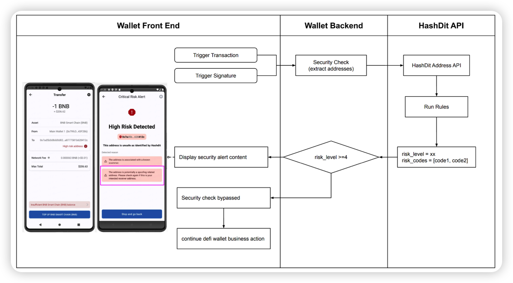
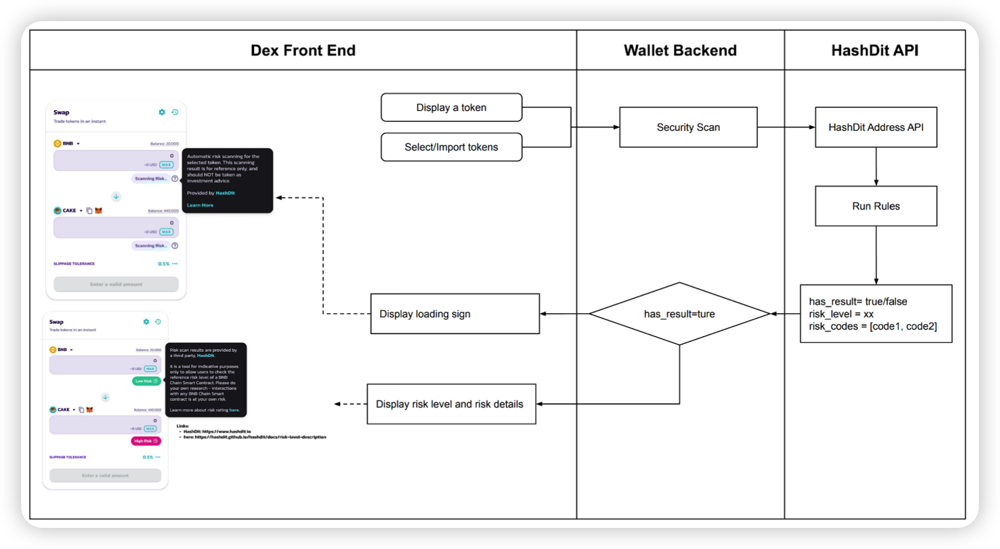

# Integrate HashDit API With 3 Steps

● Step1: Apply for access by sending a request with following information to support@hashdit.com.

    ○ Project name

    ○ Project description & main products

    ○ Estimated chains

    ○ Estimated QPS

    ○ Scenario (see more details in “scenario” part)

      ■ DeFi Wallet

        * Url Security Scanner

        * Address Security Scanner 
        
      ■ Dex

        * Token Security Scanner
      
      ■ Others (input the description)

    ○ Release date

● Step2: HashDit team will review the request and provide the api token and test examples within 5 work days.

● Step3: You can build up the Security Scanner within your project .
  Query Per Second, the HashDit Security API rate limit is 1200 calls/minute. If you require a higher limit than the available plans, please input correct QPS info. 🎉

 
## Security Scanner Scenario
### 1.Wallet
● Typical Example:
https://trustwallet.com/blog/a-safer-web3-experience-with-trust-wallet-security-scanner

● Url Security Scanner

  ○ API: https://hashdit.github.io/hashdit/docs/hashdit-api/dapp-url-analysis

  ○ User interaction and design references

● Address Security Scanner

○ API: https://hashdit.github.io/hashdit/docs/hashdit-api/address-analysis-api

○ User interaction and design references
 

### 2.Dex Token Security Scanner

● Typical Example:
https://pancakeswap.finance/swap?outputCurrency=0xDd25E1955FD9F7B3aBE83CC419070A7ace104DCE

● API:https://hashdit.github.io/hashdit/docs/hashdit-api/address-analysis-api

● User interaction and design references

    