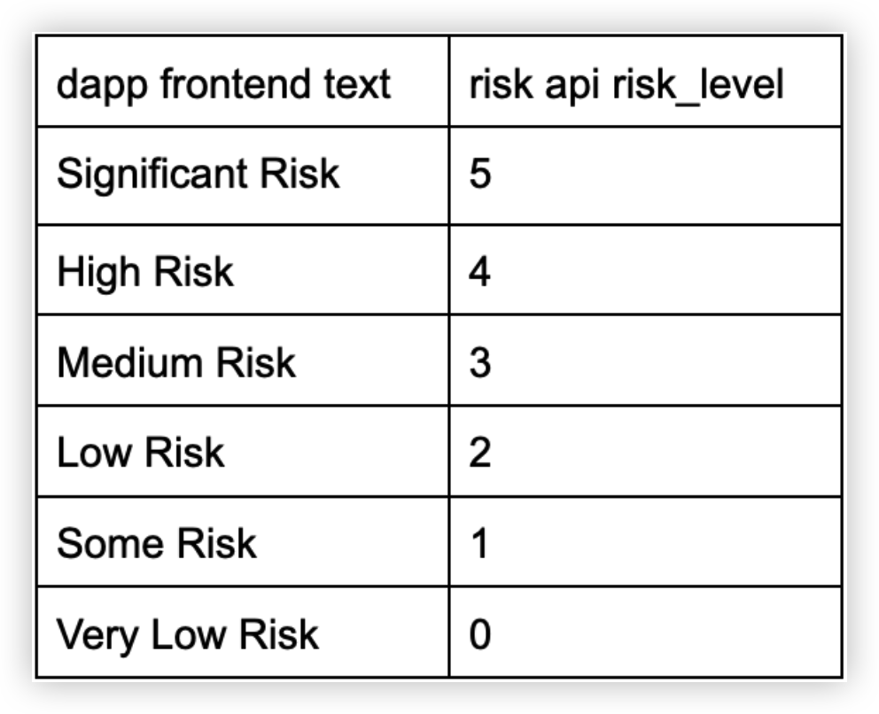

# Data

| Name             | Nullable | Description                                                                                                 | Type   | Example                                                                                                                                                                                                                                                                                                                                                                                                                                               |
|------------------|----------|-------------------------------------------------------------------------------------------------------------|--------|-------------------------------------------------------------------------------------------------------------------------------------------------------------------------------------------------------------------------------------------------------------------------------------------------------------------------------------------------------------------------------------------------------------------------------------------------------|
| request ID       | No        | Unique request id                                                                                           | String |   96c9d4c578ec466db51ed5290dd84463                                                                                                                                                                                                                                                                                                                                                                                                                                                    |
| risk_level       | No       | 6 levels risk classification                                               | Integer   |                                                                                                                                                                                                                                                                                                                                    |
| has_result       | No       | Whether there is already a definite result, if False it needs to be requested in [polling_interval] million seconds | Boolean   | True                                                                                                                                                                                                                                                                                                                                                                                                                                                  |
| polling_interval | Yes       | Recommended waiting time(million seconds) to the next repeat request. seconds                                                                   | Long   | 60000                                                                                                                                                                                                                                                                                                                                                                                                                                                    |