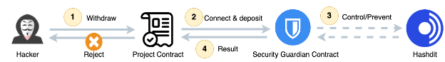

# Guardian Strategy

## Introduction

The Guardian strategy is an upgraded version of the Timelock strategy. Similarly to the Timelock strategy, the Guardian strategy is also suitable for some basic transfer scenarios, such as the withdrawal from the staking contract, the transfer of the token contract, the deposit into the farm contract, etc. However, it's incompatible for more complex scenarios such as token swaps.

The basic assumption of the Guardian strategy is that when a user calls the project contract to transfer money, if the involved fund size exceeds the project team's pre-set threshold, the funds will be automatically transferred to the Guardian contract and a TransferFunds event will be triggered. The HashDit backend will monitor this event in real time and give a security risk rating for the transaction, and if the security risk is considered low, it will call the exitFundsProtect function of the Guardian contract to unfreeze the funds. Otherwise, the funds will remain in the Guardian contract, and the project team has the right to dispose of the funds in any way.

The following two diagrams illustrate the different execution processes between normal transactions and malicious transactions.

For Normal Transaction:

* Step 1: The user initiates a fund withdrawal by submitting a transaction to the project smart contract.
* Step 2: The project contract connects and deposits the fund into the security guardian contract.
* Step 3: Upon trigger by the TransferFunds event, the guardian contract query the Hashdit to verify the integrity of the accounts involved and get their risk level.
* Step 4: Because the risk level is low, then the guardian contract approves the fund to the project contract to fulfill the transaction. 
* Step 5: The project contract will approve the withdrawal.

For Malicious Transaction:

* Step 1: The hacker initiates a fund withdrawal by submitting a transaction to the project smart contract.
* Step 2: The project contract connects and deposits the fund into the security guardian contract.
* Step 3: Upon trigger by the transfer event, the guardian contract query the Hashdit to verify the integrity of the accounts involved and get their risk level.
* Step 4: Because the risk level is deemed high risk, then the fund will be stored in the guardian contract and never return back to the original contract.
* Step 5: The project contract will reject the withdrawal.

## Integration

The integration process is not complex; all it requires is using our SDK to incorporate the invocation logic from the fund saver related functions in the Guardian smart contract into the project's smart contract.

## Advantages & Limitations

### Advantages

1.	Compared to the Timelock strategy, essentially, the transfer or withdrawal of funds can be completed in the subsequent block, similar to having an extremely short timelock. This minimizes any discomfort for regular users.
2.	Deployment is straightforward. As long as clients integrate and utilize our SDK in their projects, they can achieve fund protection.
3.	Our monitoring backend is a lightweight event-monitoring module, filtering out many irrelevant on-chain data, ensuring high efficiency.

### Limitations

1.	This strategy is only suitable for simple and direct transfer logic, and is not suitable for more complex fund transfer scenarios such as swap tokens. 
2.	 It's impossible to execute all operations within a single transaction; it requires at least two separate transactions.
3.	The accuracy of risk assessment derives from HashDit, which could lead to potential false positives or false negatives.

## Real-world Use Case Example

Take the real-world example of Merlin Lab hacking incident. The yield aggregator, Merlin Lab, was hacked due to a logical flaw present in MerlinStrategyAlpacaBNB. The contract mistakenly treated the BNB transferred by the yielder as mining earnings, causing the contract to mint more MERL as rewards. Through repeated operations, the hacker made a profit of $300,000. 
This hacking incident could have been intercepted by our Guardian strategy. When a hacker tries to profit multiple times by exploiting a logical loophole, the transferred amount triggers the threshold, and the hacked funds would enter a fund protection program. As the hacker's address hits the blacklist, the funds would be retained in the Guardian contract. Any attempts by the hacker to withdraw profits would be nonviable, and the right to manage funds would solely lie with the project's team.
Guardian strategy can effectively intercept such simple transfer scenario hacks, regardless of how complex the contract vulnerabilities exploited in the attack method are. Furthermore, it minimizes the impact on normal user operations.