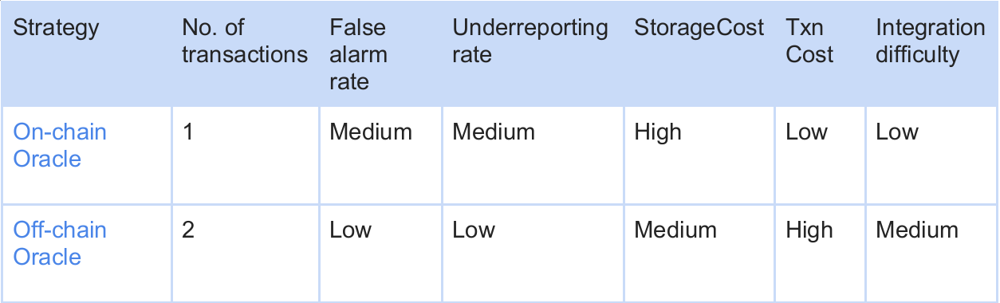

# Oracle Strategy

## Introduction

The Oracle strategy is:
It integrates Oracle query logic into the functions handling fund transfers in the project's smart contracts. For each transaction that calls these related functions involving fund transfers, if the transaction amount triggers a preset threshold on the project side, it enters the Oracle query logic.The HashDit service persistently provides our Oracle with data gathered from HashDit’s extensive multi-source, front-line threat intelligence network. This allows the Oracle contract to assess the risk level of the transaction data and relay the results to the project contract. Depending on each transaction's risk level, the project contract initiates different execution processes. Transactions with high risk levels will be reverted. Transactions with low risk levels, as well as those not surpassing the transaction amount threshold, will be processed following the original function logic.

Oracle strategy can handle more complex fund transfer scenarios, such as swap tokens, add liquidity, etc.

The following diagram illustrates these processes in greater detail with an example:

* Step 1: The user initiates a $$10,001 fund withdrawal by submitting a transaction to the project contract.
* Step 2: As the preset limit for a trigger check is $$10,000, the withdrawal transaction enters the oracle query control flow. The project contract then queries the Oracle contract, providing details such as the transfer receiver's address, token address, and the transfer amount.
* Step 3: Upon receiving the query, the oracle contract solicits information from the connected node.
* Step 4: The node processes the query request from the oracle contract utilizing the integrated Hashdit service and subsequently returns the results to the oracle.
* Step 5: The oracle contract then relays the query results to the project contract via a callback function.
* Step 6: Based on the returned query results, the project contract either approves or denies the transaction. On the other hand, it will be processed according to the original function logic.

At present, our oracle strategy is subdivided into two more detailed strategies, *on-chain oracle strategy* and *off-chain oracle strategy*.

### On-chain Oracle strategy

It will deploy an Oracle contract on the chain and periodically update the new HashDit data to the on-chain Oracle contract storage. By querying data directly from the Oracle contract, two key steps - risk query and function execution - can be completed in a single transaction. However, since the data stored on-chain is not updated in real time, there could be instances where the query results are incorrect. Additionally, due to cost considerations, the amount of data that can be stored on-chain is limited, which could result in underreporting of high-risks.

### Off-chain oracle strategy

The Off-chain Oracle strategy breaks down the data query step into two steps. First, the project side contract requests the Oracle; second, the contract solicits information from the connected node. The node processes the query request from the oracle contract utilizing the integrated Hashdit service and subsequently returns the results to the oracle. 

Correspondingly, the original single transaction for fund transfer will be divided into two transactions. The first transaction is the one triggering the oracle query request; the second is an oracle callback transaction initiated by the operation wallet. If the transaction is identified as risky at this point, the transaction will be reverted and the original function logic won’t be executed. If the transaction is deemed risk-free, it will continue to execute the remaining function logic.

With this strategy, the intelligence data is stored on the HashDit server and does not require additional storage costs. However, because each operation is split into two transactions, the gas of the transaction needs to be higher, especially for each operation of the account to initiate a second transaction, which requires additional gas.

Despite this, the ability to query the latest real-time data maintained by HashDit minimizes the chances of false positives and false negatives.

The following table shows the difference between the two strategies:

## Integration

*On-chain Oracle strategy*:

Integration is relatively simple. The project's smart contract needs to integrate our SDK, the main thing being the set up of the Oracle interface and address. Subsequently, it should conduct corresponding queries on the key functions of the Oracle contract.

*Off-chain Oracle strategy*:

This strategy is relatively more complex. The project's smart contract needs to integrate our SDK, but the logic within the SDK is relatively more complicated. It integrates the project's contract code with Chainlink's smart contracts in order to interact with the nodes, configure parameters, design the Oracle's request functions as well as the Oracle's callback functions, and break down the normal transaction logic.
 
## Advantages & Limitations

We offer two different Oracle strategies for project parties to choose from based on their situation and requirements, and they can even combine the two strategies . For example, for relatively small transactions, on-chain oracle queries can be used to meet the requirements, while for larger transactions, in order to avoid any misreporting, we can use off-chain oracle strategies to ensure correct handling.

Here is a review of the advantages and disadvantages of the Oracle strategies:

### Advantages

1.	The off-chain oracle strategy leverages the robust oracle architecture of ChainLink, which is relatively safe.
2.	There are no time-locked contracts or Guardian contracts, so the original funds do not have to be deposited with a third party, eliminating risk of creating other issues.
3.	The on-chain Oracle strategy can identify and protect funds from risk within a single transaction. In some cases, after the fund transfer is completed, there is still a lot of work to be done, and it must be completed within a single transaction. For instance, in the case of flash loans, this on-chain Oracle-based strategy becomes quite valuable.
4.	The Oracle strategy is suitable for more complex funds transfer design functionality, filling the gap between Timelock and Guardian strategies and can intelligently deal with simple transfer scenarios.

### Limitations

1.	The whole architecture at the off-chain oracle end is quite extensive. In addition to multiple contract layers, it also needs its own nodes, making deployment and configuration complex.
2.	The off-chain oracle uses the Chainlink architecture for oracle queries, consumes Chainlink tokens, and each query is costly. However, the consumption of Chainlink tokens is controlled by the project team.

## Real-world Use Case Example

Let's take the real-world example of the AutoShark Finance invasion incident. The Binance smart chain DeFi protocol, AutoShark Finance, was hit by a flash loan attack. The main reason is that the swap mining function was exploited by hackers in a series of transactions. Hackers were able to use flash loans to occupy most of the pool shares (to offset swap loss/fees) while simultaneously receiving swap fee rewards, earning a total of 3.18 million $FINS. Subsequently, the hacker exchanged the $FINS for 1,388 BNB.

This hacking incident could have been intercepted by our Oracle strategy because it involves transactions of the logically complex swap mining function. During the execution of the attacking transaction, the risk query logic for the Oracle contract would automatically be triggered. As the hacker's address hit HashDit's blacklist, the attacking transaction would therefore be revoked, preventing the hacker from executing the attack successfully.

The Oracle strategy can capably intercept such examples that involve logically complex transfer functions, especially the on-chain oracle solution which ensures that while querying the oracle, all operations are still executed within a single transaction.